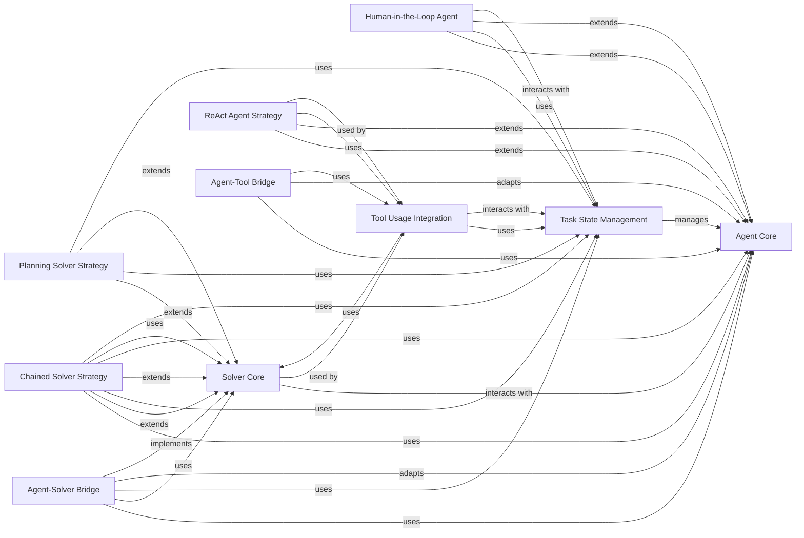

## Details

The `Agent & Solver Framework` subsystem is the core orchestrator for how LLMs and agents approach and resolve evaluation tasks within the `inspect_ai` framework. It provides a flexible and extensible architecture for defining various agent behaviors and task-solving strategies, managing their execution, and integrating external capabilities like tool usage and human intervention.

### Agent Core

This component defines the fundamental `Agent` interface and provides base functionalities for all LLM agents within the framework. It manages the agent's internal state (`AgentState`) and its interaction with the conversation history, serving as the blueprint for specific agent implementations. It is fundamental as it establishes the common contract for all agents, enabling extensibility and consistent interaction patterns.

**Related Classes/Methods**:

- <a href="https://github.com/UKGovernmentBEIS/inspect_ai/src/inspect_ai/agent/_agent.py#L1-L1" target="_blank" rel="noopener noreferrer">`inspect_ai.agent._agent` (1:1)</a>

### Solver Core

This component establishes the abstract `Solver` interface, which dictates how an LLM or an agent approaches and resolves an evaluation task. It forms the foundational layer for various task-solving strategies, ensuring a consistent approach across different problem-solving methodologies. It is fundamental as it provides the high-level strategy for task completion, allowing for diverse problem-solving patterns.

**Related Classes/Methods**:

- <a href="https://github.com/UKGovernmentBEIS/inspect_ai/src/inspect_ai/solver/_solver.py#L1-L1" target="_blank" rel="noopener noreferrer">`inspect_ai.solver._solver` (1:1)</a>

### Task State Management

This is a critical, central component responsible for maintaining the complete and current state of an ongoing evaluation task. This includes the conversation history, outputs from models, records of tool calls, scoring metrics, and adherence to various operational limits (e.g., token limits, time limits). It acts as the single source of truth and shared context for all agents and solvers involved in a task. It is fundamental for ensuring data consistency, enabling complex multi-turn interactions, and providing a comprehensive audit trail for evaluations.

**Related Classes/Methods**:

- <a href="https://github.com/UKGovernmentBEIS/inspect_ai/src/inspect_ai/solver/_task_state.py#L1-L1" target="_blank" rel="noopener noreferrer">`inspect_ai.solver._task_state` (1:1)</a>

### ReAct Agent Strategy

This component implements the ReAct (Reasoning and Acting) agent strategy, a common pattern where LLMs iteratively reason about a task and interact with external tools. It handles the parsing of model outputs to identify and execute tool calls, and manages the agent's internal thought process. It is fundamental as it provides a concrete and widely adopted pattern for intelligent agent behavior, crucial for complex LLM evaluations.

**Related Classes/Methods**:

- <a href="https://github.com/UKGovernmentBEIS/inspect_ai/src/inspect_ai/agent/_react.py#L1-L1" target="_blank" rel="noopener noreferrer">`inspect_ai.agent._react` (1:1)</a>

### Human-in-the-Loop Agent

This component provides the necessary framework for human-assisted agents, enabling human evaluators to intervene, provide instructions, or submit scores during an evaluation. It includes sub-components for processing human commands, displaying interactive UI panels, and managing the state of human interactions. It is fundamental for incorporating human judgment and oversight, which is essential for qualitative evaluation in an LLM framework.

**Related Classes/Methods**:

- `inspect_ai.agent._human` (1:1)

### Chained Solver Strategy

This component implements a solver strategy that allows for the sequential execution of multiple agents or solvers. This enables the creation of complex, multi-step evaluation workflows where the output of one step feeds into the next. It is fundamental for building sophisticated evaluation pipelines that require a sequence of distinct problem-solving steps.

**Related Classes/Methods**:

- <a href="https://github.com/UKGovernmentBEIS/inspect_ai/src/inspect_ai/solver/_chain.py#L1-L1" target="_blank" rel="noopener noreferrer">`inspect_ai.solver._chain` (1:1)</a>

### Planning Solver Strategy

This component implements a solver strategy where the LLM or agent first generates a detailed plan to solve the task before executing any steps. It manages the planning process and the subsequent execution of the planned actions. It is fundamental for evaluating LLMs' ability to strategize and execute multi-step plans, a key aspect of complex problem-solving.

**Related Classes/Methods**:

- <a href="https://github.com/UKGovernmentBEIS/inspect_ai/src/inspect_ai/solver/_plan.py#L1-L1" target="_blank" rel="noopener noreferrer">`inspect_ai.solver._plan` (1:1)</a>

### Tool Usage Integration

This component provides the essential mechanism for solvers to interact with and effectively utilize external tools. It acts as a bridge, connecting the solver's decision-making logic with the secure tool execution environment. It is fundamental for enabling LLMs to perform actions beyond pure text generation, allowing for realistic evaluation scenarios involving external systems.

**Related Classes/Methods**:

- <a href="https://github.com/UKGovernmentBEIS/inspect_ai/src/inspect_ai/solver/_use_tools.py#L1-L1" target="_blank" rel="noopener noreferrer">`inspect_ai.solver._use_tools` (1:1)</a>

### Agent-Solver Bridge

This component acts as an adapter, enabling an `Agent` to be seamlessly integrated and used as a `Solver`. This flexibility allows agent-based logic to be incorporated directly into the broader solver framework, promoting reusability and modularity. It is fundamental for maximizing the reusability of agent implementations within the solver framework, fostering a more modular architecture.

**Related Classes/Methods**:

- <a href="https://github.com/UKGovernmentBEIS/inspect_ai/src/inspect_ai/agent/_as_solver.py#L1-L1" target="_blank" rel="noopener noreferrer">`inspect_ai.agent._as_solver` (1:1)</a>

### Agent-Tool Bridge

This component provides an adapter that allows an `Agent` to be exposed and utilized as a `Tool` within the system. This means that other agents or models can invoke an agent's capabilities as if it were a standard tool, enhancing the composability of the framework. It is fundamental for enabling advanced composability, where agents can leverage the capabilities of other agents as if they were simple tools.

**Related Classes/Methods**:

- <a href="https://github.com/UKGovernmentBEIS/inspect_ai/src/inspect_ai/agent/_handoff.py#L1-L1" target="_blank" rel="noopener noreferrer">`inspect_ai.agent._handoff` (1:1)</a>

### [FAQ](https://github.com/CodeBoarding/GeneratedOnBoardings/tree/main?tab=readme-ov-file#faq)