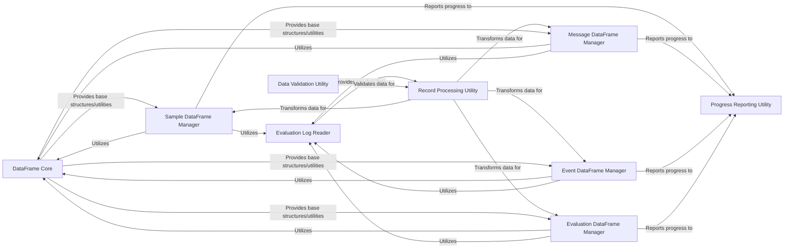

## Details

The `Data Analysis` subsystem, primarily centered around `inspect_ai.analysis.beta._dataframe`, is designed to transform raw evaluation logs into structured, queryable dataframes (e.g., Pandas DataFrames). This enables advanced statistical analysis, filtering, and custom reporting of LLM evaluation results. It adheres to the project's data-driven design and modular architecture, providing clear contracts for data transformation and access.

### DataFrame Core

This is the foundational layer for data manipulation and analysis within the subsystem. It defines the base `Column` structure and provides common utilities for creating, validating, and processing dataframes from evaluation logs. It acts as a central hub for shared data transformation tasks, including JSONPath extraction and type coercion.

**Related Classes/Methods**:

- `inspect_ai.analysis.beta._dataframe` (0:0)

- <a href="https://github.com/UKGovernmentBEIS/inspect_ai/src/inspect_ai/analysis/beta/_dataframe/columns.py#L0-L0" target="_blank" rel="noopener noreferrer">`inspect_ai.analysis.beta._dataframe.columns` (0:0)</a>

- <a href="https://github.com/UKGovernmentBEIS/inspect_ai/src/inspect_ai/analysis/beta/_dataframe/extract.py#L0-L0" target="_blank" rel="noopener noreferrer">`inspect_ai.analysis.beta._dataframe.extract` (0:0)</a>

- <a href="https://github.com/UKGovernmentBEIS/inspect_ai/src/inspect_ai/analysis/beta/_dataframe/util.py#L0-L0" target="_blank" rel="noopener noreferrer">`inspect_ai.analysis.beta._dataframe.util` (0:0)</a>

### Evaluation Log Reader

Responsible for reading raw evaluation log files from the file system. It serves as the primary data source, providing the raw log entries that are subsequently processed and transformed by other components.

**Related Classes/Methods**:

- <a href="https://github.com/UKGovernmentBEIS/inspect_ai/src/inspect_ai/log/_file.py#L0-L0" target="_blank" rel="noopener noreferrer">`inspect_ai.log._file` (0:0)</a>

### Record Processing Utility

Handles the conversion of raw log entries into structured records suitable for DataFrame creation. This includes logic for resolving values, performing type coercion (e.g., string to boolean/int), and managing duplicate columns during the import process.

**Related Classes/Methods**:

- <a href="https://github.com/UKGovernmentBEIS/inspect_ai/src/inspect_ai/analysis/beta/_dataframe/record.py#L0-L0" target="_blank" rel="noopener noreferrer">`inspect_ai.analysis.beta._dataframe.record` (0:0)</a>

### Data Validation Utility

Ensures the structural and type correctness of data, particularly for JSONPath expressions used in column definitions. It prevents malformed data from corrupting the analysis and ensures data integrity.

**Related Classes/Methods**:

- <a href="https://github.com/UKGovernmentBEIS/inspect_ai/src/inspect_ai/analysis/beta/_dataframe/validate.py#L0-L0" target="_blank" rel="noopener noreferrer">`inspect_ai.analysis.beta._dataframe.validate` (0:0)</a>

### Progress Reporting Utility

Provides mechanisms for displaying progress during potentially long-running data import operations, enhancing user experience by giving feedback on the loading process.

**Related Classes/Methods**:

- <a href="https://github.com/UKGovernmentBEIS/inspect_ai/src/inspect_ai/analysis/beta/_dataframe/progress.py#L0-L0" target="_blank" rel="noopener noreferrer">`inspect_ai.analysis.beta._dataframe.progress` (0:0)</a>

### Sample DataFrame Manager

Specializes in loading, processing, and managing DataFrames for individual evaluation samples. It orchestrates the reading of raw log data, converting it into a structured DataFrame, and ensuring data integrity for individual evaluation samples.

**Related Classes/Methods**:

- `inspect_ai.analysis.beta._dataframe.samples` (0:0)

- <a href="https://github.com/UKGovernmentBEIS/inspect_ai/src/inspect_ai/analysis/beta/_dataframe/samples/columns.py#L0-L0" target="_blank" rel="noopener noreferrer">`inspect_ai.analysis.beta._dataframe.samples.columns` (0:0)</a>

- <a href="https://github.com/UKGovernmentBEIS/inspect_ai/src/inspect_ai/analysis/beta/_dataframe/samples/extract.py#L0-L0" target="_blank" rel="noopener noreferrer">`inspect_ai.analysis.beta._dataframe.samples.extract` (0:0)</a>

- <a href="https://github.com/UKGovernmentBEIS/inspect_ai/src/inspect_ai/analysis/beta/_dataframe/samples/table.py#L0-L0" target="_blank" rel="noopener noreferrer">`inspect_ai.analysis.beta._dataframe.samples.table` (0:0)</a>

### Message DataFrame Manager

Specializes in creating and managing DataFrames specifically for chat messages extracted from evaluation logs. This allows for detailed analysis of conversational turns and model outputs.

**Related Classes/Methods**:

- `inspect_ai.analysis.beta._dataframe.messages` (0:0)

- <a href="https://github.com/UKGovernmentBEIS/inspect_ai/src/inspect_ai/analysis/beta/_dataframe/messages/columns.py#L0-L0" target="_blank" rel="noopener noreferrer">`inspect_ai.analysis.beta._dataframe.messages.columns` (0:0)</a>

- <a href="https://github.com/UKGovernmentBEIS/inspect_ai/src/inspect_ai/analysis/beta/_dataframe/messages/extract.py#L0-L0" target="_blank" rel="noopener noreferrer">`inspect_ai.analysis.beta._dataframe.messages.extract` (0:0)</a>

- <a href="https://github.com/UKGovernmentBEIS/inspect_ai/src/inspect_ai/analysis/beta/_dataframe/messages/table.py#L0-L0" target="_blank" rel="noopener noreferrer">`inspect_ai.analysis.beta._dataframe.messages.table` (0:0)</a>

### Event DataFrame Manager

Specializes in creating and managing DataFrames for events recorded during the evaluation process (e.g., model calls, tool executions). This provides a granular timeline of the evaluation flow.

**Related Classes/Methods**:

- `inspect_ai.analysis.beta._dataframe.events` (0:0)

- <a href="https://github.com/UKGovernmentBEIS/inspect_ai/src/inspect_ai/analysis/beta/_dataframe/events/columns.py#L0-L0" target="_blank" rel="noopener noreferrer">`inspect_ai.analysis.beta._dataframe.events.columns` (0:0)</a>

- <a href="https://github.com/UKGovernmentBEIS/inspect_ai/src/inspect_ai/analysis/beta/_dataframe/events/extract.py#L0-L0" target="_blank" rel="noopener noreferrer">`inspect_ai.analysis.beta._dataframe.events.extract` (0:0)</a>

- <a href="https://github.com/UKGovernmentBEIS/inspect_ai/src/inspect_ai/analysis/beta/_dataframe/events/table.py#L0-L0" target="_blank" rel="noopener noreferrer">`inspect_ai.analysis.beta._dataframe.events.table` (0:0)</a>

### Evaluation DataFrame Manager

Specializes in creating and managing DataFrames for overall evaluation summaries and metadata, providing a high-level view of evaluation runs.

**Related Classes/Methods**:

- `inspect_ai.analysis.beta._dataframe.evals` (0:0)

- <a href="https://github.com/UKGovernmentBEIS/inspect_ai/src/inspect_ai/analysis/beta/_dataframe/evals/columns.py#L0-L0" target="_blank" rel="noopener noreferrer">`inspect_ai.analysis.beta._dataframe.evals.columns` (0:0)</a>

- <a href="https://github.com/UKGovernmentBEIS/inspect_ai/src/inspect_ai/analysis/beta/_dataframe/evals/extract.py#L0-L0" target="_blank" rel="noopener noreferrer">`inspect_ai.analysis.beta._dataframe.evals.extract` (0:0)</a>

- <a href="https://github.com/UKGovernmentBEIS/inspect_ai/src/inspect_ai/analysis/beta/_dataframe/evals/table.py#L0-L0" target="_blank" rel="noopener noreferrer">`inspect_ai.analysis.beta._dataframe.evals.table` (0:0)</a>

### [FAQ](https://github.com/CodeBoarding/GeneratedOnBoardings/tree/main?tab=readme-ov-file#faq)