```mermaid

graph LR

    Dataset_Abstraction["Dataset Abstraction"]

    In_Memory_Dataset_Task_Definition["In-Memory Dataset & Task Definition"]

    Data_Sample["Data Sample"]

    Data_Source_Adapters["Data Source Adapters"]

    Data_Source_Utilities["Data Source Utilities"]

    Data_Source_Adapters -- "provides data to" --> In_Memory_Dataset_Task_Definition

    In_Memory_Dataset_Task_Definition -- "is a type of" --> Dataset_Abstraction

    Dataset_Abstraction -- "contains" --> Data_Sample

    Data_Source_Utilities -- "assists" --> Data_Source_Adapters

    In_Memory_Dataset_Task_Definition -- "defines" --> Evaluation_Core

    Data_Sample -- "is processed by" --> Evaluation_Core

```

## Details

The `Dataset Management` component is central to `inspect_ai`'s data-driven evaluation framework, ensuring that diverse input data is consistently prepared for evaluation tasks. It achieves this through a well-defined structure of abstract and concrete dataset representations, coupled with robust data source adapters and utilities.

### Dataset Abstraction

This is the abstract base class that defines the fundamental structure and interface for all datasets within the `inspect_ai` framework. It establishes the contract for how evaluation data is represented and accessed, ensuring consistency across different data sources.

**Related Classes/Methods**:

- <a href="https://github.com/UKGovernmentBEIS/inspect_ai/src/inspect_ai/dataset/_dataset.py#L129-L205" target="_blank" rel="noopener noreferrer">`inspect_ai.dataset._dataset.Dataset` (129:205)</a>

### In-Memory Dataset & Task Definition

A concrete implementation of `Dataset` that holds evaluation data in memory. Its significance lies in its dual role: it not only represents a dataset but also inherits from `inspect_ai._eval.task.task.Task`, meaning a dataset can directly define an evaluation task. This is a core aspect of the framework's data-driven design, where the data itself dictates the evaluation structure.

**Related Classes/Methods**:

- <a href="https://github.com/UKGovernmentBEIS/inspect_ai/src/inspect_ai/dataset/_dataset.py#L241-L363" target="_blank" rel="noopener noreferrer">`inspect_ai.dataset._dataset.MemoryDataset` (241:363)</a>

### Data Sample

Represents a single, immutable entry or row within a dataset. Each `Sample` contains the input data for a specific evaluation instance, and it can also store metadata and results as the evaluation progresses.

**Related Classes/Methods**:

- <a href="https://github.com/UKGovernmentBEIS/inspect_ai/src/inspect_ai/dataset/_dataset.py#L29-L106" target="_blank" rel="noopener noreferrer">`inspect_ai.dataset._dataset.Sample` (29:106)</a>

### Data Source Adapters

This package (and its sub-modules like `_csv`, `_json`, `_hf`, `_file`, `_example`) provides the specific logic and adapters required to load and parse evaluation data from diverse external sources (CSV, JSONL, Hugging Face datasets, etc.). Each sub-module handles a particular data format.

**Related Classes/Methods**:

- `inspect_ai.dataset._sources` (0:0)

### Data Source Utilities

This utility module provides common functions for processing and transforming data originating from the various sources. It ensures data consistency, performs necessary transformations (e.g., converting to chat message format), and potentially interacts with the sandbox environment for secure or complex data preparation steps.

**Related Classes/Methods**:

- <a href="https://github.com/UKGovernmentBEIS/inspect_ai/src/inspect_ai/dataset/_sources/util.py#L0-L0" target="_blank" rel="noopener noreferrer">`inspect_ai.dataset._sources.util` (0:0)</a>

### [FAQ](https://github.com/CodeBoarding/GeneratedOnBoardings/tree/main?tab=readme-ov-file#faq)