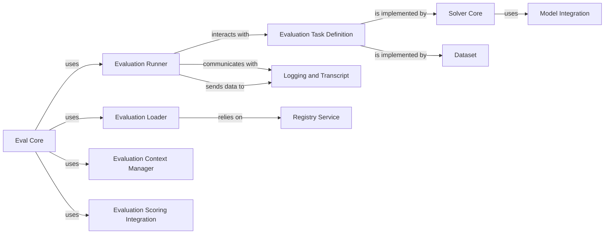

## Details

One paragraph explaining the functionality which is represented by this graph. What the main flow is and what is its purpose.

### Eval Core

The primary module responsible for initiating and coordinating the overall evaluation process. It acts as the central hub, bringing together task loading, configuration resolution, execution, and result handling. This is the "brain" of the orchestrator.

**Related Classes/Methods**:

- <a href="https://github.com/UKGovernmentBEIS/inspect_ai/src/inspect_ai/_eval/eval.py#L73-L255" target="_blank" rel="noopener noreferrer">`inspect_ai._eval.eval` (73:255)</a>

### Evaluation Runner

Manages the execution lifecycle of individual evaluation runs. It handles the actual dispatching of tasks, manages concurrency, and integrates with display and logging mechanisms. This is the "executor" that makes the evaluation happen.

**Related Classes/Methods**:

- <a href="https://github.com/UKGovernmentBEIS/inspect_ai/src/inspect_ai/_eval/run.py#L1-L1" target="_blank" rel="noopener noreferrer">`inspect_ai._eval.run` (1:1)</a>

### Evaluation Loader

Responsible for discovering, loading, and resolving evaluation tasks and their associated configurations (models, solvers, scorers, datasets). It ensures all necessary components are correctly identified and prepared for an evaluation run. This is the "setup crew."

**Related Classes/Methods**:

- <a href="https://github.com/UKGovernmentBEIS/inspect_ai/src/inspect_ai/_eval/loader.py#L1-L1" target="_blank" rel="noopener noreferrer">`inspect_ai._eval.loader` (1:1)</a>

### Evaluation Task Definition

Defines the fundamental structure and properties of an evaluation task. This includes specifying datasets, models, solvers, and scoring criteria. It serves as the blueprint for what an evaluation entails. This is the "blueprint" for any evaluation.

**Related Classes/Methods**:

- <a href="https://github.com/UKGovernmentBEIS/inspect_ai/src/inspect_ai/_eval/task/task.py#L1-L1" target="_blank" rel="noopener noreferrer">`inspect_ai._eval.task.task` (1:1)</a>

### Evaluation Context Manager

Provides and manages the operational context for an evaluation run, including environment variables, hooks, and logging configurations. It ensures a consistent and controlled environment for evaluation execution. This is the "environment controller."

**Related Classes/Methods**:

- <a href="https://github.com/UKGovernmentBEIS/inspect_ai/src/inspect_ai/_eval/context.py#L1-L1" target="_blank" rel="noopener noreferrer">`inspect_ai._eval.context` (1:1)</a>

### Evaluation Scoring Integration

Handles the integration and application of scoring mechanisms within the overall evaluation flow. It processes evaluation results and applies defined scorers to generate metrics and outcomes, effectively acting as the scoring engine. This is the "results processor and scoring engine."

**Related Classes/Methods**:

- <a href="https://github.com/UKGovernmentBEIS/inspect_ai/src/inspect_ai/scorer/_score.py#L11-L62" target="_blank" rel="noopener noreferrer">`inspect_ai.scorer._score.score` (11:62)</a>

- <a href="https://github.com/UKGovernmentBEIS/inspect_ai/src/inspect_ai/scorer/_scorer.py#L32-L59" target="_blank" rel="noopener noreferrer">`inspect_ai.scorer._scorer.Scorer` (32:59)</a>

### Model Integration

Provides an abstraction layer for interacting with various LLMs. It handles model loading, inference calls, and manages model-specific configurations.

**Related Classes/Methods**:

- <a href="https://github.com/UKGovernmentBEIS/inspect_ai/src/inspect_ai/model/_model.py#L1-L1" target="_blank" rel="noopener noreferrer">`inspect_ai.model._model` (1:1)</a>

### Solver Core

Represents the logic or "agent" that interacts with the LLM to perform tasks within an evaluation. This could be a simple prompt, a chain of prompts, or a more complex agentic workflow.

**Related Classes/Methods**:

- <a href="https://github.com/UKGovernmentBEIS/inspect_ai/src/inspect_ai/solver/_solver.py#L1-L1" target="_blank" rel="noopener noreferrer">`inspect_ai.solver._solver` (1:1)</a>

### Logging and Transcript

Manages the recording of all events, interactions, and results during an evaluation run. It provides detailed logs and transcripts for analysis and debugging.

**Related Classes/Methods**:

- <a href="https://github.com/UKGovernmentBEIS/inspect_ai/src/inspect_ai/log/_transcript.py#L1-L1" target="_blank" rel="noopener noreferrer">`inspect_ai.log._transcript` (1:1)</a>

### Registry Service

A centralized service for registering and discovering various components like models, datasets, and scorers. It acts as a lookup mechanism for the Evaluation Loader.

**Related Classes/Methods**:

- <a href="https://github.com/UKGovernmentBEIS/inspect_ai/src/inspect_ai/_eval/registry.py#L1-L1" target="_blank" rel="noopener noreferrer">`inspect_ai._eval.registry` (1:1)</a>

### Dataset

A component providing datasets for evaluation tasks.

**Related Classes/Methods**:

- <a href="https://github.com/UKGovernmentBEIS/inspect_ai/src/inspect_ai/dataset/_dataset.py#L1-L1" target="_blank" rel="noopener noreferrer">`inspect_ai.dataset._dataset` (1:1)</a>

### [FAQ](https://github.com/CodeBoarding/GeneratedOnBoardings/tree/main?tab=readme-ov-file#faq)