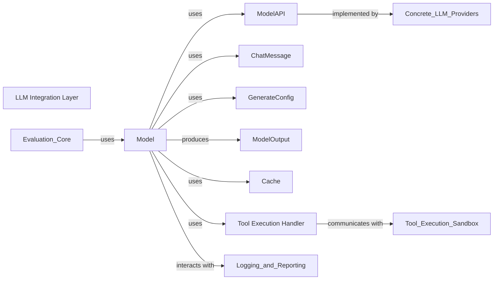

## Details

Overview of abstract components and their relationships within the inspect_ai framework's LLM integration layer.

### LLM Integration Layer [[Expand]](./LLM_Integration_Layer.md)

A crucial component within the `inspect_ai` framework, acting as an abstraction over various Large Language Models. Its primary purpose is to provide a unified interface for interacting with different LLM providers, handling the complexities of message formatting, API calls, response parsing, and managing model-specific configurations and caching. This ensures that the core evaluation logic of `inspect_ai` remains decoupled from the specific implementations of individual LLM APIs.

**Related Classes/Methods**: _None_

### Model

This is the core class representing an LLM within the `inspect_ai` framework. It provides a high-level, unified interface for LLM interaction, handling common concerns such as caching, concurrency, retry mechanisms, and orchestrating tool execution loops. It acts as the primary entry point for the `LLM Integration Layer` for external components like the `Evaluation Core`.

**Related Classes/Methods**:

- <a href="https://github.com/UKGovernmentBEIS/inspect_ai/src/inspect_ai/model/_model.py#L257-L816" target="_blank" rel="noopener noreferrer">`inspect_ai.model._model.Model` (257:816)</a>

### ModelAPI

An abstract base class that defines the low-level interface for specific LLM provider integrations. Concrete implementations (e.g., for OpenAI, Anthropic, Google) inherit from `ModelAPI` and are responsible for handling the actual API calls, request/response translation, and model-specific behaviors. The `Model` component utilizes an instance of `ModelAPI` to perform the underlying LLM generation.

**Related Classes/Methods**:

- <a href="https://github.com/UKGovernmentBEIS/inspect_ai/src/inspect_ai/model/_model.py#L97-L254" target="_blank" rel="noopener noreferrer">`inspect_ai.model._model.ModelAPI` (97:254)</a>

### ChatMessage

This component defines the structure for messages exchanged with LLMs. It includes various types of messages like `ChatMessageUser`, `ChatMessageAssistant`, `ChatMessageSystem`, and `ChatMessageTool`, ensuring consistent message formatting across different LLM APIs.

**Related Classes/Methods**:

- <a href="https://github.com/UKGovernmentBEIS/inspect_ai/src/inspect_ai/model/_chat_message.py#L1-L1" target="_blank" rel="noopener noreferrer">`inspect_ai.model._chat_message.ChatMessage` (1:1)</a>

### GenerateConfig

This class encapsulates configuration parameters for generating responses from LLMs, such as temperature, max tokens, and response schema. It allows for fine-grained control over the LLM's behavior during generation.

**Related Classes/Methods**:

- <a href="https://github.com/UKGovernmentBEIS/inspect_ai/src/inspect_ai/model/_generate_config.py#L112-L233" target="_blank" rel="noopener noreferrer">`inspect_ai.model._generate_config.GenerateConfig` (112:233)</a>

### ModelOutput

Represents the structured output received from an LLM after a generation call. It includes the generated text, usage statistics (e.g., token counts), and potentially other metadata like citations or tool calls.

**Related Classes/Methods**:

- <a href="https://github.com/UKGovernmentBEIS/inspect_ai/src/inspect_ai/model/_model_output.py#L130-L267" target="_blank" rel="noopener noreferrer">`inspect_ai.model._model_output.ModelOutput` (130:267)</a>

### Cache

This component is responsible for caching LLM responses to avoid redundant API calls, especially during repeated evaluations or development cycles. It helps in speeding up evaluations and reducing costs.

**Related Classes/Methods**:

- <a href="https://github.com/UKGovernmentBEIS/inspect_ai/src/inspect_ai/model/_cache.py#L1-L1" target="_blank" rel="noopener noreferrer">`inspect_ai.model._cache.Cache` (1:1)</a>

### Tool Execution Handler

This component, primarily represented by the `execute_tools` function, facilitates the invocation and execution of external tools by the LLM. It processes tool calls made by the LLM, executes the corresponding tool functions, and formats their results back into messages for the LLM.

**Related Classes/Methods**:

- <a href="https://github.com/UKGovernmentBEIS/inspect_ai/src/inspect_ai/model/_call_tools.py#L96-L342" target="_blank" rel="noopener noreferrer">`inspect_ai.model._call_tools.execute_tools` (96:342)</a>

### [FAQ](https://github.com/CodeBoarding/GeneratedOnBoardings/tree/main?tab=readme-ov-file#faq)