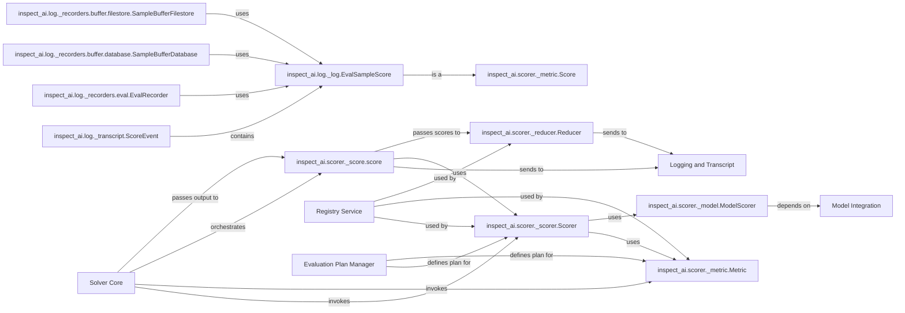

## Details

The Scoring & Metrics Engine is a crucial component within the LLM Evaluation Framework, responsible for quantitatively assessing the performance and quality of LLM outputs. It provides a flexible and extensible mechanism for defining, applying, and aggregating various evaluation metrics.

### inspect_ai.scorer._scorer.Scorer

This is the foundational component for defining and registering scoring functions. It acts as a decorator, transforming a standard Python function into a callable scorer that can be seamlessly integrated into the evaluation pipeline. It orchestrates the execution of individual metrics and ensures they operate within the correct evaluation context.

**Related Classes/Methods**:

- <a href="https://github.com/UKGovernmentBEIS/inspect_ai/src/inspect_ai/scorer/_scorer.py#L32-L59" target="_blank" rel="noopener noreferrer">`inspect_ai.scorer._scorer.Scorer` (32:59)</a>

### inspect_ai.scorer._metric.Metric

Represents a single, atomic metric used for evaluation. This class serves as the base for all specific metric types (e.g., accuracy, F1-score, mean squared error). It defines the essential interface for how a metric is calculated and how its results are structured, ensuring consistency across different evaluation criteria.

**Related Classes/Methods**:

- <a href="https://github.com/UKGovernmentBEIS/inspect_ai/src/inspect_ai/scorer/_metric.py#L0-L0" target="_blank" rel="noopener noreferrer">`inspect_ai.scorer._metric.Metric` (0:0)</a>

### inspect_ai.scorer._model.ModelScorer

A specialized `Scorer` that leverages an LLM to perform evaluations. This enables "model-graded evaluations," where one LLM assesses the quality of another LLM's output based on predefined criteria or rubrics. It interacts with the `Model Integration` component to utilize LLMs for the scoring process.

**Related Classes/Methods**:

- <a href="https://github.com/UKGovernmentBEIS/inspect_ai/src/inspect_ai/scorer/_model.py#L0-L0" target="_blank" rel="noopener noreferrer">`inspect_ai.scorer._model.ModelScorer` (0:0)</a>

### inspect_ai.scorer._reducer.Reducer

Responsible for aggregating scores from individual samples or metrics into a final, summarized result. This is essential for providing overall performance insights (e.g., average accuracy, standard deviation, aggregated F1-score across a dataset). It defines how raw scores are processed and combined to yield meaningful evaluation summaries.

**Related Classes/Methods**:

- <a href="https://github.com/UKGovernmentBEIS/inspect_ai/src/inspect_ai/scorer/_reducer/reducer.py#L0-L0" target="_blank" rel="noopener noreferrer">`inspect_ai.scorer._reducer.Reducer` (0:0)</a>

### inspect_ai.scorer._score.score

A utility function or decorator that applies a `Scorer` to a given evaluation sample. It orchestrates the process of taking an LLM output and computing its score using the defined metrics and scorers. It acts as a bridge between the evaluation execution and the scoring logic.

**Related Classes/Methods**:

- <a href="https://github.com/UKGovernmentBEIS/inspect_ai/src/inspect_ai/scorer/_score.py#L11-L62" target="_blank" rel="noopener noreferrer">`inspect_ai.scorer._score.score` (11:62)</a>

### inspect_ai.log._log.EvalSampleScore

Represents the structured output of a scoring operation for a single evaluation sample. It inherits from `inspect_ai.scorer._metric.Score`, indicating that it holds the result of a metric calculation. This component is crucial for logging and reporting, ensuring that detailed scoring results are captured and made available for analysis.

**Related Classes/Methods**:

- <a href="https://github.com/UKGovernmentBEIS/inspect_ai/src/inspect_ai/log/_log.py#L502-L506" target="_blank" rel="noopener noreferrer">`inspect_ai.log._log.EvalSampleScore` (502:506)</a>

### inspect_ai.log._transcript.ScoreEvent

An event type within the evaluation transcript that specifically records the outcome of a scoring operation. It contains an `EvalSampleScore` object, providing a timestamped record of when a score was computed and what its value was. This is part of the broader logging and observability framework.

**Related Classes/Methods**:

- <a href="https://github.com/UKGovernmentBEIS/inspect_ai/src/inspect_ai/log/_transcript.py#L406-L423" target="_blank" rel="noopener noreferrer">`inspect_ai.log._transcript.ScoreEvent` (406:423)</a>

### inspect_ai.log._recorders.eval.EvalRecorder

A specialized recorder responsible for capturing and persisting evaluation-related data, including scores. It extends `inspect_ai.log._recorders.file.FileRecorder`, suggesting it writes evaluation logs to files. This component is essential for long-term storage and retrieval of evaluation results.

**Related Classes/Methods**:

- <a href="https://github.com/UKGovernmentBEIS/inspect_ai/src/inspect_ai/log/_recorders/eval.py#L58-L237" target="_blank" rel="noopener noreferrer">`inspect_ai.log._recorders.eval.EvalRecorder` (58:237)</a>

### inspect_ai.log._recorders.buffer.database.SampleBufferDatabase

Manages a buffer of evaluation samples and their associated data, including scores, before they are fully processed or written to a permanent log. It acts as a temporary storage mechanism, inheriting from `inspect_ai.log._recorders.buffer.types.SampleBuffer` and `inspect_ai._eval.task.log.TaskLogger`.

**Related Classes/Methods**:

- <a href="https://github.com/UKGovernmentBEIS/inspect_ai/src/inspect_ai/log/_recorders/buffer/database.py#L56-L571" target="_blank" rel="noopener noreferrer">`inspect_ai.log._recorders.buffer.database.SampleBufferDatabase` (56:571)</a>

### inspect_ai.log._recorders.buffer.filestore.SampleBufferFilestore

A concrete implementation of a sample buffer that stores evaluation data, including scores, in a file-based system. It inherits from `inspect_ai.log._recorders.buffer.types.SampleBuffer`, indicating its role in managing temporary storage of evaluation data.

**Related Classes/Methods**:

- <a href="https://github.com/UKGovernmentBEIS/inspect_ai/src/inspect_ai/log/_recorders/buffer/filestore.py#L48-L204" target="_blank" rel="noopener noreferrer">`inspect_ai.log._recorders.buffer.filestore.SampleBufferFilestore` (48:204)</a>

### Solver Core

The core component responsible for orchestrating the evaluation process.

**Related Classes/Methods**: _None_

### Model Integration

Component responsible for integrating and interacting with LLMs.

**Related Classes/Methods**: _None_

### Registry Service

A service for registering and discovering various components within the framework.

**Related Classes/Methods**: _None_

### Evaluation Plan Manager

Manages and defines the evaluation plan, specifying which scorers and metrics to use.

**Related Classes/Methods**: _None_

### Logging and Transcript

The component responsible for logging and recording evaluation events and results.

**Related Classes/Methods**: _None_

### inspect_ai.scorer._metric.Score

A base class or data structure representing the result of a metric calculation.

**Related Classes/Methods**:

- <a href="https://github.com/UKGovernmentBEIS/inspect_ai/src/inspect_ai/scorer/_metric.py#L55-L109" target="_blank" rel="noopener noreferrer">`inspect_ai.scorer._metric.Score` (55:109)</a>

### [FAQ](https://github.com/CodeBoarding/GeneratedOnBoardings/tree/main?tab=readme-ov-file#faq)