```mermaid

graph LR

    Tool_Definition_and_Registry["Tool Definition and Registry"]

    Tool_Invocation_and_Communication_Protocol_MCP_["Tool Invocation and Communication Protocol (MCP)"]

    Sandbox_Environment_Management["Sandbox Environment Management"]

    Tool_Approval_System["Tool Approval System"]

    Built_in_Tools_Library["Built-in Tools Library"]

    Tool_Definition_and_Registry -- "defines tools for" --> Built_in_Tools_Library

    Tool_Definition_and_Registry -- "provides metadata to" --> Tool_Invocation_and_Communication_Protocol_MCP_

    Tool_Invocation_and_Communication_Protocol_MCP_ -- "requests execution from" --> Sandbox_Environment_Management

    Tool_Invocation_and_Communication_Protocol_MCP_ -- "sends tool calls to" --> Tool_Approval_System

    Sandbox_Environment_Management -- "executes tools for" --> Tool_Invocation_and_Communication_Protocol_MCP_

    Tool_Approval_System -- "intercepts tool calls from" --> Tool_Invocation_and_Communication_Protocol_MCP_

    Tool_Approval_System -- "grants/denies execution to" --> Sandbox_Environment_Management

    Built_in_Tools_Library -- "implements tools using definitions from" --> Tool_Definition_and_Registry

    Built_in_Tools_Library -- "is executed within" --> Sandbox_Environment_Management

```

## Details

This subsystem enables LLMs and agents to interact with external functionalities and environments through defined tools. It encompasses tool definition, invocation, result processing, and provides a secure, isolated execution environment (sandbox), including an approval system for sensitive tool calls.

### Tool Definition and Registry

This component is responsible for defining, registering, and managing the metadata of tools that LLM agents can utilize. It provides mechanisms to expose Python functions as callable tools, automatically extracting essential information such as descriptions, parameters, and usage instructions. This metadata is crucial for LLMs to understand and correctly invoke the tools.

**Related Classes/Methods**:

- <a href="https://github.com/UKGovernmentBEIS/inspect_ai/src/inspect_ai/tool/_tool.py#L152-L152" target="_blank" rel="noopener noreferrer">`inspect_ai.tool._tool.tool` (152:152)</a>

- <a href="https://github.com/UKGovernmentBEIS/inspect_ai/src/inspect_ai/tool/_tool_def.py#L35-L167" target="_blank" rel="noopener noreferrer">`inspect_ai.tool._tool_def.ToolDef` (35:167)</a>

- <a href="https://github.com/UKGovernmentBEIS/inspect_ai/src/inspect_ai/tool/_tool_info.py#L55-L122" target="_blank" rel="noopener noreferrer">`inspect_ai.tool._tool_info.parse_tool_info` (55:122)</a>

- <a href="https://github.com/UKGovernmentBEIS/inspect_ai/src/inspect_ai/tool/_tool.py#L88-L113" target="_blank" rel="noopener noreferrer">`inspect_ai.tool._tool.Tool` (88:113)</a>

### Tool Invocation and Communication Protocol (MCP)

This component manages the entire process of invoking a tool, from receiving an LLM's tool request to executing it and transmitting the results back. It utilizes a Multi-Component Protocol (MCP) built on JSON-RPC for robust and reliable inter-process communication between the main `inspect_ai` process and the isolated sandbox environment.

**Related Classes/Methods**:

- <a href="https://github.com/UKGovernmentBEIS/inspect_ai/src/inspect_ai/tool/_tool_call.py#L36-L56" target="_blank" rel="noopener noreferrer">`inspect_ai.tool._tool_call.ToolCall` (36:56)</a>

- <a href="https://github.com/UKGovernmentBEIS/inspect_ai/src/inspect_ai/tool/_json_rpc_helpers.py#L0-L0" target="_blank" rel="noopener noreferrer">`inspect_ai.tool._json_rpc_helpers` (0:0)</a>

- <a href="https://github.com/UKGovernmentBEIS/inspect_ai/src/inspect_ai/tool/_mcp/_mcp.py#L43-L75" target="_blank" rel="noopener noreferrer">`inspect_ai.tool._mcp._mcp.MCPServerImpl` (43:75)</a>

- <a href="https://github.com/UKGovernmentBEIS/inspect_ai/src/inspect_ai/tool/_mcp/connection.py#L45-L59" target="_blank" rel="noopener noreferrer">`inspect_ai.tool._mcp.connection.MCPServerConnection` (45:59)</a>

- <a href="https://github.com/UKGovernmentBEIS/inspect_ai/src/inspect_ai/tool/_tool_support_helpers.py#L0-L0" target="_blank" rel="noopener noreferrer">`inspect_ai.tool._tool_support_helpers.ToolSupportSandboxTransport` (0:0)</a>

### Sandbox Environment Management

This component provides and manages secure, isolated execution environments for tools. It abstracts the underlying sandboxing technology (e.g., Docker containers), ensuring that tool execution is contained, preventing malicious code or unintended side effects from impacting the main evaluation process. It handles the setup, execution, and teardown of these isolated environments.

**Related Classes/Methods**:

- <a href="https://github.com/UKGovernmentBEIS/inspect_ai/src/inspect_ai/util/_sandbox/context.py#L52-L114" target="_blank" rel="noopener noreferrer">`inspect_ai.util._sandbox.context.sandbox_with` (52:114)</a>

- <a href="https://github.com/UKGovernmentBEIS/inspect_ai/src/inspect_ai/util/_sandbox/environment.py#L83-L353" target="_blank" rel="noopener noreferrer">`inspect_ai.util._sandbox.environment.SandboxEnvironment` (83:353)</a>

- <a href="https://github.com/UKGovernmentBEIS/inspect_ai/src/inspect_ai/util/_sandbox/local.py#L21-L115" target="_blank" rel="noopener noreferrer">`inspect_ai.util._sandbox.local.LocalSandboxEnvironment` (21:115)</a>

- <a href="https://github.com/UKGovernmentBEIS/inspect_ai/src/inspect_ai/util/_sandbox/service.py#L90-L356" target="_blank" rel="noopener noreferrer">`inspect_ai.util._sandbox.service.SandboxService` (90:356)</a>

- <a href="https://github.com/UKGovernmentBEIS/inspect_ai/src/inspect_ai/util/_sandbox/environment.py#L64-L80" target="_blank" rel="noopener noreferrer">`inspect_ai.util._sandbox.environment.SandboxConnection` (64:80)</a>

### Tool Approval System

This component implements a robust, policy-driven approval mechanism for sensitive or potentially risky tool calls. It allows for human intervention or automated policy checks before a tool is executed within the sandbox, adding a crucial layer of security and control to the evaluation process.

**Related Classes/Methods**:

- <a href="https://github.com/UKGovernmentBEIS/inspect_ai/src/inspect_ai/approval/_policy.py#L31-L80" target="_blank" rel="noopener noreferrer">`inspect_ai.approval._policy.policy_approver` (31:80)</a>

- <a href="https://github.com/UKGovernmentBEIS/inspect_ai/src/inspect_ai/approval/_approver.py#L8-L30" target="_blank" rel="noopener noreferrer">`inspect_ai.approval._approver.Approver` (8:30)</a>

- <a href="https://github.com/UKGovernmentBEIS/inspect_ai/src/inspect_ai/approval/_apply.py#L0-L0" target="_blank" rel="noopener noreferrer">`inspect_ai.approval._apply` (0:0)</a>

- <a href="https://github.com/UKGovernmentBEIS/inspect_ai/src/inspect_ai/approval/_human/approver.py#L0-L0" target="_blank" rel="noopener noreferrer">`inspect_ai.approval._human.approver` (0:0)</a>

- <a href="https://github.com/UKGovernmentBEIS/inspect_ai/src/inspect_ai/approval/_human/manager.py#L11-L16" target="_blank" rel="noopener noreferrer">`inspect_ai.approval._human.manager.ApprovalRequest` (11:16)</a>

### Built-in Tools Library

This package contains a collection of pre-defined, ready-to-use tools that demonstrate the framework's capabilities and provide common functionalities for LLMs, such as interacting with the shell (`bash`), executing Python code, performing web searches, or simulating web browsing. These tools serve as examples and extend the LLM's operational scope.

**Related Classes/Methods**:

- <a href="https://github.com/UKGovernmentBEIS/inspect_ai/src/inspect_ai/tool/_tools/__init__.py#L0-L0" target="_blank" rel="noopener noreferrer">`inspect_ai.tool._tools.__init__.py` (0:0)</a>

- <a href="https://github.com/UKGovernmentBEIS/inspect_ai/src/inspect_ai/tool/_tools/_bash_session.py#L31-L33" target="_blank" rel="noopener noreferrer">`inspect_ai.tool._tools._bash_session.BashSessionStore` (31:33)</a>

- <a href="https://github.com/UKGovernmentBEIS/inspect_ai/src/inspect_ai/tool/_tools/_computer/_computer.py#L0-L0" target="_blank" rel="noopener noreferrer">`inspect_ai.tool._tools._computer._computer.py` (0:0)</a>

- <a href="https://github.com/UKGovernmentBEIS/inspect_ai/src/inspect_ai/tool/_tools/_web_search/_web_search.py#L0-L0" target="_blank" rel="noopener noreferrer">`inspect_ai.tool._tools._web_search._web_search.py` (0:0)</a>

- <a href="https://github.com/UKGovernmentBEIS/inspect_ai/src/inspect_ai/tool/_tools/_web_browser/_web_browser.py#L0-L0" target="_blank" rel="noopener noreferrer">`inspect_ai.tool._tools._web_browser._web_browser.py` (0:0)</a>

### [FAQ](https://github.com/CodeBoarding/GeneratedOnBoardings/tree/main?tab=readme-ov-file#faq)