```mermaid

graph LR

    Evaluation_Orchestrator["Evaluation Orchestrator"]

    Dataset_Management["Dataset Management"]

    Agent_Solver_Framework["Agent & Solver Framework"]

    LLM_Integration_Layer["LLM Integration Layer"]

    Tool_Sandbox_Environment["Tool & Sandbox Environment"]

    Scoring_Metrics_Engine["Scoring & Metrics Engine"]

    Data_Analysis["Data Analysis"]

    Evaluation_Orchestrator -- "interacts with" --> Dataset_Management

    Evaluation_Orchestrator -- "orchestrates" --> Agent_Solver_Framework

    Scoring_Metrics_Engine -- "provides to" --> Evaluation_Orchestrator

    Evaluation_Orchestrator -- "provides to" --> Data_Analysis

    Dataset_Management -- "provides to" --> Evaluation_Orchestrator

    Dataset_Management -- "provides to" --> Data_Analysis

    Agent_Solver_Framework -- "interacts with" --> Evaluation_Orchestrator

    Agent_Solver_Framework -- "interacts with" --> LLM_Integration_Layer

    Agent_Solver_Framework -- "interacts with" --> Tool_Sandbox_Environment

    Agent_Solver_Framework -- "provides to" --> Scoring_Metrics_Engine

    LLM_Integration_Layer -- "interacts with" --> Agent_Solver_Framework

    LLM_Integration_Layer -- "interacts with" --> Tool_Sandbox_Environment

    Scoring_Metrics_Engine -- "uses" --> LLM_Integration_Layer

    Tool_Sandbox_Environment -- "interacts with" --> Agent_Solver_Framework

    Tool_Sandbox_Environment -- "interacts with" --> LLM_Integration_Layer

    click Evaluation_Orchestrator href "https://github.com/UKGovernmentBEIS/inspect_ai/blob/main/.codeboarding//Evaluation_Orchestrator.md" "Details"

    click Dataset_Management href "https://github.com/UKGovernmentBEIS/inspect_ai/blob/main/.codeboarding//Dataset_Management.md" "Details"

    click Agent_Solver_Framework href "https://github.com/UKGovernmentBEIS/inspect_ai/blob/main/.codeboarding//Agent_Solver_Framework.md" "Details"

    click LLM_Integration_Layer href "https://github.com/UKGovernmentBEIS/inspect_ai/blob/main/.codeboarding//LLM_Integration_Layer.md" "Details"

    click Tool_Sandbox_Environment href "https://github.com/UKGovernmentBEIS/inspect_ai/blob/main/.codeboarding//Tool_Sandbox_Environment.md" "Details"

    click Scoring_Metrics_Engine href "https://github.com/UKGovernmentBEIS/inspect_ai/blob/main/.codeboarding//Scoring_Metrics_Engine.md" "Details"

    click Data_Analysis href "https://github.com/UKGovernmentBEIS/inspect_ai/blob/main/.codeboarding//Data_Analysis.md" "Details"

```

## Details

High-level data flow overview of the `inspect_ai` architecture, focusing on its core components and their interactions, aligned with typical LLM Evaluation Framework patterns.

### Evaluation Orchestrator [[Expand]](./Evaluation_Orchestrator.md)

The central control plane managing the entire evaluation lifecycle. It loads evaluation tasks, resolves configurations (models, solvers, scorers, datasets), orchestrates the execution of evaluation runs, and manages the overall flow, including concurrency and error handling.

**Related Classes/Methods**:

- <a href="https://github.com/UKGovernmentBEIS/inspect_ai/src/inspect_ai/_eval/eval.py#L73-L255" target="_blank" rel="noopener noreferrer">`inspect_ai._eval.eval` (73:255)</a>

- <a href="https://github.com/UKGovernmentBEIS/inspect_ai/src/inspect_ai/_eval/run.py#L1-L1" target="_blank" rel="noopener noreferrer">`inspect_ai._eval.run` (1:1)</a>

- <a href="https://github.com/UKGovernmentBEIS/inspect_ai/src/inspect_ai/_eval/loader.py#L1-L1" target="_blank" rel="noopener noreferrer">`inspect_ai._eval.loader` (1:1)</a>

- <a href="https://github.com/UKGovernmentBEIS/inspect_ai/src/inspect_ai/_eval/task/task.py#L1-L1" target="_blank" rel="noopener noreferrer">`inspect_ai._eval.task.task` (1:1)</a>

### Dataset Management [[Expand]](./Dataset_Management.md)

Manages the loading, processing, and transformation of evaluation datasets from diverse sources (e.g., JSONL, CSV, Hugging Face datasets). It ensures that input data is prepared in a consistent format for evaluation tasks.

**Related Classes/Methods**:

- <a href="https://github.com/UKGovernmentBEIS/inspect_ai/src/inspect_ai/dataset/_dataset.py#L1-L1" target="_blank" rel="noopener noreferrer">`inspect_ai.dataset._dataset` (1:1)</a>

### Agent & Solver Framework [[Expand]](./Agent_Solver_Framework.md)

Provides a flexible framework for implementing and running different types of LLM agents (e.g., ReAct agents, human-in-the-loop agents). It defines high-level strategies, manages task state, and chains multiple steps for how an LLM or agent approaches and solves a given evaluation task.

**Related Classes/Methods**:

- <a href="https://github.com/UKGovernmentBEIS/inspect_ai/src/inspect_ai/agent/_agent.py#L1-L1" target="_blank" rel="noopener noreferrer">`inspect_ai.agent._agent` (1:1)</a>

- <a href="https://github.com/UKGovernmentBEIS/inspect_ai/src/inspect_ai/agent/_react.py#L1-L1" target="_blank" rel="noopener noreferrer">`inspect_ai.agent._react` (1:1)</a>

- <a href="https://github.com/UKGovernmentBEIS/inspect_ai/src/inspect_ai/solver/_solver.py#L1-L1" target="_blank" rel="noopener noreferrer">`inspect_ai.solver._solver` (1:1)</a>

- <a href="https://github.com/UKGovernmentBEIS/inspect_ai/src/inspect_ai/solver/_plan.py#L1-L1" target="_blank" rel="noopener noreferrer">`inspect_ai.solver._plan` (1:1)</a>

- <a href="https://github.com/UKGovernmentBEIS/inspect_ai/src/inspect_ai/solver/_chain.py#L1-L1" target="_blank" rel="noopener noreferrer">`inspect_ai.solver._chain` (1:1)</a>

### LLM Integration Layer [[Expand]](./LLM_Integration_Layer.md)

Offers a unified, abstract interface for interacting with various Large Language Models (LLMs) from different providers (e.g., OpenAI, Anthropic, Google, Hugging Face). It handles message formatting, API calls, response parsing, and manages model-specific configurations and caching.

**Related Classes/Methods**:

- <a href="https://github.com/UKGovernmentBEIS/inspect_ai/src/inspect_ai/model/_model.py#L1-L1" target="_blank" rel="noopener noreferrer">`inspect_ai.model._model` (1:1)</a>

- <a href="https://github.com/UKGovernmentBEIS/inspect_ai/src/inspect_ai/model/_chat_message.py#L1-L1" target="_blank" rel="noopener noreferrer">`inspect_ai.model._chat_message` (1:1)</a>

- <a href="https://github.com/UKGovernmentBEIS/inspect_ai/src/inspect_ai/model/_generate_config.py#L1-L1" target="_blank" rel="noopener noreferrer">`inspect_ai.model._generate_config` (1:1)</a>

- <a href="https://github.com/UKGovernmentBEIS/inspect_ai/src/inspect_ai/model/_call_tools.py#L1-L1" target="_blank" rel="noopener noreferrer">`inspect_ai.model._call_tools` (1:1)</a>

### Tool & Sandbox Environment [[Expand]](./Tool_Sandbox_Environment.md)

Enables LLMs and agents to interact with external functionalities and environments through defined tools. It handles tool definition, invocation, result processing, and provides a secure, isolated execution environment (sandbox), including an approval system for sensitive tool calls.

**Related Classes/Methods**:

- <a href="https://github.com/UKGovernmentBEIS/inspect_ai/src/inspect_ai/tool/_tool.py#L1-L1" target="_blank" rel="noopener noreferrer">`inspect_ai.tool._tool` (1:1)</a>

- <a href="https://github.com/UKGovernmentBEIS/inspect_ai/src/inspect_ai/tool/_tool_def.py#L1-L1" target="_blank" rel="noopener noreferrer">`inspect_ai.tool._tool_def` (1:1)</a>

- <a href="https://github.com/UKGovernmentBEIS/inspect_ai/src/inspect_ai/tool/_tool_call.py#L1-L1" target="_blank" rel="noopener noreferrer">`inspect_ai.tool._tool_call` (1:1)</a>

- <a href="https://github.com/UKGovernmentBEIS/inspect_ai/src/inspect_ai/util/_sandbox/context.py#L1-L1" target="_blank" rel="noopener noreferrer">`inspect_ai.util._sandbox.context` (1:1)</a>

- <a href="https://github.com/UKGovernmentBEIS/inspect_ai/src/inspect_ai/approval/_policy.py#L1-L1" target="_blank" rel="noopener noreferrer">`inspect_ai.approval._policy` (1:1)</a>

### Scoring & Metrics Engine [[Expand]](./Scoring_Metrics_Engine.md)

Defines and applies various scoring methodologies and metrics to evaluate the quality and performance of LLM outputs. It supports different metric types (e.g., accuracy, F1, model-graded evaluations) and provides mechanisms for aggregating scores.

**Related Classes/Methods**:

- <a href="https://github.com/UKGovernmentBEIS/inspect_ai/src/inspect_ai/scorer/_scorer.py#L1-L1" target="_blank" rel="noopener noreferrer">`inspect_ai.scorer._scorer` (1:1)</a>

- <a href="https://github.com/UKGovernmentBEIS/inspect_ai/src/inspect_ai/scorer/_metric.py#L1-L1" target="_blank" rel="noopener noreferrer">`inspect_ai.scorer._metric` (1:1)</a>

- <a href="https://github.com/UKGovernmentBEIS/inspect_ai/src/inspect_ai/scorer/_model.py#L1-L1" target="_blank" rel="noopener noreferrer">`inspect_ai.scorer._model` (1:1)</a>

### Data Analysis [[Expand]](./Data_Analysis.md)

Provides tools and utilities for loading and transforming raw evaluation results (logs) into structured dataframes (e.g., Pandas DataFrames). This facilitates advanced statistical analysis, filtering, and custom reporting of evaluation results.

**Related Classes/Methods**:

- `inspect_ai.analysis.beta._dataframe` (1:1)

### [FAQ](https://github.com/CodeBoarding/GeneratedOnBoardings/tree/main?tab=readme-ov-file#faq)