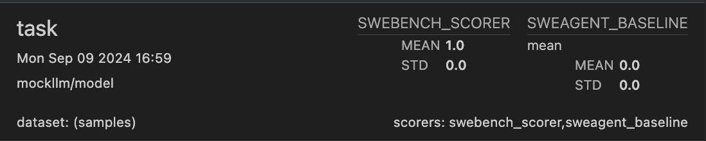

# SWE-agent
This is an inspect-native implementation of [the SWE-bench dataset](https://www.swebench.com/).

## Installation

- **Install requirements.** As well as the requirements provided by inspect, this benchmark has its own dependencies. You can install them in your virtual enviro   nment by running ```pip install -r requirements.txt```
- **Build environment images.** SWE-bench requires a set of images with all the dependencies of each repository. Yo build them for the SWE-bench-verified split, run ```./build_images.py --dataset_path princeton-nlp/SWE-bench_Verified --split train```. See ```./build_images.py --help``` for all arguments. NOTE: Depending on the repositories contained in your subset of SWE-bench, this can take a while to run (several hours). 

## Usage


### Running the benchmark
The ```swe_bench.py``` file contains the ```swe_bench``` function, which creates an instance of a SWE-bench Task:

```python
from inspect_ai import eval
from inspect_ai.solver import use_tools, generate, system_message

# Make a simple agent that only uses bash.
simple_bash_plan =  [
    system_message("Please solve the coding task."),
    use_tools([bash()]),
    generate(),
]

# Create a Task object for the SWE-bench dataset, using the recent verified split (https://openai.com/index/introducing-swe-bench-verified/).
swebench_verified_task = swe_bench(dataset="princeton-nlp/SWE-bench_Verified", split="train",plan=simple_bash_plan)

# Run the eval. NOTE: SWE-bench will take a while to run, and uses a lot of tokens. If things are too slow, you should increase the level of parallelism - see https://inspect.ai-safety-institute.org.uk/parallelism.html 
eval(swebench_verified_task)
```

### Comparing to baselines
Submissions to [the official SWE-bench leaderboard](https://www.swebench.com/) often come with a set of trajectories and per-swebench-instance results. This means that you can compare the performance of your agent not just on the full dataset, but also on subsets of that dataset. This is often useful when trying to run smaller, cheaper experiments. To make this comparison easy, we provide a scorer that will calculate the average performance of an existing baseline on that set of trajectories:

```python
from inspect_ai import eval
from swe_bench import swe_bench, swe_bench_scorer, swebench_baseline_scorer

# Select only the subset where the patch is more than 20 lines long
swebench_verified_task_subset = swe_bench(dataset="princeton-nlp/SWE-bench_Verified", split="train",plan=simple_bash_plan, filter=lambda x: len(x["patch"].split("\n")) > 20)
m
# Report the Claude 3.5 Sonnet + SweAgent baseline, as well as the performance of the agent.
swebench_verified_task_subset.scorer = [swebench_baseline_scorer("./resources/baselines/swebench_verified_20240620_sweagent_claude3.5sonnet",name="sweagent_baseline"), swebench_scorer()]

eval(swebench_verified_task_subset)
```

This will lead to both numbers being reported in the final output:


```


