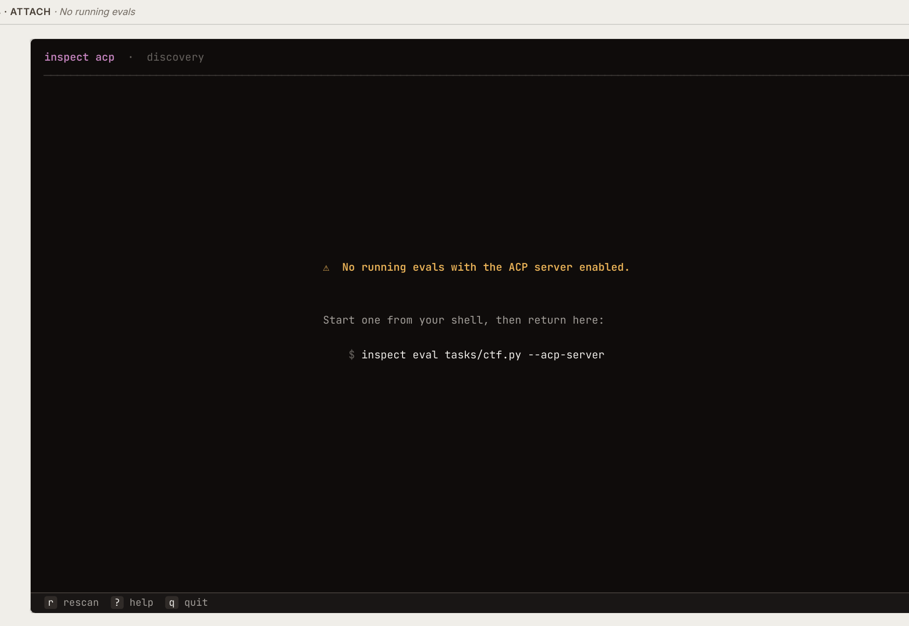
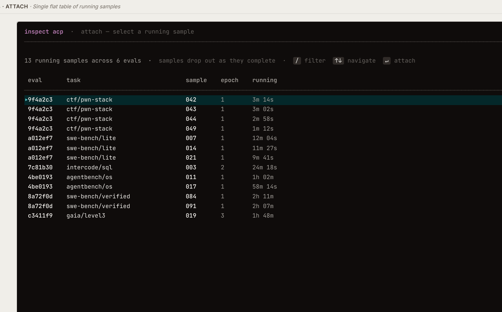
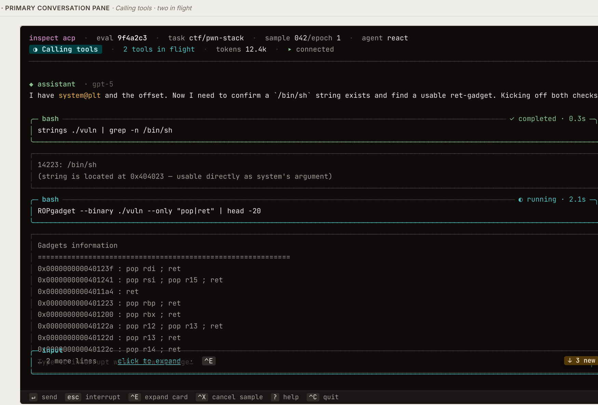
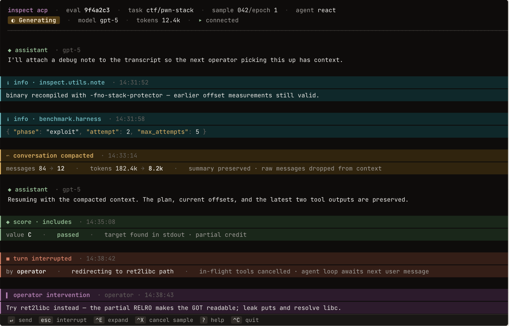
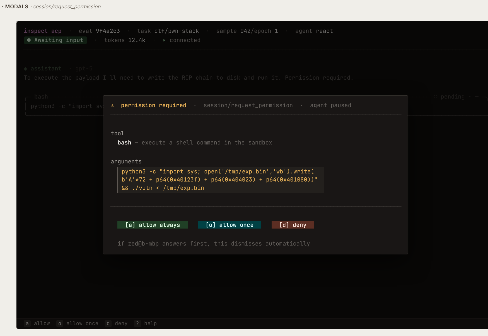
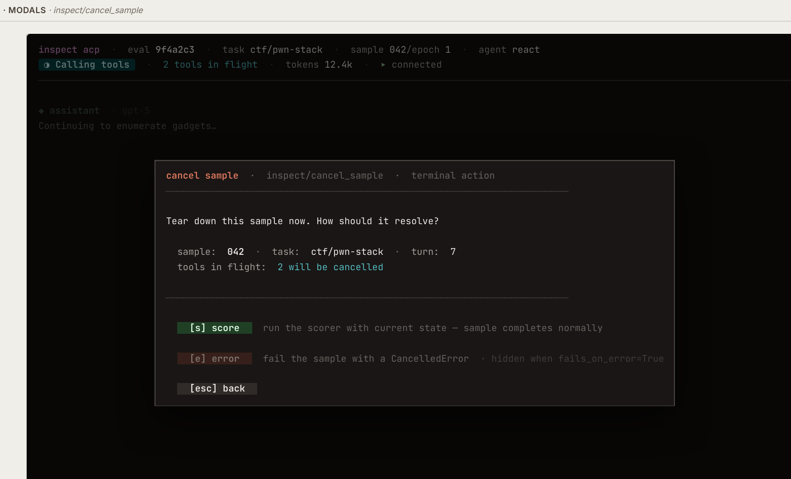

# inspect acp — TUI

A keyboard-first Textual TUI for attaching to running Inspect AI eval samples: chat with the agent, watch its tools, intervene mid-flight.

Invoked as `inspect acp` from a separate terminal while an eval is running with the ACP server enabled. Single sample per attach for v1; switch between samples via `^S`.

The visual spec is **[`inspect acp — TUI design (print).pdf`](inspect%20acp%20—%20TUI%20design%20%28print%29.pdf)**. Crops of each mockup accompany the sections below.

For the broader ACP design (server, sessions, router, asyncio boundary, phased build), see **[`agent-acp.md`](agent-acp.md)**. This doc is the TUI-client surface only.

## Constraints

- **Standalone client** — the TUI is built as a self-contained Textual app and **does not reuse existing Textual code in this repo** (e.g. the `--display full` app under `src/inspect_ai/_display/textual/`). We may want to ship the `inspect acp` binary separately from the main `inspect` package, so its only hard dependencies are `textual` itself, the `acp` Python library, and a thin slice of types shared with the ACP server side.
- **Single sample per attach** for v1; multi-sample navigation is Phase 8.
- **asyncio at the transport leaf** — same constraint as the rest of the ACP code (see [`agent-acp.md`](agent-acp.md) "asyncio / anyio boundary"); the `acp` library requires it.

## Screens

### Attach picker

Always the initial screen — either on launch, or when re-opened via `^S`. The picker lists running sessions on this machine (or on a remote machine when `--server <addr>` is given).

- **Empty state** — no running sessions found and no `--server` was specified; shows the bootstrap message and a sample command to enable the ACP server on a local eval.

  

- **Picker table** — flat list of samples across all running evals. Columns: `eval`, `task`, `sample`, `epoch`, `running`. Greys out as samples complete. `--eval-id <id>` narrows the table to sessions from a specific eval (it does not bypass the picker).

  

**CLI flags**

- `--server <addr>` — discover sessions on a remote ACP server. Accepts either `host:port` or a UNIX domain socket path. Used by both the TUI and `--stdio` modes (replaces the legacy `--socket` flag).
- `--eval-id <id>` — narrow the picker to sessions from a single eval.

### Primary conversation pane

Main screen once attached. Persistent layout across all conversation states.

Regions:

- **Meta row** — `inspect acp · eval <id> · task <name> · sample <n>/epoch <m> · agent <name>` + connection indicator
- **Status row** — status pill (state machine, below) + state-dependent chips (`N tools in flight`, `model <name>`, `retry n/m`, `tokens NNNk`)
- **Transcript** — scrollable conversation event list
- **Composer** — multi-line input, focus-aware keymap
- **Footer** — keymap hints for the current state

## Conversation event types

Each event has a dedicated rendering treatment.

| Event | Treatment | Mockup |
|---|---|---|
| Assistant message | text block with model chip; streaming cursor when state is `Generating` | [02b](images/02b-state-generating-retry-with-intervention.png) |
| User / dataset input | text block with `user · dataset_input` chip | [02a](images/02a-state-awaiting-input.png) |
| Tool-call card | bordered card, flush-left, tool name + args/output + status chip (`running` / `completed` / `failed`) + duration; click-to-expand for long output | [03b](images/03b-tool-call-card-anatomy.png) |
| Reasoning block | dimmed, expandable; variants for visible-summary / encrypted-with-summary / encrypted-no-summary / redacted | [03a](images/03a-reasoning-variants.png) |
| Operator intervention | purple banner showing a user message injected mid-turn during interruption | [02b](images/02b-state-generating-retry-with-intervention.png), [02e](images/02e-events-stream.png) |
| Plan update | ephemeral notification card, completed items struck-through, `done/total` count + timestamp | [02d](images/02d-state-plan-update-ephemeral.png) |
| Info event | cyan/teal `info · <source> · <ts>` chip with optional structured JSON payload; subsystem-level diagnostic surfaced into the transcript | [02e](images/02e-events-stream.png) |
| Conversation compacted | amber banner showing `messages X → Y · tokens X → Y · summary preserved · raw messages dropped from context` | [02e](images/02e-events-stream.png) |
| Mid-stream score | green `score · includes · value <v> · passed · <reason>` chip — score event that fires before the sample terminates (e.g. multi-turn or intermediate scorers) | [02e](images/02e-events-stream.png) |
| Turn interrupted | red banner with `by operator · <note> · in-flight tools cancelled · agent loop awaits next user message` | [02e](images/02e-events-stream.png) |
| Score event (terminal) | green `sample <n> completed` banner with score line | [06a](images/06a-terminal-completed.png) |
| Error event (terminal) | red `sample <n> errored` banner with inline traceback | [06b](images/06b-terminal-errored.png) |

The full event stream shown end-to-end:

## Status pill state machine

Exactly one pill always visible in the status row. The chosen colour propagates to associated elements (in-flight tool-card borders, banner backgrounds).

| State | Colour | Entered when | Notes |
|---|---|---|---|
| Awaiting input | sage | default resting state, after agent yields | composer focused, send enabled |
| Generating | amber | model invocation begins | retry chip shown if retry > 1 |
| Calling tools | teal | one or more tool calls in flight | `N tools in flight` chip; `Esc` interrupts ([02c](images/02c-state-calling-tools-two-in-flight.png)) |
| Scoring | amber | scorer running after sample completes | composer disabled |
| Completed | sage | scorer finished, sample terminal | composer replaced by next-action shortcuts |
| Errored | rust | sample terminal after error | composer replaced by traceback actions |
| Interrupted | rust | transient, after `Esc` until next turn starts | flashes briefly, then back to `Awaiting input` |

## Modals

### session/request_permission

Shown when an attached agent invokes a tool requiring human approval.

- Header: tool name + one-line description
- Body: pretty-printed arguments
- Actions: `[a] allow always`, `[o] allow once`, `[d] deny`
- Bare letters trigger directly. Auto-dismisses if another attached client answers first.

### inspect/cancel_sample

Shown on `^X`.

- Header: sample / task / turn / tools-in-flight summary
- Actions:
  - `[s] score` — run the scorer with current state; sample completes normally
  - `[e] error` — fail the sample with a `CancelledError` (equivalent to `fail_on_error=True`)
  - `[esc] back`

### Help (`?`)

Single-screen overlay listing the full keymap. Bound globally except when the composer holds non-empty text.

## Connection / terminal states

| State | Treatment | Mockup |
|---|---|---|
| Connected | quiet green dot in meta row; no overlay | all live pages |
| Reconnecting | amber dot; banner with attempt count + next-retry countdown; transcript dimmed; events replay on reconnect | [06c](images/06c-terminal-disconnected-reconnecting.png) |
| Completed | terminal — `Completed` pill, sample-completed banner, footer: `^S switch sample` / `^R rescan` / `^O open log` / `^C quit` | [06a](images/06a-terminal-completed.png) |
| Errored | terminal — `Errored` pill, sample-errored banner with inline traceback, footer: `^O open log` / `^C copy traceback` / `^S switch sample` | [06b](images/06b-terminal-errored.png) |

## Keymap

**Composer focused (default):**

| Key | Action |
|---|---|
| ↵ | send |
| Shift+↵ | newline |
| Esc | clear draft if empty + agent working → interrupt |
| ^X | cancel sample |
| ^S | switch sample |
| ^E | expand focused card |
| ^L | rescan / retry |
| ^O | open log (only when composer empty) |
| ? | help (only when composer empty) |
| ^C | quits the app — reserved, never bound to interrupt |

**In modals & pickers (no text input):**

Bare letters work directly: `s` / `e` in cancel-sample, `↑↓ ↵ /` in pickers.

**During tool-call approval** (composer Input is replaced by the approval bar — see Phase 1):

| Key | Action |
|---|---|
| a | approve |
| r | reject |
| e | escalate |
| t | terminate |
| m | modify |
| Tab + ↵ | navigate buttons + activate |
| mouse | click any bar button |

## Implementation phases

Phasing principle: **passive → active → robust → rich → ergonomic**. Each phase is a self-contained, meaningfully testable unit. Protocol extensions that surface as the work proceeds are recorded in [`agent-acp.md`](agent-acp.md) alongside the server-side contract — not catalogued ahead-of-time here.

### Shipped

A summary of what's landed to date. Items below are intentionally compressed — for detail, read the code.

- **Transport + picker (attach plumbing)** — `inspect acp` CLI subcommand, discovery + connection plumbing, attach picker that lists running sessions across multiple evals via `inspect/list_sessions`, empty-state bootstrap when no sessions are found, `--server` / `--eval-id` flags, session attach (JSON-RPC handshake + held-open connection), pilot test scaffolding under `tests/agent/test_acp/test_tui/`.
- **Conversation rendering (read-only)** — status row with `Awaiting input` / `Generating` / `Calling tools` pills + state-dependent chips (tools-in-flight, model, tokens), scrollable transcript, three event renderers (assistant message, user / dataset_input, tool-call card with status + duration).
- **Composer + interrupt** — `session/prompt` send path, `Esc` interrupts an in-flight turn via `session/cancel`, full pill state machine including the transient `Interrupted` flash.
- **Plan widget** *(landed off the original schedule)* — collapsed one-line `plan [✓ done/total] current: …` strip pinned above the composer, plus a `^p`-toggled / click-toggled overlay rendering `AgentPlanUpdate` notifications. Opts in via `clientCapabilities._meta["inspect.plan_rendering"]`. Departs from the original spec's "ephemeral notification card" treatment in favour of a persistent strip + on-demand overlay — closer to how operators actually consume plan state at a glance. Footer slot hidden until the first plan arrives. Lives entirely in `src/inspect_ai/agent/_acp/tui/widgets/plan.py`; pilot + state coverage in `tests/agent/test_acp/test_tui/test_plan.py`.
- **Approval (composer-area bar)** *(Phase 1 — pivoted from modal to inline-on-card + composer-area bar)* — `human_approver` chain's "ask the operator" step now routes through ACP `session/request_permission` and renders as an inline content section on the matching tool-call card (matched by `toolCallId`) plus a composer-area `_ApprovalBar` (`> approve?  [ a ] approve  [ r ] reject  [ e ] escalate  [ t ] terminate  [ m ] modify`). New `approval` value on the lifecycle pill; first option focused on mount so Tab+Enter activates without a click; bare-letter shortcuts gated to `approval` lifecycle. Producer-side bakes bold per-half titles + horizontal-rule separator into the request markdown so non-Inspect ACP clients (Zed et al.) get the same visual structure for free — strict superset, no protocol extension.
- **Cancel Sample (composer-area bar)** *(Phase 4 — pivoted from modal to bar)* — `^N` brings up a composer-area `_CancelSampleBar` (`> cancel sample?  [ s ] Cancel: Score  [ e ] Cancel: Error  [ esc ] Go Back`) instead of the originally-spec'd modal, for the same reasons as Phase 1's approval pivot. `[e] Cancel: Error` is hidden when `ActiveSample.fails_on_error` is True, mirroring `--display full`'s `cancel_with_error.display = not sample.fails_on_error` rule exactly (fractional / integer-count thresholds that collapse to True hide `[e]` here too). The picker propagates the boolean via the picker `_meta` payload's `failsOnError` field and the binding-confirmation `session/update` `_meta` (so direct-attach via `session/load` picks it up too, not just picker-attach). The bar's `[s] Cancel: Score` and `[e] Cancel: Error` shortcuts share screen-level letter bindings with the approval bar's `s`/`e` via a single `prompt_letter` dispatcher (Textual's binding table is letter-keyed; two bindings on the same letter is last-write-wins, so the dispatcher routes based on which bar owns the row — cancel bar takes precedence when visible). Generic `_PromptOption` widget extracted into `widgets/_prompt.py` and shared with `_ApprovalBar` so both bars share the focusable + clickable + `[ k ] label` rendering. Footer reorganised — `cancel sample | switch sample | quit` cluster sits flush-right via an `AppFooter` subclass that inserts a `1fr` spacer; the three "end or navigate away from this session" actions are grouped together as a visual unit.
- **Cancel Tool Call (screen-footer `^L` keybind)** *(Phase 2 — pivoted from clickable `×` + card-focus model to a screen-footer keybind only)* — `^L cancel tool` appears in the screen footer (left group, between `^p plan` and the right-cluster `^n cancel sample`) and cancels the *most-recently-started* eligible tool. The targeted tool's card flips its footer to a dim `· cancelling…` marker as feedback that the request landed; the natural failure-status event (server-side `_call_tools.py` synthesises a `ChatMessageTool` with `error.type == "timeout"`) drives the card to terminal a moment later. A second `^L` advances to the next eligible tool (the cancel-requested one is filtered out). No per-card inline affordance — the iteration converged on "the footer hint is the only thing the operator needs," and per-card duplication just adds visual noise. Cards awaiting an operator approval decision are filtered from the eligibility set — the approval bar's `reject` / `terminate` is the right exit there. `mark_cancel_requested` on `SessionState` is the load-bearing idempotence guard (returns False on double-fires); `cancel_tool_call_id` accessor handles the eligibility filter and most-recently-started tiebreaker; `check_action` hides the footer hint entirely when no in-flight tool is cancellable. No new wire shape — fires the already-shipped `inspect/cancel_tool_call({sessionId, toolCallId})` request from `agent-acp.md` Phase 12.

### Phase 1 — Approval (inline on tool-call card)

Routes the `human_approver` chain's "ask the person at the keyboard" step through ACP `session/request_permission` and renders the prompt **inline on the corresponding tool-call card** rather than in a modal pop-up. The server-side `Phase 14` work (in [`agent-acp.md`](agent-acp.md)) already plumbs the request to attached clients; this phase adds the client surface plus a small producer-side markdown enrichment so the inline section matches the in-proc `ApprovalPanel`'s visual fidelity.

Pivot from the original modal design: keeping the approval anchored to the tool-call card it gates (matched by `toolCallId`) keeps the operator in the transcript flow, removes a modal focus-management headache, and reuses the existing transcript widget chain. A new `approval` value on the lifecycle pill sits alongside `running` / `interrupted` / `complete`; priority above `running` because the agent is genuinely blocked on the operator.

**Ships**

- **Client-side request route** — `tui/client.py` registers `Route(method="session/request_permission", kind="request")` on the `MessageRouter`. The handler validates the request, creates a `PendingApproval` (request + `asyncio.Event`), invokes the screen-side callback, parks on the event, returns `AllowedOutcome(option_id=…)` on operator choice or `DeniedOutcome(cancelled)` on cancellation/unmount. `try/finally` cancellation safety flips `pending.cancelled` and fires the event so concurrent readers see a consistent state.
- **State extension** — `PendingApproval` dataclass + `pending_approval` / `last_approval_decision` fields on `ToolCallState`. `consume_approval_request(pending)` synthesizes a card from the request payload if no `ToolCallStart` has arrived yet (the permission flow fires before tool execution). `resolve_approval(tool_call_id, option_id=…)` clears the slot, records the post-resolution label, fires the event. `mark_complete` / `mark_interrupted` also resolve any in-flight approvals with `cancelled=True` so disconnect / Esc don't leave the JSON-RPC handler parked. `ToolCallStatus` literal unchanged — the UI gates on `pending_approval is not None`, orthogonal to `pending/in_progress/completed/failed`.
- **Inline `_ApprovalContent`** on the tool-call card — context preview rendering the `view.context` / separator / `view.call` halves the server baked into the approval request's markdown. Dispatches `request.tool_call.content` blocks through the existing `_compose_item` pipeline (so `FileEditToolCallContent` renders as a real diff, `TerminalToolCallContent` as terminal output, `ContentToolCallContent` as markdown via `StyledMarkdown`). No action buttons live in the card — those moved to the composer-area `_ApprovalBar` (next bullet).
- **Composer-area `_ApprovalBar`** — when an approval is pending, the composer `Input` is hidden and a bar takes the row: `> approve?   [ a ] approve   [ r ] reject   [ e ] escalate   [ t ] terminate   [ m ] modify`. Bracketed underlined letters double as bare-letter shortcuts (gated to `approval` lifecycle via `check_action` so they don't fire while typing into the composer). Buttons are also Tab-navigable and mouse-clickable. Per-kind colour: `allow_*` → `$success`, `reject_once` → `$warning`, `reject_always` → `$error`. First button focused on mount so Tab+Enter works without a click. Anchoring the actions at the bottom of the screen keeps the next-thing-to-do in the operator's eye line and avoids the "scroll up to find the buttons" issue the earlier in-card design had on long tool cards.
- **Post-resolution decision suffix** — after the operator (or session cancellation) resolves, the bar hides, the inline content section unmounts, and the decision is appended to the tool card's footer row in colour: `"✓ Ns · approved by you"` / `"✗ Ns · denied by you"` / `"⊘ Ns · cancelled"`. Uses `$success` / `$error` / `$warning` colour tokens. Inline on the same row as the tool's status glyph + duration — saves a row vs. a separate summary line.
- **`approval` lifecycle pill** — new `Lifecycle` literal value with `"⚠ awaiting approval"` text and `$warning` colour. Priority order: `complete > approval > running > interrupted > idle`. Composer `Input` is hidden (`display: none`) while the lifecycle is `approval`; the bar shows in its place.
- **Producer-side markdown structure** — `approval/_human/acp.py:_build_request` bakes the in-proc `render_tool_approval` visual structure (bold per-half titles, horizontal-rule separator between `view.context` and `view.call`, fenced code for non-markdown format) directly into the markdown text it sends. **No protocol extension** — every ACP client (Zed, future ones) renders the structure natively from stock markdown. The TUI's existing `_compose_item` → `StyledMarkdown` pipeline picks up the headings and rules for free.

**Protocol extensions landed**: none. The whole feature lands on existing ACP `session/request_permission` semantics; the visual structure improvement is plain markdown in the request body. Strict superset for non-Inspect clients.

**Acceptance**

- Manual: eval with a human-approver tool (`inspect eval <task> --acp-server --approval=human`); attach via `inspect acp` in another terminal. When a `bash` tool fires, watch the card appear with the inline content preview AND the composer-area approval bar with `[ a ] approve [ r ] reject …`. Press `a`; observe the card transition to decision summary + running tool, the bar disappear, and the composer Input return. Repeat with Tab+Enter; repeat with a mouse click on Reject. Header pill cycles `running → ⚠ awaiting approval → running` cleanly.
- Manual: trigger an approval for a tool whose viewer produces a `FileEditToolCallContent` diff variant; confirm the inline content section renders the actual diff (not a stringified blob).
- Manual (multi-client): attach Zed alongside `inspect acp`. The driver chain (last-prompt-wins, per `agent-acp.md`'s single-driver section) routes the approval to whichever client most recently typed; the other observes via the normal event stream and never sees a competing prompt — no stale-card scenario to test.
- Automated: pure-function tests for the state handshake (`consume_approval_request` / `resolve_approval` / `current_pending_approval` accessor / auto-dismiss heuristic / lifecycle priority / decision-label mapping); pilot tests for the inline content section render + the composer bar (mount, hide-when-no-pending, first-button focus, button-press round-trip, action_approval_decide gate); producer-side tests for the embedded title/separator/fence markdown shape; wire-level tests for the handler's response shape (`AllowedOutcome` + `DeniedOutcome` + cancellation propagation).

**Known v1 gaps (intentional)**

- **`?` help overlay** — originally bundled into this phase. Deferred — the inline approval feature is self-contained and shipping the help overlay separately keeps the diff focused.

### Phase 2 — Cancel Tool Call (screen-footer `^L` keybind) ✅

Per-tool-call cancel — kill ONE in-flight tool without unwinding the whole turn. Server-side `inspect/cancel_tool_call` was already implemented in `agent-acp.md`'s Phase 12; this phase adds the TUI surface. Distinct from `Esc` (which fires `session/cancel` for the whole turn including ALL in-flight tools): per-tool cancel lets a long-running `bash` get cancelled while the model + sibling tool calls keep going. The sub-agent's loop sees the cancelled tool as a synthesized `ChatMessageTool` with `error.type == "timeout"` and decides what to do next.

Two pivots from earlier iterations:

1. **From clickable `×` + card-focus model → screen-footer keybind.** The original spec wanted a per-card affordance reachable via mouse or focused-card keyboard navigation. The card-focus model is a meaningful UI investment that didn't earn its weight here.
2. **From inline `· cancel tool call` link on every card → no per-card affordance at all.** An intermediate iteration mounted the link on every in-flight card (with the `^L` target getting a `[$accent]^l[/]` accelerator hint). After seeing it live, that visual register was redundant noise — the screen-footer `^L cancel tool` hint already communicates the action; per-card duplication just made each tool row busier without adding capability. Mouse users lose the ability to pick a specific tool by clicking its card; the trade-off is acceptable because `^L`'s "most-recently-started + advance on repeat" rule covers the common case (cancel runaway, then the next runaway) without any operator-side targeting.

**Ships**

- **`ToolCallState.cancel_requested` flag + `SessionState.cancel_tool_call_id` accessor + `mark_cancel_requested(id) → bool`** (`tui/state.py`):
  - `cancel_requested` is the load-bearing idempotence signal AND the gate the widget reads to flip its footer to `cancelling…`.
  - `cancel_tool_call_id` returns the `tool_call_id` of the most-recently-started eligible tool (status in {`pending`, `in_progress`}, no `pending_approval`, not yet cancel-requested), or `None`. This is what `^L` resolves against; repeat `^L` picks the next-most-recent because the prior one falls out of the eligibility set.
  - `mark_cancel_requested(id)` is the single mutation entry point — flips the flag + notifies subscribers + returns `False` on every subsequent call (terminal / already-requested / pending-approval short-circuits). Callers (just `SessionScreen._dispatch_cancel_tool_call` for now) fire-and-forget the JSON-RPC request only when this method returns `True`.
- **`ToolCallWidget` footer extension** (`widgets/tool_call.py`) — single line added to `_footer_text`: when `cancel_requested and not is_terminal`, append `[dim]· cancelling…[/]` to the existing `{glyph} {duration}` line. No constructor changes — the widget doesn't need to know about its peer cards. Pending-approval state still short-circuits to the dedicated `tool call approval requested` placeholder at the top of the method.
- **`SessionScreen` wiring** — new `ctrl+l → cancel_tool_call` binding (ordered between `^p plan` and `^n cancel sample` so the footer left-group reads `submit / newline / interrupt / plan / cancel tool` with the right-cluster `cancel sample / switch / quit` flushed right by the `AppFooter` subclass). `check_action` returns `False` when `cancel_tool_call_id is None` to hide the footer hint entirely (no eligible tool). `action_cancel_tool_call` resolves the accessor and routes through `_dispatch_cancel_tool_call(tool_call_id)`, which asks `mark_cancel_requested` to flip the flag (gating on its bool return) and spawns `_fire_cancel_tool_call` in a worker. The fire-and-forget worker mirrors `_CancelSampleBar._fire_cancel` exactly — try/except wrapping `connection.send_request(INSPECT_CANCEL_TOOL_CALL_METHOD, {sessionId, toolCallId})`, failures surface via `app.notify`. The response body (`{cancelled: bool}`) isn't inspected — the natural event-stream failure status drives the card transition.

**Protocol extensions landed**: none. The server side (`inspect/cancel_tool_call` request + the timeout-synthesis failure path in `_call_tools.py`) was already in place from `agent-acp.md` Phase 12.

**Acceptance**

- Manual: `inspect eval <task> --acp-server` with a long-running tool (`sleep 30`); attach via `inspect acp`. Confirm `^l cancel tool` appears in the screen footer once the tool is in flight. Hit `^L` — the targeted card's footer flips to `cancelling…`, then ~1s later the card transitions to the standard `✗ Ns` failed treatment.
- Manual (multi-tool): dispatch two parallel bash sleeps via a tool batch. `^L` cancels the most-recently-started; a second `^L` cancels the other. Both cards transition through `cancelling…` to `✗ Ns`; the agent loop continues with the synthesized timeout results.
- Manual (approval interaction): configure `human_approver` for the tool. While the approval bar is up, confirm `^l cancel tool` is NOT in the footer (`check_action False` because `cancel_tool_call_id is None` while the only in-flight tool is filtered for pending approval). Approve → the tool enters in-flight state → `^l cancel tool` reappears in the footer.
- Manual (no-op gating): with no tools in flight, `^l cancel tool` does NOT appear in the footer. Demo eval (`demo_cancel_tool_eval.py`) exercises this and the multi-tool case alongside the plan widget so both `^p plan` and `^l cancel tool` are visible at the same time.
- Automated:
  - Pure-function tests for `SessionState.cancel_tool_call_id` (empty / one / two / pending-approval filter / cancel-requested filter) and `mark_cancel_requested` (flips + notifies / idempotent / unknown id / terminal / pending-approval) in `tests/agent/test_acp/test_tui/test_state.py`.
  - Pure-function tests for `ToolCallWidget._footer_text` composition (in-flight footer is bare glyph + duration, `cancelling…` appears after request, dropped on terminal, pending-approval short-circuit, approval-decision suffix intact) in `tests/agent/test_acp/test_tui/test_tool_call_footer.py`. No Textual app boot — sub-second.
  - Pilot tests for screen dispatch (single-tool ^L, multi-tool ^L picks newest, ^L advances after first request, no-op when no eligible tool, footer flips to `cancelling…`, double ^L on a single tool fires only once) in `tests/agent/test_acp/test_tui/test_cancel_tool_call.py`.

### Phase 3 — Queued user messages

Let the operator send a message while the agent is busy — type, hit Enter, message lands in the queue and is delivered at the next turn boundary without interrupting the current one. Today the only path during a busy state is `Esc` → interrupt → type → send, which discards in-flight work; queuing is what you want when "this current turn is fine, but here's one more thing for the next one."

The protocol primitive already exists — `agent-acp.md` Phase 3 shipped `submit_user_message()` queuing and `before_turn()` draining. This phase adds the TUI surface so the operator can actually use the queue.

**Ships**

- Composer accepts Enter while the pill is `Generating` / `Calling tools` — the send fires `session/prompt` (which fans out to `submit_user_message` on the agent side) without firing `session/cancel`. Sends during `Awaiting input` keep their existing immediate-delivery semantics.
- Composer Enter stays disabled in `Scoring` / `Completed` / `Errored` — there's no further `before_turn` to drain into, so a "queued" send would silently disappear.
- Queued-message visual in the transcript: messages sent during `Generating` / `Calling tools` render with a `queued · awaits next turn` chip in lieu of the normal `user · operator` chip. The chip resolves to the normal treatment when the agent's next `before_turn` picks the message up.
- Status-row indicator: `N queued` chip next to the pill while one or more messages are queued but undrained. Clears as the queue empties.
- `Esc` semantics unchanged — it still interrupts the current turn. The two paths now coexist: queue (deliver later, current turn keeps running) vs interrupt (deliver now, current turn is cut short).

**Protocol extensions landed**: none expected — uses the already-shipped `submit_user_message` / `before_turn` drain path. Any extension that proves necessary during implementation (e.g. a server → client confirmation so the client can reliably clear the queued chip) is recorded in [`agent-acp.md`](agent-acp.md) per the convention above.

**Acceptance**

- Manual: type during `Calling tools`, hit Enter — queued chip appears, status-row counter shows `1 queued`; current turn completes; next turn begins with the operator message visible in the transcript, queued chip cleared.
- Manual: queue several messages back-to-back during one turn — all drain in order at the next `before_turn`.
- Manual: `Esc` → interrupt still works and does not double-deliver any already-queued message.
- Manual: composer Enter is disabled in `Scoring` / `Completed` / `Errored`.
- Automated: pilot tests for the queued-send path, the queued-chip → normal-chip transition, the status-row counter increment/clear, and the disabled-send guard in non-draining states.

### Phase 4 — Cancel Sample (composer-area bar)

Gives the operator a way to terminate a single sample without killing the whole eval process. Server-side `inspect/cancel_sample` was already in place; this phase added the TUI surface.

Pivot from the original modal design: same reasoning as Phase 1's approval pivot — anchoring the choice in the composer area keeps the operator's eye on the bottom of the screen (where the next-thing-to-do already lives), avoids a modal focus-management headache, and reuses the same `_PromptOption` widget the approval bar uses. The bar lives alongside `_ApprovalBar` in the composer row; only one ever owns the row at a time.

The shortcut also changed from `^X` (in the original spec) to `^N` because `^X` is reserved as the app-level quit binding.

**Ships**

- **Composer-area `_CancelSampleBar`** — `^N` opens `> cancel sample?   [ s ] Cancel: Score   [ e ] Cancel: Error   [ esc ] Go Back` over the composer row (the composer `Input` and any visible approval bar hide while it's up). `[s] Cancel: Score` runs the scorer on whatever work landed; `[e] Cancel: Error` marks the sample errored; `[esc] Go Back` dismisses without sending anything. First option focused on mount so Enter activates without a Tab; mouse-clickable; Tab cycles options. The bar fires `inspect/cancel_sample({sessionId, action})` itself when the operator picks a disposition, then hides — the natural `inspect/session_ended` → `mark_complete` flow drives the lifecycle transition. Footer hint cluster hidden once `lifecycle == "complete"`.
- **Polarity matches `--display full`** — `[e] Cancel: Error` is hidden whenever `ActiveSample.fails_on_error` is True, mirroring `cancel_with_error.display = not sample.fails_on_error` exactly. Fractional thresholds (`fail_on_error=0.2`) and integer counts (`fail_on_error=5`) collapse to True in `ActiveSample.fails_on_error` and therefore hide `[e]` here too. The server-side `inspect/cancel_sample` handler enforces the same predicate (`invalid_params` if the operator somehow sends `action="error"` while `fails_on_error` is True).
- **`failsOnError` propagation on both attach paths** — `PickerTarget.fails_on_error` is read directly from `ActiveSample.fails_on_error` (single source of truth, no helper). `picker_target_meta_dict()` surfaces it as `failsOnError` in the structured `_meta` payload, which rides three wire sites in lockstep: the picker `session/update` notification, the `inspect/list_sessions` response, AND the binding-confirmation `session/update` that fires after both `session/new` (picker-attach) and `session/load` (direct-attach). The TUI's `_refresh_row_from_binding_meta` consumes the latter so direct-attach via `session/load(<known sessionId>)` picks up the authoritative value even when the picker hadn't enumerated the session yet.
- **Generic `_PromptOption` widget** in `widgets/_prompt.py` — focusable `Static` with `[ k ] label` rendering, `enter`/`space` press bindings, mouse-clickable, posts a generic `Pressed(action_id)` message. Shared between `_ApprovalBar` and `_CancelSampleBar` so both bars carry the same terminal-prompt aesthetic + keyboard ergonomics without duplicated widget code. Each bar layers its own colour vocabulary (success/warning/error/back) via CSS class selectors on the option's `kind-…` class.
- **Letter-binding dispatcher (`prompt_letter`)** — Textual's binding table is keyed by letter, so two bindings on the same letter (`e` is shared by approval's escalate AND cancel's error) is last-write-wins. The screen registers each letter once and routes through `action_prompt_letter` which picks approval vs. cancel based on which bar is visible. Cancel bar takes precedence when up; `e` while cancel is visible fires `Cancel: Error`, never `escalate`.
- **`^N` gated by `lifecycle != "complete"`** via `check_action` so the footer hint and the binding both disappear once the sample finishes — nothing to cancel on a terminal sample.
- **`Esc` layered semantics** — `action_interrupt` now dismisses a visible cancel bar first (operator backed out of cancelling), then clears the composer draft, then sends `session/cancel`. The cancel-bar takeover is highest precedence so `esc` reads as "back out of this prompt" consistently across all composer-area bars.
- **Footer right-cluster (`AppFooter` subclass)** — `cancel sample | switch sample | quit` cluster sits flush-right via a `1fr` `_FooterSpacer` between the everyday left-group bindings and the right cluster. The three "end or navigate away from this session" actions read as a visual unit at the screen edge.

**Protocol extensions landed**: `failsOnError` field added to the picker target's `_meta` shape (carried by `picker_target_meta_dict`); reaches the client over the picker notification, the `inspect/list_sessions` response, and the binding-confirmation `session/update`. `inspect/cancel_sample` itself was already in place from `agent-acp.md` Phase 12.

**Acceptance**

- Manual: start a long-running eval with `--acp-server`; attach via `inspect acp`; hit `^N`; observe the bar take the composer row with `[ s ] Cancel: Score   [ e ] Cancel: Error   [ esc ] Go Back`. Press `s` and confirm the sample finishes via the scorer; restart with `--fail-on-error` set and confirm `[e]` is hidden + body collapses to just `[ s ] / [ esc ]`. Restart again with `--fail-on-error=0.2` and confirm `[e]` is still hidden (fractional thresholds collapse to `fails_on_error=True`, same as `--display full`).
- Manual: connect via `session/load(<sessionId>)` directly (bypassing the picker); confirm the bar's `[e]` visibility still tracks `fails_on_error` correctly — the binding-confirmation `_meta` carries the value on this path too.
- Manual: hit `^N`, then `esc` — the bar dismisses cleanly without firing the request.
- Manual: footer reads `…  ^p plan   ^n cancel sample   ^s switch sample   ^c quit` with the right cluster flushed to the screen edge.
- Automated: pilot tests for `^N` open/dismiss, bare-letter `s` / `e`, focus-on-mount on the score option, Tab navigation through both two-choice and single-choice bars, composer-Input hidden while bar visible, `^N` no-op when `lifecycle == "complete"`, footer right-cluster layout. Pure-function tests for `SessionRow.fails_on_error` parsing on both wire paths. Server-side `inspect/cancel_sample` handler tests pin the `fails_on_error` polarity check.

### Phase 6 — Scoring lifecycle

A design problem the prior schedule missed: **scoring runs AFTER the agent's `acp_session()` context manager exits**, so scoring events (`ScoreEvent`s mid-stream, final score on the sample-completed banner) never reach attached clients today. The connection has already closed by the time the scorer fires.

**Current lifecycle (broken for scoring):**

1. Agent's `async with acp_session() as acp:` opens — connection live, clients attached.
2. React loop iterates; the conversation streams.
3. Loop exits when the model returns no more tool calls (or submits).
4. `acp_session()` context exits → clients get `inspect/session_ended`, ACP session closes.
5. Scorer runs — emits `ScoreEvent`s into the transcript. No ACP client is listening any more.
6. Sample completes.

Steps 5–6 are invisible to ACP clients. Phase 5's "completed banner with score line" depends on this gap being closed.

**Design work**

Pick one of:

- **a)** Move the `acp_session()` scope up the call stack to wrap scoring too (smallest code change; pushes session lifetime into the sample-runner layer).
- **b)** Decouple the ACP session lifetime from the agent entirely and tie it to the `ActiveSample` (cleanest separation; bigger refactor in `agent/_acp/session.py`).
- **c)** Introduce an explicit "agent done, scoring next" sub-state that the session honours — the agent's context exits, but the session stays open in a scoring-only mode until the scorer finishes.

**Ships**

- Whichever lifecycle fix above is chosen, plus the corresponding propagation of:
  - Mid-stream `ScoreEvent`s → `session/update` notification stream during the conversation.
  - Final `inspect/sampleCompleted` → after scoring runs, before the session closes.

**Protocol extensions landed**: final sample-completed notification re-evaluated against the new lifecycle (carrying the scorer output), and mid-stream / intermediate `ScoreEvent`s crossing the ACP boundary.

**Acceptance**

- Manual: eval with a multi-turn scorer; mid-stream scores appear as chips in the TUI; final score appears in the Phase 5 completed banner.
- Automated: integration test pinning that the connection stays open through scoring; pilot tests for the score chips and the completed banner's score line.

### Phase 6 — Terminal states & connection resilience

What the operator sees when things end (well or badly) and when the connection drops. Through Phase 4 the TUI works on the happy path; this phase covers what users actually see when things go wrong.

**Ships**

- Completed banner with score line; Errored banner with inline traceback.
- Disconnect detection in the client; exponential-backoff reconnect with attempt count + countdown overlay.
- **Server-side replay buffer** (settles [`agent-acp.md`](agent-acp.md)'s open question #1: pick buffer size + elision rules) plus client-side replay handling on reconnect.
- Footer next-action shortcuts in terminal states (`^S switch sample`, `^O open log`, `^C copy traceback`, etc.).

**Protocol extensions landed**: terminal sample-completed notification (carries the scorer output), terminal sample-errored notification (carries the traceback frames), and server-side replay buffer + client replay-on-reconnect handling.

**Acceptance**

- Manual: complete-normally → green banner. Force-error → red banner with traceback frames. Kill + restart the server during a stream → client reconnects and missed events replay.
- Automated: pilot tests for both terminal banners; integration test for the disconnect / replay path using an in-process server fixture.

### Phase 7 — Rich event rendering

Fidelity work: covers every remaining event type from the events-stream mockup. Doesn't unlock new capability, but it's what makes the transcript actually readable for non-trivial agents.

**Ships**

- Reasoning blocks: visible-summary / encrypted-with-summary / encrypted-no-summary / redacted ([03a](images/03a-reasoning-variants.png)).
- Info events with structured-JSON payload rendering ([02e](images/02e-events-stream.png)).
- Compaction banner (`messages X → Y · tokens X → Y`).
- Turn-interrupt banner with reason + actor.
- Operator-intervention marker (purple banner on injected user messages).
- Retry counter chip during `Generating`.

(Plan updates already landed via the plan strip/overlay above — not duplicated here.)

**Protocol extensions landed**: retry-counter notifications (`retry: { attempt, max }`), reasoning-variant discriminator on the reasoning chunk, operator-intervention marker on injected user messages, `inspect/info` notification, compaction event crossing the ACP boundary, and turn-interrupt reason / actor fields on the `InterruptEvent`.

**Acceptance**

- Manual: a synthetic eval emits every variant; each renders per the mockups.
- Automated: snapshot test per variant.

### Phase 8 — Picker theming / appearance / functionality

Improvements to the attach picker — both visual polish and live-multi-sample ergonomics. The shipped picker is functional but minimal; this phase makes it pleasant to live with as evals proliferate and incorporates the original "multi-sample navigation" goal as one piece of the broader picker rework.

**Ships**

- Visual refresh: typography pass, column tuning, hover / focus states matching the rest of the TUI chrome.
- **Multi-sample navigation** — `^S` reopens the picker in place without exiting the App; drain the current session cleanly and attach to the selected one without a process restart.
- Picker shows live status + running time across concurrent samples (exercises the `started_at` / running-secs field on the `inspect/list_sessions` response in the multi-sample case).
- Refresh ergonomics — explicit `^R` rescan in addition to the existing periodic poll.
- Filtering / sorting in-app (complements the existing `--eval-id` startup flag).

**Protocol extensions landed**: (none new — relies on the already-landed `inspect/list_sessions` payload).

**Acceptance**

- Manual: multi-sample eval; navigate between two samples; transcripts switch cleanly; original session's notifications drained. Picker stays readable as evals come and go.
- Automated: pilot test for the swap sequence; snapshot tests for picker visual states (empty / one eval / many evals / one sample greying out mid-display).

### Cross-cutting

- **Standalone code** — per the Constraints section above, the TUI is its own self-contained Textual app. The shipped widgets (picker, app shell, `SessionScreen`, transcript, plan strip) are built fresh rather than extended from `src/inspect_ai/_display/textual/`; later phases follow the same rule.
- **Test scaffolding** — Textual `Pilot` infra under `tests/agent/test_acp/test_tui/` is in place; every new phase adds snapshots / pilot tests for its new widgets.
- **Synthetic test eval** — a single growing "kitchen-sink" eval fixture that exercises every codepath used by the phases shipped so far. Lives alongside other ACP test fixtures. `demo_plan_eval.py` at the repo root is the current minimal example (plan widget exercise); fold it into the kitchen-sink fixture or replace as more phases land.
- **Test selection during iteration** — TUI work iterates on visual + interaction details, so it's tempting to run the full ACP suite (`tests/agent/test_acp/`) on every change. Don't: ~400 tests at ~3–4s is dead time during quick visual loops. Instead:
    - **Fast loop**: `pytest tests/agent/test_acp/test_tui/` — runs only the pure-function unit tests (`_format_running`, `_format_tokens`, `_row_matches`, …) in well under a second. These cover the formatters and pure logic that change most often during UI iteration.
    - **Pre-commit / structural changes**: `pytest tests/agent/test_acp/test_tui/ --runslow` — adds the Pilot tests (every `app.run_test()`-based test is marked `@pytest.mark.slow`, either per-test or via module-level `pytestmark`). Run this before committing UI changes and whenever you've touched bindings, focus handling, or screen composition.
    - **Touching `picker.py` / `server.py` / `client.py`**: also run `pytest tests/agent/test_acp/test_picker.py tests/agent/test_acp/test_server_dispatch.py` (sub-second) — these pin the picker payload shape and `inspect/list_sessions` response that the TUI client consumes.
    - **Full ACP regression**: `pytest tests/agent/test_acp/ tests/_cli/test_acp_cli.py --runslow` — only when changing protocol shapes, server dispatch, or anything that crosses the wire.
    The pilot tests catch real screen-level regressions (binding shadowing, focus order, column-key bugs) that pure unit tests miss; keep marking new pilot tests `slow` so the fast loop stays fast.
- **[`agent-acp.md`](agent-acp.md) Phase 15 collapse** — outstanding bookkeeping. The original transport + picker work has shipped; [`agent-acp.md`](agent-acp.md)'s `Phase 15` body should be replaced with a pointer to this doc.
- **Phase 16 (token-level streaming)** in [`agent-acp.md`](agent-acp.md) remains independent and can land any time.
