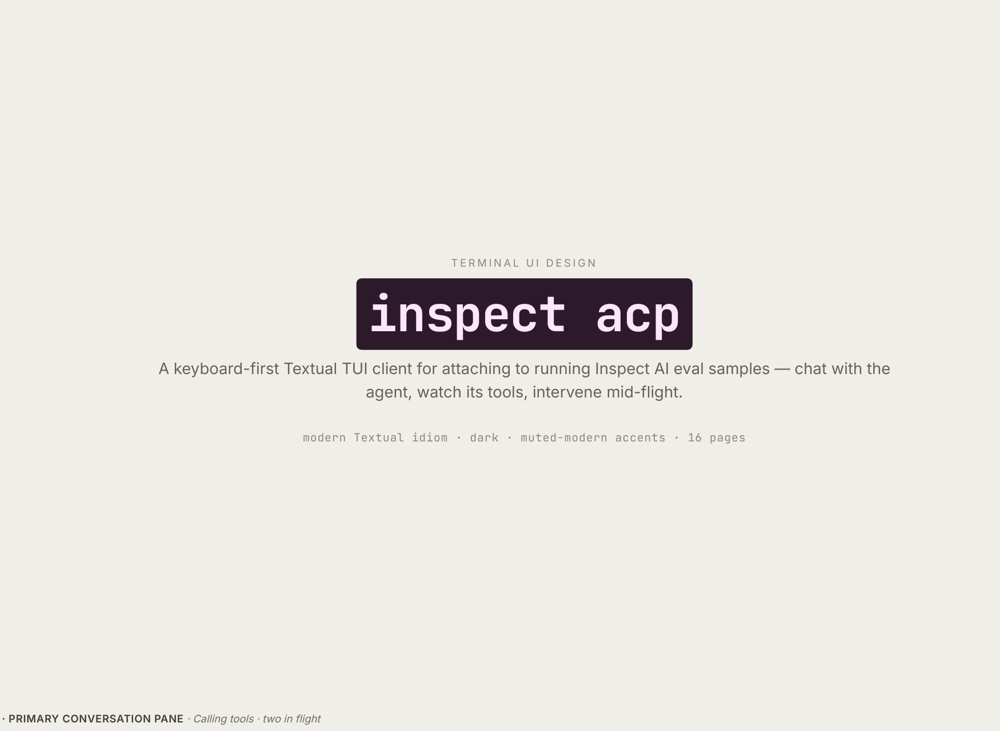

# inspect acp — TUI

A keyboard-first Textual TUI for attaching to running Inspect AI eval samples: chat with the agent, watch its tools, intervene mid-flight.

Invoked as `inspect acp` from a separate terminal while an eval is running with the ACP server enabled. Single sample per attach for v1; switch between samples via `^S`.

The visual spec is **[`inspect acp — TUI design (print).pdf`](inspect%20acp%20—%20TUI%20design%20%28print%29.pdf)**. Crops of each mockup accompany the sections below.

For the broader ACP design (server, sessions, router, asyncio boundary, phased build), see **[`agent-acp.md`](agent-acp.md)**. This doc is the TUI-client surface only.

## Screens

### Attach picker

Initial screen when no specific sample target is given on the command line, or when re-opened via `^S`.

- **Empty state** — no running evals have the ACP server enabled.

  

- **Picker table** — flat list of samples across all running evals. Columns: `eval`, `task`, `sample`, `epoch`, `running`. Greys out as samples complete.

  

### Primary conversation pane

Main screen once attached. Persistent layout across all conversation states.

Regions:

- **Meta row** — `inspect acp · eval <id> · task <name> · sample <n>/epoch <m> · agent <name>` + connection indicator
- **Status row** — status pill (state machine, below) + state-dependent chips (`N tools in flight`, `model <name>`, `retry n/m`, `tokens NNNk`)
- **Transcript** — scrollable conversation event list
- **Composer** — multi-line input, focus-aware keymap
- **Footer** — keymap hints for the current state

## Conversation event types

Each event has a dedicated rendering treatment.

| Event | Treatment | Mockup |
|---|---|---|
| Assistant message | text block with model chip; streaming cursor when state is `Generating` | [02b](images/02b-state-generating-retry-with-intervention.png) |
| User / dataset input | text block with `user · dataset_input` chip | [02a](images/02a-state-awaiting-input.png) |
| Tool-call card | bordered card, flush-left, tool name + args/output + status chip (`running` / `completed` / `failed`) + duration; click-to-expand for long output | [03b](images/03b-tool-call-card-anatomy.png) |
| Reasoning block | dimmed, expandable; variants for visible-summary / encrypted-with-summary / encrypted-no-summary / redacted | [03a](images/03a-reasoning-variants.png) |
| Operator intervention | purple banner showing a user message injected mid-turn during interruption | [02b](images/02b-state-generating-retry-with-intervention.png), [02e](images/02e-events-stream.png) |
| Plan update | ephemeral notification card, completed items struck-through, `done/total` count + timestamp | [02d](images/02d-state-plan-update-ephemeral.png) |
| Info event | cyan/teal `info · <source> · <ts>` chip with optional structured JSON payload; subsystem-level diagnostic surfaced into the transcript | [02e](images/02e-events-stream.png) |
| Conversation compacted | amber banner showing `messages X → Y · tokens X → Y · summary preserved · raw messages dropped from context` | [02e](images/02e-events-stream.png) |
| Mid-stream score | green `score · includes · value <v> · passed · <reason>` chip — score event that fires before the sample terminates (e.g. multi-turn or intermediate scorers) | [02e](images/02e-events-stream.png) |
| Turn interrupted | red banner with `by operator · <note> · in-flight tools cancelled · agent loop awaits next user message` | [02e](images/02e-events-stream.png) |
| Score event (terminal) | green `sample <n> completed` banner with score line | [06a](images/06a-terminal-completed.png) |
| Error event (terminal) | red `sample <n> errored` banner with inline traceback | [06b](images/06b-terminal-errored.png) |

The full event stream shown end-to-end:

## Status pill state machine

Exactly one pill always visible in the status row. The chosen colour propagates to associated elements (in-flight tool-card borders, banner backgrounds).

| State | Colour | Entered when | Notes |
|---|---|---|---|
| Awaiting input | sage | default resting state, after agent yields | composer focused, send enabled |
| Generating | amber | model invocation begins | retry chip shown if retry > 1 |
| Calling tools | teal | one or more tool calls in flight | `N tools in flight` chip; `Esc` interrupts ([02c](images/02c-state-calling-tools-two-in-flight.png)) |
| Scoring | amber | scorer running after sample completes | composer disabled |
| Completed | sage | scorer finished, sample terminal | composer replaced by next-action shortcuts |
| Errored | rust | sample terminal after error | composer replaced by traceback actions |
| Interrupted | rust | transient, after `Esc` until next turn starts | flashes briefly, then back to `Awaiting input` |

## Modals

### session/request_permission

Shown when an attached agent invokes a tool requiring human approval.

- Header: tool name + one-line description
- Body: pretty-printed arguments
- Actions: `[a] allow always`, `[o] allow once`, `[d] deny`
- Bare letters trigger directly. Auto-dismisses if another attached client answers first.

### inspect/cancel_sample

Shown on `^X`.

- Header: sample / task / turn / tools-in-flight summary
- Actions:
  - `[s] score` — run the scorer with current state; sample completes normally
  - `[e] error` — fail the sample with a `CancelledError` (equivalent to `fail_on_error=True`)
  - `[esc] back`

### Help (`?`)

Single-screen overlay listing the full keymap. Bound globally except when the composer holds non-empty text.

## Connection / terminal states

| State | Treatment | Mockup |
|---|---|---|
| Connected | quiet green dot in meta row; no overlay | all live pages |
| Reconnecting | amber dot; banner with attempt count + next-retry countdown; transcript dimmed; events replay on reconnect | [06c](images/06c-terminal-disconnected-reconnecting.png) |
| Completed | terminal — `Completed` pill, sample-completed banner, footer: `^S switch sample` / `^R rescan` / `^O open log` / `^C quit` | [06a](images/06a-terminal-completed.png) |
| Errored | terminal — `Errored` pill, sample-errored banner with inline traceback, footer: `^O open log` / `^C copy traceback` / `^S switch sample` | [06b](images/06b-terminal-errored.png) |

## Keymap

**Composer focused (default):**

| Key | Action |
|---|---|
| ↵ | send |
| Shift+↵ | newline |
| Esc | clear draft if empty + agent working → interrupt |
| ^X | cancel sample |
| ^S | switch sample |
| ^E | expand focused card |
| ^L | rescan / retry |
| ^O | open log (only when composer empty) |
| ? | help (only when composer empty) |
| ^C | quits the app — reserved, never bound to interrupt |

**In modals & pickers (no text input):**

Bare letters work directly: `a` / `o` / `d` in approval, `s` / `e` in cancel-sample, `↑↓ ↵ /` in pickers.

## `inspect/*` protocol extensions implied by the UI

Several UI elements depend on data that the current ACP surface doesn't expose. Each is listed below with the originating mockup, the data needed, and a tentative method / field name. The pattern follows the existing `inspect/new_session` extension method.

These are flagged here for discussion; the actual extension contracts will be locked in alongside their consumers and recorded in [`agent-acp.md`](agent-acp.md).

1. **Running time per sample** — picker shows `running` column ([04b](images/04b-attach-picker-table.png)). `inspect/listSessions` response needs `started_at` (or pre-computed `running_secs`) per session.

2. **Tools-in-flight count** — header chip `2 tools in flight` ([01](images/01-primary-pane-calling-tools.png)). Derivable client-side from open `tool_call` notifications; if we prefer server-canonical, add `tools_in_flight: int` to a session-state notification.

3. **Running token usage** — header chip `tokens 12.4k` ([01](images/01-primary-pane-calling-tools.png)). New `inspect/sessionStats` push (or extra fields on `session/update`) with running `input_tokens` / `output_tokens` / `total_tokens`.

4. **Retry counter** — `retry 1/3` chip during `Generating` ([02b](images/02b-state-generating-retry-with-intervention.png)). Model-retry events surfaced through `session/update` with `retry: { attempt, max }`.

5. **Agent name** — `agent react` in meta row ([01](images/01-primary-pane-calling-tools.png)). `inspect/new_session` response (or `inspect/sessionInfo`) carries the `@agent`-registered name.

6. **Reasoning block variants** — visible / encrypted-with-summary / encrypted-no-summary / redacted ([03a](images/03a-reasoning-variants.png)). The reasoning `agent_message_chunk` needs a discriminator (`reasoning_kind`) and optional `summary` text.

7. **Operator intervention marker** — purple banner for a user message injected during cancellation ([02b](images/02b-state-generating-retry-with-intervention.png), [02e](images/02e-events-stream.png)). The user-message event needs an `intervention: true` flag (or the surrounding `InterruptEvent → user_message → resume` sequence must be distinguishable client-side).

8. **Plan updates as ephemeral notifications** — separate visual treatment from regular events ([02d](images/02d-state-plan-update-ephemeral.png)). Either a `transient: true` flag on `session/update`, or a dedicated `inspect/planUpdate` notification.

9. **Tool-call timing** — each card shows duration ([01](images/01-primary-pane-calling-tools.png), [03b](images/03b-tool-call-card-anatomy.png)). `tool_call` start/end timestamps in the notification stream, or a `duration_ms` field on the completed update.

10. **`inspect/cancel_sample` method** — modal offers `score` vs `error` disposition ([05b](images/05b-modal-cancel-sample.png)). New method, distinct from ACP's `session/cancel` (which only cancels the current turn): `inspect/cancel_sample { disposition: "score" | "error" }`.

11. **Sample-completed notification with score** — terminal banner shows score line ([06a](images/06a-terminal-completed.png)). Final `inspect/sampleCompleted` notification carrying the scorer output (or equivalent appended to the standard stream).

12. **Sample-errored notification with traceback** — terminal banner shows traceback frames ([06b](images/06b-terminal-errored.png)). `inspect/sampleErrored { error_type, message, traceback: [Frame] }`.

13. **Replay on reconnect** — "events will replay on reconnect" overlay ([06c](images/06c-terminal-disconnected-reconnecting.png)). Confirms the server-side buffering decision from `agent-acp.md`'s open question #1; the TUI relies on it. Need to settle the buffer size + elision rules.

14. **`info` events** — subsystem-level diagnostic surfaced into the transcript ([02e](images/02e-events-stream.png)). New `inspect/info` notification carrying `source: str` (e.g. `inspect.utils.bash`, `benchmark.harness`), `message: str`, optional `payload: dict`, and `timestamp`.

15. **Compaction events** — `messages X → Y · tokens X → Y` banner ([02e](images/02e-events-stream.png)). The existing `CompactionEvent` in the transcript needs to traverse the ACP boundary — either via `session/update` with discriminator, or `inspect/compactionEvent { messages_before, messages_after, tokens_before, tokens_after, strategy, summary_preserved: bool }`.

16. **Mid-stream / intermediate score events** — `score · includes · value <v> · passed` mid-conversation ([02e](images/02e-events-stream.png)). The existing `ScoreEvent` can fire before the sample terminates (multi-turn or intermediate scorers); the stream needs to carry these distinctly from the terminal sample-completed banner.

17. **Turn-interrupt reason / note** — `by operator · redirecting to ret2libc path` ([02e](images/02e-events-stream.png)). The `InterruptEvent` (or its ACP-side counterpart) needs an optional `note: str` field plus the actor (`operator`, `policy`, `timeout`). Tools-in-flight count at cancel time is already implied by item 2.

## Out of scope (for this doc)

- Implementation phasing and sequencing (handled separately)
- Code sketches / module breakdown (handled separately)
- Server-side ACP architecture — covered by [`agent-acp.md`](agent-acp.md)
- Editor-side stdio bridge (`inspect acp --stdio`) — covered by [`agent-acp.md`](agent-acp.md)
- Token-level streaming visuals — flagged in [`agent-acp.md`](agent-acp.md) open questions
