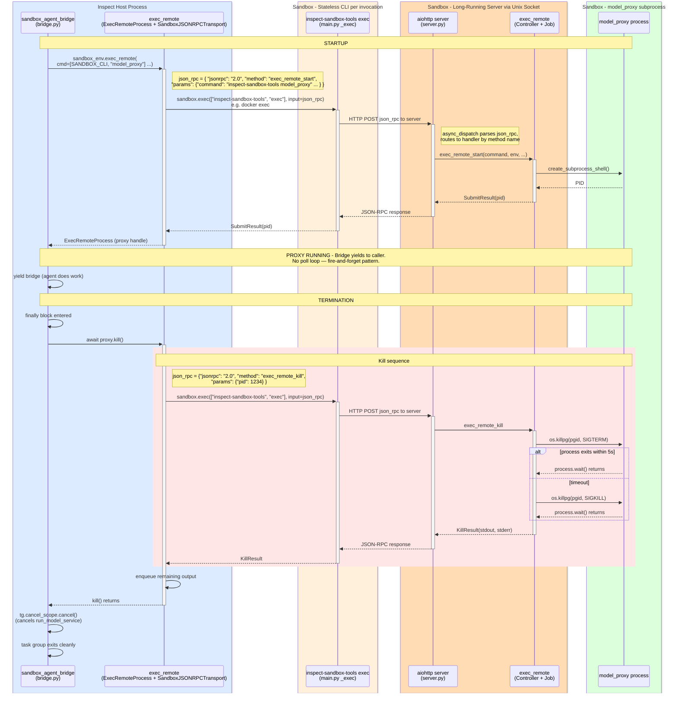

# Model Proxy Lifecycle: Start to Termination

This document traces the complete flow of running and terminating the model proxy within the sandbox via `sandbox_agent_bridge`.

## Sequence Diagram

