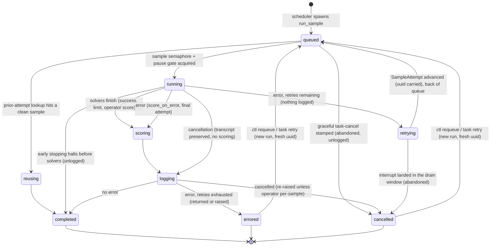

# The per-sample lifecycle in `task/run.py`

How one **sample run** — one `(sample, epoch)` slot in a task's fanout —
moves from queued to terminal, where each transition lives in
[`_eval/task/run.py`](../src/inspect_ai/_eval/task/run.py), and which
side-effects every terminal outcome must perform. Companion docs:
[`ctl/sample-requeue.md`](ctl/sample-requeue.md) (re-running a terminal
sample in a live eval), [`sample-source.md`](sample-source.md) (dynamic
sample feeds), [`retry-reused-sample-flush.md`](retry-reused-sample-flush.md)
(the reuse sweep on task retry).

Deliberately **not** a dispatch mechanism: transitions here are ordinary
control flow, and cancellation / fail-on-error propagate as exceptions
because they must tear down the task group (structured concurrency). The
consolidated pieces are the two things that were historically duplicated and
drifted — the terminal side-effects (`SampleTerminalReporter`) and the retry
re-entry (`task_run_sample`'s attempt loop over `SampleAttempt`).

## States and transitions

The code anchors:

- **queued → running / abandoned / reused.** `run_sample` (a closure in
  `task_run`) does the prior-attempt lookup (reuse / resume-checkpoint /
  carried error history — see `EvalSampleSource`), then calls
  `task_run_sample`. The queue itself is emergent: every run parks at the
  pause gate + sample semaphore inside `_task_run_sample_attempt`, and the
  graceful-cancel abandon check runs at queue exit, before the sample is
  even materialized.
- **running.** One `_task_run_sample_attempt` call: `active_sample` context,
  init span, sandbox, solvers under the limit scopes, scoring, then the
  shielded logging window. The early-stopping check is the first thing
  inside `active_sample` — a halted run is terminal completed without the
  init span ever opening (so nothing is logged), but unlike the queue-exit
  abandon it has already materialized and registered as an active sample.
- **retrying.** An attempt that errored with retries remaining returns a
  `_SampleRetry` to `task_run_sample`'s loop (after releasing the
  semaphore), which advances the `SampleAttempt` — error appended, sample
  uuid carried — and re-enters. Retries are re-entries of the *same run*:
  same uuid (the control channel's event cursor keys on it), no terminal
  side-effects for the failed attempt, its buffered log events removed.
- **terminal.** The attempt's tail dispatch resolves exactly one outcome and
  reports it through the run's `SampleTerminalReporter` (below). Cancellation
  is then re-raised to preserve structured concurrency (except an operator
  per-sample cancel, which is sample-scoped), and a fail-on-error terminal
  raises to tear the task down.

### Re-entries from outside the run

Three mechanisms re-run a `(sample, epoch)` key without being part of the
run's own attempt loop — all shaped as a **new run** (fresh uuid, fresh
retry budget, prior history seeded via `previous_attempt_errors`):

- **Task-level retry** (eval-set / `eval_retry`): a new eval attempt whose
  sample source reuses clean priors (the `reusing` state above) and seeds
  errored ones (`PreviousError` / resume checkpoints).
- **Requeue** (`ctl sample requeue`): re-adds a terminal errored/cancelled
  sample to the live run's scheduler; the prior terminal outcome is
  re-bucketed at accept (`record_sample_requeued`, progress un-tick). See
  `ctl/sample-requeue.md`.
- **`retry_immediate`**: a task-level retry variant minting a fresh log per
  attempt; from the run's perspective identical to task-level retry.

## Terminal side-effects: `SampleTerminalReporter`

Every terminal path must fire the same bookkeeping exactly once, and there
are eight such paths. Before the reporter existed each spelled the calls
out by hand, and paths missed pieces: the injected-slot release was once
forgotten on the reuse and early-stop paths (fixed separately), and until
this consolidation the drain-window abandon skipped the slot-release
callback entirely (benign in practice — a non-completed outcome only
`discard`s the epoch, and that epoch can't be in the completed set on this
path — but the invariant now holds by construction rather than by
argument). One reporter is created per run in `run_sample` and shared by
all of the run's attempts; only the attempt that goes terminal reports.

| Terminal path (in `_task_run_sample_attempt` unless noted) | Counter | Slot release | Progress tick | Metrics (`sample_complete`) | Log record |
| --- | --- | --- | --- | --- | --- |
| completed (no error) | completed + usage | ✓ | ✓ | scores (may be empty) | written |
| errored, returned (`fail_on_error` off / threshold uncrossed) | errored + usage | ✓ | ✓ | scores, when present | written with error |
| errored, raised (fails the eval) | errored + usage | ✓ | ✓ | — (eval is dying; scores stay in the sample log) | written with error |
| cancelled (external / sibling / operator per-sample) | cancelled + usage | ✓ | ✓ | — | written with error |
| drain-window abandon (interrupt suppressed a pending retry) | cancelled + usage | ✓ | — | — | removed |
| abandoned before start (graceful task-cancel while queued) | cancelled | ✓ | — | — | never written |
| early stop | completed | ✓ | — | — | never written |
| reused prior sample (`run_sample`, never enters `task_run_sample`) | completed + prior usage | ✓ | ✓ | prior scores | re-logged |

Column meanings:

- **Counter** — `record_sample_completed` / `errored` / `cancelled` in
  `_control/eval_state.py`: lets the eval reach `total` and read as
  finished, accumulating the run's token/message usage.
- **Slot release** — the `sample_terminal` outcome callback
  (`note_injected_terminal`): frees a SampleSource-injected sample's
  in-memory slot once every epoch *completed*; errored/cancelled epochs keep
  it resident because a requeue's re-run needs the source data.
- **Progress tick** — one display progress unit; only outcomes that put (or
  reused) a result in the log tick, and they tick before the potentially
  slow, shielded log write (`SampleTerminalReporter.progress`, called from
  the logging block / reuse path — not from the terminal methods).
  Abandoned and early-stopped runs never tick; a requeue accept un-ticks.
- **Metrics** — the `sample_complete` callback: progress results (keyed by
  `(id, epoch)`, so a requeued run's fresh score supersedes), display
  metrics, and the `EarlyStopping.complete_sample` hook. Within a terminal
  report, the counter and slot release fire first, then metrics —
  uniformly, where the pre-reporter branches disagreed (the completed and
  reuse paths ran metrics first; the errored path counted first). Metrics
  run user code that can raise or suspend indefinitely (custom metric
  computations, the early-stopping hook); counting first means a raise
  there cannot leave the run outside every terminal bucket, and the
  `completed_at`-keyed task-finished gates (task cancel, sample requeue)
  read the task as finished during a suspended hook on its last sample
  rather than accepting operations on a de facto finished task. The reuse
  path notifies its `SampleSource` after the full report, so a raising
  feed leaves the reused run counted completed rather than folding it to
  cancelled — accepted: a dynamic eval's counters are already guarded
  against "reached total ≠ finished".

Log/metrics agreement is the invariant behind the scores column: whatever
scores land in the sample's log record are also reported to metrics — and
only those (the raised-error path reports none because the eval finishes
with `results=None`).

## The attempt loop: `SampleAttempt`

`task_run_sample` used to retry by recursing with ~40 re-passed kwargs;
budget and history were two parameters that could in principle drift. It is
now a loop:

- `SampleAttempt` carries the run's invariant `retry_limit`
  (`retry_on_error`) plus the `errors` accrued, so `retries_remaining`,
  `number`, and `is_first` (which gates the once-per-run `sample_init` /
  `sample_start` hook emits) all derive from one list.
- `_task_run_sample_attempt` returns `_SampleRetry` (the triggering error +
  the attempt's uuid) to request re-entry — *after* exiting the semaphore
  scope, so the retry re-acquires it and goes to the back of the queue.
- `previous_attempt_errors` (task-level seed) stays separate from
  `attempt.errors` (sample-level): the seed doesn't consume the retry budget
  and doesn't suppress the first-attempt hook emits; the logged sample and
  the `active_sample` error history concatenate both.
