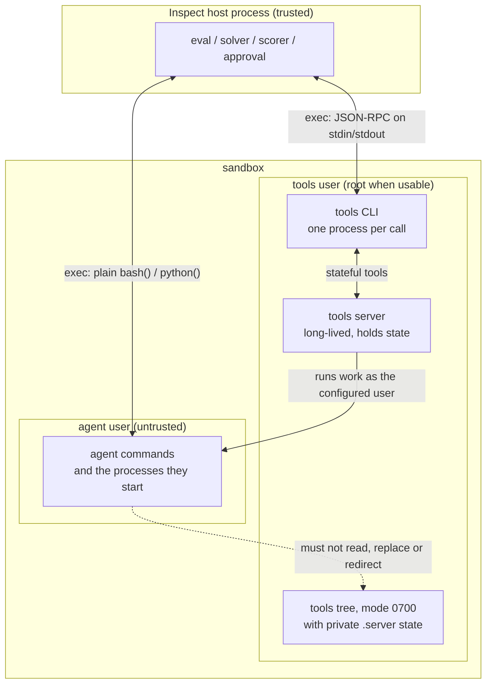

# Sandbox Trust Model and Directory-Security Contracts

Status: describes `main` as of 2026-10-06 (`38779d1e3`). Author: agent
(Claude), reviewed by Codex; see the PR.

## Scope

This document describes what runs where when Inspect evaluates a model against
a sandbox, which principals exist inside a sandbox, what the boundaries between
them are meant to guarantee, and the two contracts Inspect uses for directories
it trusts inside a sandbox: the verified-directory contract and the
verify-before-use rule. [AGENTS.md](../AGENTS.md) points authors and
reviewers of any change that creates, adopts or trusts such a directory here,
and to the helper modules that implement these contracts
([host](../src/inspect_ai/util/_sandbox/_framework_directory.py),
[guest](../src/inspect_sandbox_tools/src/inspect_sandbox_tools/_util/server_dir.py)).

Containment depends on the sandbox provider and its configuration. The
built-in `local` provider runs commands as host subprocesses with the host
user's access to host files ("no sandbox" in the provider table of
[docs/sandboxing.qmd](../docs/sandboxing.qmd)); none of the containment
guarantees below apply to it. The directory contracts still apply to the
directories Inspect trusts there.

It is the container-internal counterpart to
[BINARY_INTEGRITY.md](../src/inspect_sandbox_tools/design/BINARY_INTEGRITY.md),
which covers whether the bytes injected into a sandbox are the bytes a
maintainer released. That document's trust anchor is merge rights to this
repository; this one's is the isolation the sandbox provider supplies.

Mechanics documented elsewhere are not repeated:
[src/inspect_sandbox_tools/AGENTS.md](../src/inspect_sandbox_tools/AGENTS.md)
for the build, injection and RPC layers,
[model-proxy-lifecycle.md](model-proxy-lifecycle.md) for the sandbox agent
bridge's proxy, [docs/agent-bridge.qmd](../docs/agent-bridge.qmd) for bridged
tools and bridge approval, and
[checkpoint-snapshot-strategy.md](checkpoint-snapshot-strategy.md) (section
4.6) for the security requirements on checkpoint egress and restore.

Paths below are relative to the repository root. `src/inspect_ai/` is
shortened to `ai/` and the injected package,
`src/inspect_sandbox_tools/src/inspect_sandbox_tools/`, to `guest/`.

## Security invariant and principles

**A principal's ability to reach a directory, file or channel inside a
sandbox is not evidence that Inspect may trust what it finds there, or that
the principal may use it.** Three principles follow, and every component that
crosses a boundary described below is held to them:

- **Location is not a secret.** Sandbox paths are fixed in this repository's
  source and visible in the process table. No control may depend on a
  principal failing to discover a location.
- **Reaching a transport is not authorization.** Filesystem permissions decide
  which principals can reach an object; they say nothing about whether a
  particular request should be honoured.
- **Privileged components treat agent-influenced input as untrusted.** Names,
  file contents, archive members, process identifiers and persisted state that
  the agent could have shaped are data, whichever API delivers them.

## Architecture

### Principals and privilege zones

The evaluated model, and any code it runs, is the untrusted principal. Inspect
itself (the host process) is trusted. Inside the sandbox, Inspect's injected
tools run as the **tools user**, recorded on the sandbox object as
`_tools_user` (`ai/util/_sandbox/environment.py:195`).

The number of distinct principals inside a sandbox is a runtime property. It
depends on whether root is usable and on the user the agent's code actually
runs as, which is the user each model-facing tool runs as (see
[Tool user confinement](#tool-user-confinement)). For tools configured with
no `user`, that is the sandbox's default user:

| Configuration (tools with no `user` override) | Agent's commands run as | Tools user | Agent/tools privilege boundary |
|---|---|---|---|
| Root usable; default user is non-root | default (non-root) user | `root` | Present |
| Root usable; default user is root | root | `root` | Absent: same uid |
| Root not usable | default user | default user (`None`) | Absent: same uid |

"Root usable" means a `user="root"` exec runs as uid 0 with `CAP_SETUID`,
`CAP_SETGID` and `setgroups` allowed (`ai/tool/_sandbox_tools_utils/sandbox.py:398-424`).
The privilege boundary between the agent and the tools is a property of the
actual identities: it exists when every model-facing tool runs as a uid that
is neither root nor the tools user's uid. With no overrides that is only the
first row. An eval author can also establish it with explicit users:

- In a root-default sandbox, the tools run as root and model-facing tools
  configured as, for example, `bash(user="nobody")` and
  `bash_session(user="nobody")` keep the agent non-root.
- Where root is not usable, the tools run as the default user, and plain
  `bash()` or `python()` configured with another user that the provider can
  run (`bash(user="nobody")`) keep the agent out of the tools' private state.
  A tools process that is not root cannot switch user
  (`guest/_util/user_switch.py:36-50`), so injected tools such as
  `bash_session()` cannot be given another user there; leaving any
  model-facing tool on the default user then puts the agent in the tools
  user's uid.

Configuring any model-facing tool with `user="root"` removes the boundary.
Where it exists, the tools tree and the server's state are owned by the tools
user and mode `0700`, so the agent can neither read nor execute the tooling
that serves it. A root-owned `0700` tree is not a boundary against a process
that itself runs as root in the sandbox (`ai/util/_sandbox/_cli.py:16-20`).



### Root access is decided before the agent runs

Whether the tools may run as root is decided once per sandbox by
`resolve_root_access` (`ai/tool/_sandbox_tools_utils/sandbox.py:343-373`) and
never revisited. In an eval, sample init calls it for every sandbox after the
sample's files are copied and its setup script has run, and before solver or
agent execution begins (`ai/util/_sandbox/context.py:293-297`); a sandbox used
outside sample init is probed on first use. The verdict
(`ai/util/_sandbox/environment.py:152-174`) is one of:

- `usable`: the tools install and run as root;
- `unusable` (the provider refused root, or root cannot switch users): the
  tools install and run as the default user;
- `ambiguous` (no verdict could be read): the tools fall back to the default
  user and Inspect warns once that they run as the same user as the agent's
  own commands when those use the default user (`sandbox.py:215-244`);
- `failed` (the probe did not run or timed out): tool injection fails
  (`sandbox.py:179-198`).

### Processes in a sandbox

The injected executable is one multi-call program
(`guest/_cli/main.py:424-435`) that yields processes with different lifetimes:

| Process | Lifetime | Runs as | Serves |
|---|---|---|---|
| Tools CLI (`exec`) | One per host tool call | tools user | In-process tools (`text_editor`) itself; forwards every other method to the server |
| Tools server (`start-server`) | Sandbox lifetime | tools user | Stateful tools (`bash_session`, `exec_remote`, sandbox MCP servers) |
| Command processes | Per command | The user the tool was configured with | The tool's actual work |

The CLI routes on the set of in-process tools (`guest/_cli/main.py:179-228`).
The host never talks to the server directly; it always goes through a fresh
CLI process, and the CLI reaches the server over a Unix socket inside the
server's private state directory (see
[the guest contract](#guest-verified-directories)).

Plain `bash()` and `python()` (`ai/tool/_tools/_execute.py:65-176`) call
`sandbox.exec()` directly and never involve the injected tools. Tools are
injected on the first call to `sandbox_with_injected_tools()`
(`ai/tool/_sandbox_tools_utils/sandbox.py:101-122`), so an agent with a plain
exec tool can run commands, and create files anywhere its user can write,
before any injection has happened. This ordering is why the directories the
tools use must be verified rather than created with `mkdir -p` and trusted.

Injecting on first use is a product choice. Tools can be added to an eval
dynamically, so Inspect does not know in advance whether a sample will need
the injected tools; requiring authors to declare that need up front would let
Inspect inject before the agent runs. (The sandbox agent bridge already
injects during its setup, before the agent starts.)

### Delivery of the injected tools

The tools are not baked into images. On first use the host:

1. Checks for a trustworthy existing install: the tools tree
   (`/var/tmp/.da7be258e003d428`, `ai/util/_sandbox/_cli.py:31-33`) must satisfy
   the [verified-directory contract](#host-verified-directories) for the tools
   user and hold the launcher as a regular file. The check runs as the tools
   user that the root-access decision selects; when root is usable the default
   user's view is never consulted, so a tree planted under the agent's uid is
   never adopted (`sandbox.py:125-176`, `:247-269`).
2. Selects the artifact for the sandbox's architecture and libc: the copy
   bundled in the installed package, a download from S3, or a local build
   (`sandbox.py:608-660`). A downloaded artifact is checked against the
   SHA-256 digest vendored in `SHA256SUMS` before it is used; a mismatch or a
   missing digest entry raises and nothing is written to the binaries
   directory (`sandbox.py:685-756`). Bundled artifacts are trusted as part of
   the installed package (see BINARY_INTEGRITY.md).
3. Creates or adopts the tools tree as a verified framework directory owned by
   the tools user (`sandbox.py:285-292`).
4. Streams the gzipped archive on stdin into `tar` running with the verified
   directory as its working directory, so no copy of the archive exists at a
   path another principal could write to (`sandbox.py:478-530`).
5. Re-verifies the tree immediately before starting the server from it by
   absolute path (`sandbox.py:297-311`).

### Pattern 1: host-driven agent

The agent loop runs in the Inspect process. The model proposes tool calls;
Inspect applies approval and limits, then calls the tool's Python function in
the host process and records the call (`ai/model/_call_tools.py:936`). Whether
any of the tool's work happens in a sandbox is the tool function's choice
([docs/sandboxing.qmd](../docs/sandboxing.qmd), Overview): a custom tool that
does not use a sandbox runs entirely in the host process with the host's
authority, and nothing in this document contains it.

Work a tool delegates to a sandbox is a host-initiated `exec`: `bash()` and
`python()` call `sandbox.exec()` directly, and for injected tools the JSON-RPC
request travels on the exec's stdin and the response on its stdout
(`ai/util/_sandbox/_json_rpc_transport.py:43-125`). On this path the sandbox
has no channel of its own to the host; untrusted output crosses the boundary
only as the response to a request the host made.

### Pattern 2: agent inside the sandbox

With the sandbox agent bridge the agent runs inside the sandbox and executes
its own tools there. Its model requests are relayed to the host through a
proxy started from the injected tools (`ai/agent/_bridge/sandbox/bridge.py:171`)
and a sandbox service; [model-proxy-lifecycle.md](model-proxy-lifecycle.md)
traces that lifecycle. A sandbox service is an inbound channel from the sandbox
to the host, which Pattern 1's tool path does not have.

### Where tool calls execute

| Tool kind | Executes | Inspect's position |
|---|---|---|
| Pattern 1 tool function | In the Inspect host process | Calls it after approval |
| Work a Pattern 1 tool delegates to a sandbox | In the sandbox, through `exec` or the injected tools | Issues each `exec` from the tool function |
| A bridged agent's own tools | In the sandbox, run by the agent | Sees the model response before the agent does ([approval](../docs/agent-bridge.qmd)); does not dispatch the call |
| Provider-side tools (web search, code execution) | At the model provider | Part of the model request |
| `bridged_tools` | In the Inspect host process | See [docs/agent-bridge.qmd](../docs/agent-bridge.qmd) |

Pattern 2 therefore gives model-level rather than tool-level observability:
the bridge module states that a bridged scaffold runs its own tool loop, so
`execute_tools()` never runs for its calls (`ai/agent/_bridge/_approval.py:1-6`).
Evaluations that depend on tool-level auditing should use Pattern 1.

### Tool user confinement

The user a tool runs as is host-side configuration, chosen by the eval author
when the tool is constructed: `bash(user=...)`, `python(user=...)`,
`bash_session(user=...)`, `text_editor(user=...)`, or `user` on the
`exec_remote` options (`ai/util/_sandbox/exec_remote.py:107`). It is captured
in the tool's closure and is not part of the model-facing schema: `bash()`'s
model-facing function takes only `command`
(`ai/tool/_tools/_execute.py:94-121`) and `text_editor()`'s takes only the
editing arguments (`ai/tool/_tools/_text_editor.py:86-95`). **The model
chooses what to run, not as whom.**

```python
use_tools([bash_session(user="nobody")])
```

Omitting `user` means the sandbox's default user for every one of these
tools. For plain `bash()` and `python()` the omitted user goes to
`sandbox.exec()` unchanged. For the injected tools, when the tools user is
root the host captures the default exec identity (uid, gid, groups and
`HOME`, `sandbox.py:427-470`) at injection and supplies it with every call
that names no user (`ai/util/_sandbox/_cli.py:36-49`); the tools switch to it
before running the tool's work, a no-op when they already run as that
identity. In a sandbox whose default user is non-root, running a tool as
root therefore requires an explicit grant from the eval author:
`bash(user="root")`, `bash_session(user="root")`, `text_editor(user="root")`
or an `exec_remote` user of `"root"`. In a sandbox whose default user is root,
omitting `user` runs the tool as root. A tools process that is not root never
switches user (`guest/_util/user_switch.py:36-50`).

## Threat model

### Trust anchors

| Anchor | Establishes |
|---|---|
| Isolation supplied by the sandbox provider and its configuration | Sandbox processes cannot reach host resources except through channels Inspect provides (not supplied by the `local` provider) |
| Merge rights to this repository | The tools artifact is the one maintainers released (BINARY_INTEGRITY.md) |
| Host process integrity | Approval policy, limits and credentials are as the operator configured them |

### Attacker positions

The evaluated model is the primary adversary. We assume it can run arbitrary
code as the user its tools run as, read this repository, enumerate processes
and files in the sandbox, create files anywhere that user can write, and do
all of this before Inspect first injects its tools.

Two secondary positions matter:

- **A co-resident process under a different uid**: a deliberately
  deprivileged agent alongside a more privileged default user, or a sidecar
  service.
- **Agent-influenced data consumed later by a more privileged component**:
  file names, archive contents, process state and anything else the agent
  shaped remains untrusted when it arrives through a nominally trusted API.

### Boundaries

| Boundary | Separates | Present |
|---|---|---|
| **A**: in-sandbox privilege | agent user and tools user | Both patterns, only when every model-facing tool runs as a uid that is neither root nor the tools user's |
| **B**: sandbox to host capability | sandbox processes and the Inspect process | Wherever a sandbox service runs, for example the sandbox agent bridge |
| **C**: mediation | what the agent does and what Inspect can refuse and record | Both patterns, with different strength |

### What the boundary must guarantee

These are the requirements every component crossing a boundary is held to.
Some components are still being hardened toward them, and this document will
describe that work as it lands.

1. Unless the eval author grants a model-facing tool the tools user's
   authority (by configuring `user="root"`, or by leaving `user` unset where
   the default user is root or is itself the tools user), the agent cannot
   execute code as the tools user. *(A)*
2. The agent cannot read, replace or redirect the tools tree, the tools
   server's state directory, or their contents. *(A)*
3. The agent cannot invoke host-side capability outside the paths Inspect
   mediates. *(B)*
4. A tool call Inspect declines is not executed by any route. *(C)*
5. Nothing the agent controls can cause a privileged component to act on a
   path or identity of the agent's choosing. *(A and B)*
6. Untrusted output crossing a boundary cannot subvert the component that
   parses, records or renders it. *(all)*

Guarantee 4 differs by pattern. When Inspect executes tools it can refuse a
call outright. When the agent runs its own loop, Inspect can only decline to
return a proposal; it cannot stop the agent acting without asking. Pattern 2
relies on containment where Pattern 1 relies on mediation.

Boundary A has the same presence condition in both patterns: both inject the
same tools under the same tools user, so in both, whether the agent is outside
the boundary depends on the identities its code runs as relative to that
user.

### Out of scope

- **Escape through the container runtime or kernel, and the isolation level
  of a provider.** That is the sandbox provider's concern; the `local`
  provider supplies none. A stronger isolation layer (a microVM) does not supply
  any guarantee above: Boundary A is internal to the guest, and Boundaries B
  and C are channels Inspect deliberately provides across the isolation layer.
- **Boundary A in single-principal sandboxes.** When the agent's code runs as
  root or as the tools user (a root default user with no `user` override, an
  explicit `user="root"`, or a model-facing tool left on the default user
  where root is not usable), there is no agent/tools privilege boundary and
  guarantees 1 and 2 are not supplied. Boundaries B and C remain in scope.
- **Denial of service by the agent against its own tooling.** An agent can
  refuse to cooperate regardless; for example, a directory it plants at a
  framework path makes the operation fail rather than be adopted.
- **Supply chain.** See BINARY_INTEGRITY.md.
- **Host compromise.** An attacker who can write to the host's
  `site-packages` can patch Inspect itself.

## Contracts

### Host verified directories

[`ai/util/_sandbox/_framework_directory.py`](../src/inspect_ai/util/_sandbox/_framework_directory.py)
is the one audited primitive the host uses to prepare a directory inside a sandbox that Inspect later trusts,
and to run commands against it. Its contract for a private framework
directory (`_framework_directory.py:13-30`):

- it is a real directory, not a symbolic link, and not reached through one at
  the leaf;
- it is owned by the uid the sandbox command runs as;
- its mode is exactly the mode the caller asked for: `0700` by default, never
  writable by group or others, never set-id or sticky
  (`framework_directory_mode`, `:345-377`);
- its parent is owned by that uid or by root, and is either not writable by
  group or others or is sticky, so no other principal can rename or unlink the
  directory out from under a verified path.

`SHARED_MODE` (`0o1777`) selects the one other policy: a sticky,
world-writable directory in which several users each keep a private framework
directory. It must be owned by root or by the uid the command runs as, and is
never repaired.

**Ancestors are the caller's responsibility.** Only the immediate parent is
checked (`:32-39`). A caller must choose a path whose ancestors are root-owned
and not writable by others; `/var/tmp/<name>` and `/root/.cache/inspect`
qualify. A path beneath a directory another principal controls (a home
directory, a project checkout) gets no guarantee from the helper.

**Refuse, do not repair.** Any existing entry that does not satisfy the
contract fails the operation with `FrameworkDirectoryError`, whose message
tells the user to remove the entry (`:41-47`, `:256-268`). Nothing is silently
replaced: a wrong-owner or wrong-mode directory may already hold planted
content. Callers must not fall back to a weaker owner or continue privileged
work on that error. The one exception is opt-in `repair_mode`, which sets the
mode of a directory the current uid already owns (`:69-75`, `:514-523`). Only
the rootless tools install uses it, to reuse a tools tree an older release
left at `0755`. It runs after the type, owner and parent checks, so the
directory's contents can only have been written by its owner, by root, or by a
principal the owner itself gave write access. Where the agent shares the
owner's uid the mode never protected anything; where the agent runs as another
uid, tightening the mode removes access only the owner could have granted.

**Binding to the verified object.** Verification runs in one `/bin/sh`
process (`_SCRIPT`, `:129-237`). The script `cd -P`s into the parent and then
the directory, checks ownership and mode on `.`, and compares `pwd -P` with
the expected physical path, which catches a symbolic link placed at the leaf
after the earlier test. It runs under `umask 077` with `PATH` replaced by the
four system directories. When a command is wrapped, the script `exec`s it
from inside the verified directory, so relative names in the command refer to
the verified object rather than to whatever the path names by then.

**Running as the user asked for.** `expected_uid` makes the script fail before
touching anything when `id -u` reports another uid; `expected_uid_for("root")`
pins uid 0 (`:334-342`), so a provider that ignores or downgrades
`user="root"` cannot pass off a default-user directory as root's.
`try_ensure_framework_directory_as_root` (`:564-650`) returns `False` when the
script ran as a uid other than 0 (`FrameworkDirectoryUserError`) or the
provider raised any other exception. That second case is deliberately broad,
because providers signal "cannot exec as root" with provider-specific
exceptions, so an unrelated provider failure also selects the caller's
fallback (`:575-590`, `:628-650`). The caller chooses the fallback user: a
sandbox service prepares the shared directory as the service's own user, which
is the user passed to `sandbox_service(user=...)` or the default user when
none is (`ai/util/_sandbox/service.py:661-675`); the human agent's installer
falls back to the default user (`ai/agent/_human/install.py:124-131`). A contract violation (`FrameworkDirectoryError`), a
check that could not be performed (`FrameworkDirectoryUnavailableError`), a
timeout and a `ValueError` are re-raised rather than read as "no root". This
per-call classification is separate from the sandbox's recorded root-access
decision ([above](#root-access-is-decided-before-the-agent-runs)), which
selects the tools user.

**Verdicts.** The script reports its verdict as a marker line on stderr and
announces successful verification with a marker just before it runs the
wrapped command, so the wrapped command's output cannot forge a verdict
(`:90-105`, `:380-480`). Providers must therefore return stderr separately from
stdout (`:56-59`). The error types are `FrameworkDirectoryError` (untrustworthy
entry or creation failure), `FrameworkDirectoryNotFoundError`,
`FrameworkDirectoryUnavailableError` (the check itself could not run, for
example `stat` missing), `FrameworkDirectoryUserError` (wrong uid) and a plain
`RuntimeError` when the script did not run at all.

The entry points:

| Function | Use |
|---|---|
| `ensure_framework_directory` (`:483-561`) | Create, or adopt only if it satisfies the contract |
| `try_ensure_framework_directory_as_root` (`:564-650`) | Attempt preparation as root; return `False` for a wrong uid or an unclassified provider exception; re-raise classified errors |
| `verify_framework_directory` (`:653-700`) | Re-check an existing directory immediately before acting on its contents with elevated authority |
| `exec_in_framework_directory` (`:703-779`) | Verify, then run a command with the verified directory as its working directory, optionally with stdin |
| `stat_in_framework_directory` (`:822-881`) | Report a direct child's own `st_mode` without following a symbolic link |
| `write_file_in_framework_directory` (`:926-985`) | Publish a file complete and in its final mode; an existing entry at the name is never replaced |

Current adopters: the tools tree (`ai/tool/_sandbox_tools_utils/sandbox.py`),
sandbox service directories (`ai/util/_sandbox/service.py:649-699`: a shared
sticky `/var/tmp/sandbox-services`, root-owned where root is usable, holding a
private directory per service), the checkpoint work area
(`ai/util/_checkpoint/_sandbox_dir.py:20-67`, root-only with no rootless
fallback), and the human agent's install directory
(`ai/agent/_human/install.py`).

### Guest verified directories

Inside the sandbox,
[`guest/_util/server_dir.py`](../src/inspect_sandbox_tools/src/inspect_sandbox_tools/_util/server_dir.py)
is the equivalent contract for the tools' own state. In an injected bundle the server's state directory is
`.server` beside the launcher, inside the tools tree only the tools user can
write (`server_dir.py:26-44`); the `local` sandbox supplies a per-sample
directory instead (`ai/util/_sandbox/local.py:67-71`, `:96-101`).

`ensure_private_server_dir` (`server_dir.py:60-135`):

- creates the directory with mode `0700` under `umask 077`;
- opens it with `O_NOFOLLOW | O_DIRECTORY` and checks the descriptor with
  `fstat`: a symbolic link, a non-directory, or an owner other than the
  effective uid is refused with an error telling the user to remove it;
- tightens a wrong mode with `fchmod` on that descriptor when `repair_mode` is
  set (the default for the server directory, on the same reasoning as the host
  helper's: the directory is already owned by the effective uid), and refuses
  it otherwise (the text editor's history directory);
- checks only the final component; the caller must supply parents protected
  against replacement by other principals.

Files inside the directory (the socket's pid, lock, log and status files) are
opened through `_open_private` (`server_dir.py:194-232`): `O_NOFOLLOW` and
`O_NONBLOCK`, then `fstat` must show a regular file owned by the effective uid,
and a newly created file is set to `0600` through the descriptor. Both the CLI
and the server create or verify the directory before use
(`guest/_cli/main.py:245-260`, `guest/_cli/server.py:128-131`), and the server
binds its socket under `umask 077` (`server.py:147-163`).

Further guest-side state follows the same contract:

- Oversized JSON-RPC responses spill to a `chunks` subdirectory verified the
  same way. Before an in-process tool switches to a sandbox user, the CLI
  reserves the spill file as the tools user, so the response still lands in
  tools-user storage (`guest/_util/json_rpc_chunking.py:1-8`, `:64-96`).
- The text editor keeps undo history as JSON in a directory private to the
  account it runs as, checked from root to leaf before use and verified with
  no repair, and reads the history file only if it is a private, singly linked
  regular file (`guest/_in_process_tools/_text_editor/text_editor.py:290-347`).
  Its directory view passes the path to `find` as one argument, never through
  a shell (`text_editor.py:39-41`).
- `exec_remote`'s `kill()` signals a job's process group only after checking,
  through a handle taken at spawn that records creation time, that the group
  leader is still the process the job started
  (`guest/_remote_tools/_exec_remote/_job.py:38-49`, `:194-237`).

A guard test fails on any `mkdir` or `makedirs` call in the guest package
outside `ensure_private_server_dir`
(`src/inspect_sandbox_tools/tests/test_server_lifecycle.py:252`). It checks
call names and placement, not safety: renamed functions, shell commands and
directory creation inside libraries are not detected.

### Verify before use

A verified directory is only as good as the next operation on it. Every
operation that acts on a trusted directory with elevated authority:

- **binds to the verified object**, by running inside the same shell that
  verified it (`exec_in_framework_directory`) or by using a descriptor the
  guest verified, rather than re-resolving the pathname later;
- **re-verifies immediately before execution** when code from the directory
  is about to run with the tools user's authority, as injection does before it
  starts the server (`sandbox.py:297-305`);
- **receives content on stdin**, or publishes it with
  `write_file_in_framework_directory`, rather than staging it at a path
  another principal can write (`sandbox.py:478-530`);
- **reads only entries of the expected kind**: `stat_in_framework_directory`
  reports a symbolic link as one, and the guest's `_open_private` accepts only
  regular files owned by the tools user.

Commands Inspect issues on its own behalf, as any user, follow the same rule
for programs: `ai/util/_sandbox/_privileged.py` launches `/bin/sh` by absolute
path and replaces `PATH` with `/usr/sbin:/usr/bin:/sbin:/bin` before anything
else runs, so a program the sandbox user planted on the image's `PATH` is never
run in Inspect's name (`_privileged.py:1-54`). The agent's own commands keep
the image's `PATH`. A guard test fails on any `exec` call in `src/inspect_ai`
outside the agent-facing tools that passes a literal argv starting with a bare
program name (`tests/util/sandbox/test_privileged.py:460-490`).

## Considered alternatives

### Randomizing paths (rejected as a primary control)

Randomizing the tools tree and server directory per run would make
pre-creation harder. It was not adopted as a control:

- **It provides no confidentiality.** The tools path appears in the argv of
  every tool call, visible in the sandbox's process table, so a random path is
  discoverable after one call.
- **It has a real tracking cost.** The value would have to be generated once,
  replayed on every invocation for the life of the sandbox, and rediscovered
  when attaching to an existing sandbox. The guest avoids this by deriving
  its state directory from its own launcher location.
- **The verified-directory contract already removes the pre-creation
  position**, statelessly.

It remains possible as defence in depth.

### Replacing a planted directory instead of refusing it

The helpers could remove a directory that fails the contract and create a
fresh one, which would keep the operation available. They refuse instead,
because the entry may already contain planted content and the right response
(remove it, fix its ownership, or investigate the image) is the user's
decision (`_framework_directory.py:41-47`). The cost is that a planted entry
turns into a failed operation with an error naming the path.

### Removing the in-sandbox privilege split

The largest reduction in attack surface would be to stop running privileged
tools alongside an untrusted agent: run the agent as root in a disposable
sandbox, so there is nothing to escalate to. With no user overrides, the
root-default and rootless configurations already collapse Boundary A. Boundaries B and C remain.

This is a product decision as much as a security one: evaluations that hide
root-owned assets from the agent, or that deliberately deprivilege it, depend
on the split. It is recorded so the choice is made deliberately.

## Adopting this document

A component that creates, adopts or trusts anything inside a sandbox, or that
crosses Boundary A, B or C, should be able to answer:

- Which principal creates, owns and may use it, which boundary does it sit on,
  and which of the guarantees above does it uphold? If the answer to "who may
  use it?" is "whoever can reach it", the component is not finished.
- Is every directory it trusts prepared by `ensure_framework_directory` (host)
  or `ensure_private_server_dir` (guest), under root-owned ancestors that
  others cannot write to?
- Does it refuse, rather than repair or fall back to a weaker owner, when the
  contract fails?
- Does every privileged operation bind to the verified object, or re-verify
  immediately before use, rather than re-resolve a pathname?
- Is content streamed or published atomically, never staged at a path another
  principal can write?
- Does every command it issues on Inspect's behalf go through
  `privileged_exec` or `privileged_shell`, or launch an absolute path?
- Does the user it runs as come from host-side configuration, never from a
  model-facing argument?
- Does it treat names, archive members, process identifiers and persisted
  state the agent could have shaped as untrusted, acting through descriptors
  or identity-bearing handles rather than bare names or numbers?

A change that alters a principal, a boundary or a contract described here
updates this document in the same pull request.
