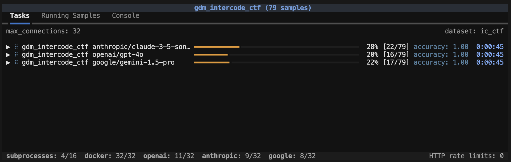

### Max Sandboxes

The `max_sandboxes` option determines how many sandboxes can be executed in parallel. Individual sandbox providers can establish their own default limits (for example, the Docker provider has a default of `2 * os.cpu_count()`). You can modify this option as required, but be aware that container runtimes have resource limits, and pushing up against and beyond them can lead to instability and failed evaluations.

When a `max_sandboxes` is applied, an indicator at the bottom of the task status screen will be shown:

Note that when `max_sandboxes` is applied this effectively creates a global `max_samples` limit that is equal to the `max_sandboxes`.

### Max Subprocesses

The `max_subprocesses` option determines how many subprocess calls can run in parallel. By default, this is set to `os.cpu_count()`. Depending on the nature of execution done inside sandbox environments, you might benefit from increasing or decreasing `max_subprocesses`.

### Max Samples

