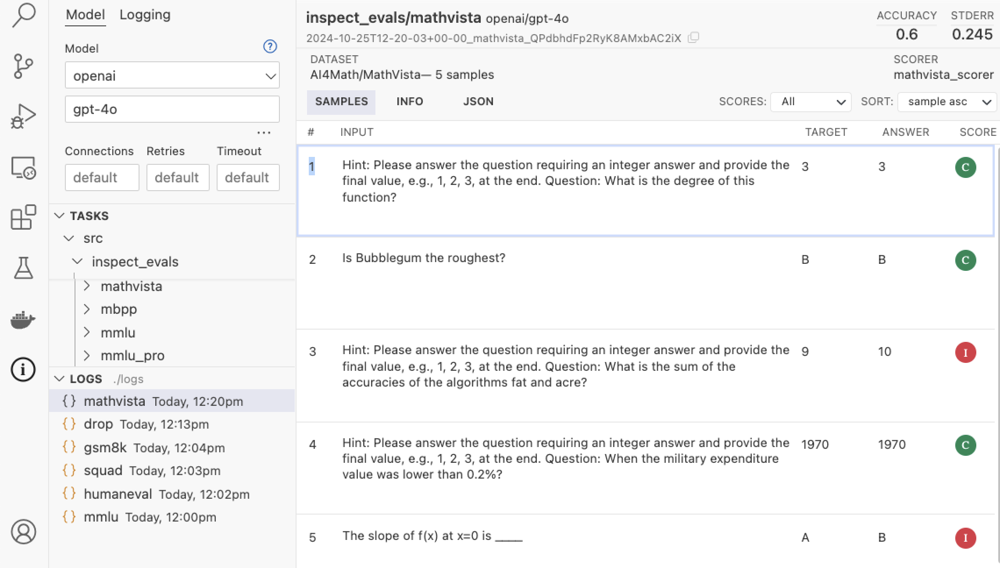
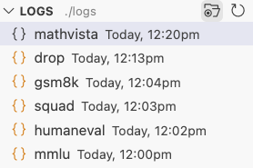
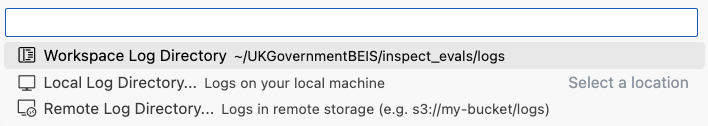
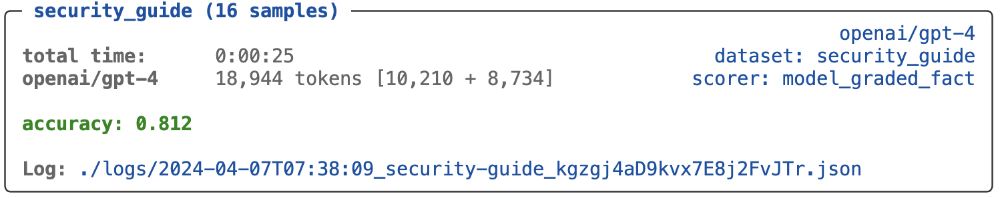

The **Logs** pane of the Inspect Activity Bar (displayed below at bottom left of the IDE) provides a listing of log files. When you select a log it is displayed in an editor pane using the Inspect log viewer:

{.border}

Click the open folder button at the top of the logs pane to browse any directory, local or remote (e.g. for logs on Amazon S3):

{.border width="27%" style="margin-right: 2%;"} {.border width="70%"}

Links to evaluation logs are also displayed at the bottom of every task result:

{fig-alt="The Inspect task results displayed in the terminal. A link to the evaluation log is at the bottom of the results display."}

If you prefer not to browse and view logs using the logs pane, you can also use the **Inspect: Inspect View...** command to open up a new pane running `inspect view`. 
