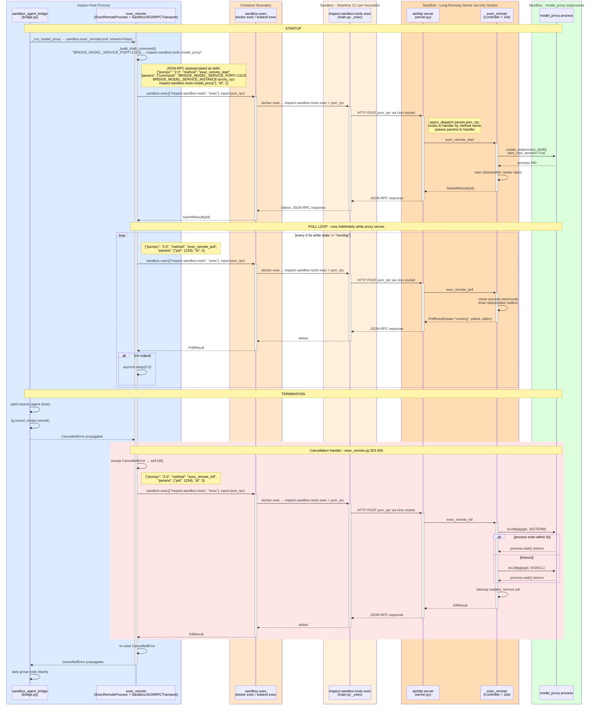

# Model Proxy Lifecycle: Start to Termination

This document traces the complete flow of running and terminating the model proxy within the sandbox via `_run_model_proxy`.

## Startup

### 1. `sandbox_agent_bridge` schedules `_run_model_proxy` in a task group
[bridge.py:147-152](../../src/inspect_ai/agent/_bridge/sandbox/bridge.py#L147-L152)

```python
tg.start_soon(_run_model_proxy, sandbox_env, port, instance)
```

### 2. `_run_model_proxy` calls `sandbox.exec_remote(stream=False)`
[bridge.py:191-199](../../src/inspect_ai/agent/_bridge/sandbox/bridge.py#L191-L199)

Passes the command `["/var/tmp/.da7be258e003d428/inspect-sandbox-tools", "model_proxy"]` with env vars `BRIDGE_MODEL_SERVICE_PORT` and `BRIDGE_MODEL_SERVICE_INSTANCE`.

### 3. `exec_remote(stream=False)` dispatches to `exec_remote_awaitable()`
[environment.py:294-295](../../src/inspect_ai/util/_sandbox/environment.py#L294-L295) → [exec_remote.py:368-419](../../src/inspect_ai/util/_sandbox/exec_remote.py#L368-L419)

### 4. `exec_remote_awaitable` creates an `ExecRemoteProcess` and submits it
[exec_remote.py:393-394](../../src/inspect_ai/util/_sandbox/exec_remote.py#L393-L394)

- `exec_remote_streaming()` constructs `ExecRemoteProcess`, calls `proc._submit()`
- `_submit()` builds a shell command string: `BRIDGE_MODEL_SERVICE_PORT=13131 BRIDGE_MODEL_SERVICE_INSTANCE=proxy_xyz /var/tmp/.../inspect-sandbox-tools model_proxy`
- Sends JSON-RPC call `exec_remote_start` with that command string

### 5. Inside the sandbox: `exec_remote_start` → `Controller.submit()` → `Job.create()`
[json_rpc_methods.py:16-19](../../src/inspect_sandbox_tools/src/inspect_sandbox_tools/_remote_tools/_exec_remote/json_rpc_methods.py#L16-L19) → [_controller.py:17-26](../../src/inspect_sandbox_tools/src/inspect_sandbox_tools/_remote_tools/_exec_remote/_controller.py#L17-L26) → [_job.py:20-51](../../src/inspect_sandbox_tools/src/inspect_sandbox_tools/_remote_tools/_exec_remote/_job.py#L20-L51)

`Job.create()` calls `asyncio.create_subprocess_shell()` with `start_new_session=True` (making the process its own process group leader). It starts background tasks reading stdout/stderr into buffers. Returns the PID to the host.

### 6. `exec_remote_awaitable` enters its poll loop
[exec_remote.py:400](../../src/inspect_ai/util/_sandbox/exec_remote.py#L400)

```python
async for event in proc:   # calls __anext__ repeatedly
```

Each `__anext__` call ([exec_remote.py:259-326](../../src/inspect_ai/util/_sandbox/exec_remote.py#L259-L326)):
- Sends JSON-RPC `exec_remote_poll` with the PID
- Inside sandbox, `Controller.poll()` → `Job.poll()` checks `process.returncode`, drains buffers, returns `PollResult(state="running", stdout=..., stderr=...)`
- If state is still `"running"` and no output, sleeps `poll_interval` (default 0.5s) and polls again
- The proxy is a long-running server, so this loop just keeps polling indefinitely

## Termination

### 7. `sandbox_agent_bridge` yields, then cancels the task group
[bridge.py:158-162](../../src/inspect_ai/agent/_bridge/sandbox/bridge.py#L158-L162)

```python
try:
    yield bridge           # caller does work here
    agent_completed = True
finally:
    tg.cancel_scope.cancel()   # cancels ALL tasks in the group
```

### 8. Cancellation propagates into `__anext__`
[exec_remote.py:323-326](../../src/inspect_ai/util/_sandbox/exec_remote.py#L323-L326)

The `__anext__` poll loop catches the cancellation exception:

```python
except anyio.get_cancelled_exc_class():
    await self.kill()   # kill before re-raising
    raise
```

### 9. `ExecRemoteProcess.kill()` sends JSON-RPC `exec_remote_kill`
[exec_remote.py:328-340](../../src/inspect_ai/util/_sandbox/exec_remote.py#L328-L340)

```python
async def kill(self) -> None:
    if self._pid is None or self._completed or self._killed:
        return
    self._killed = True
    await self._rpc("exec_remote_kill", {"pid": self._pid}, _KillResult)
```

### 10. Inside sandbox: `Controller.kill()` → `Job.kill()`
[_controller.py:40-47](../../src/inspect_sandbox_tools/src/inspect_sandbox_tools/_remote_tools/_exec_remote/_controller.py#L40-L47) → [_job.py:96-121](../../src/inspect_sandbox_tools/src/inspect_sandbox_tools/_remote_tools/_exec_remote/_job.py#L96-L121)

```python
async def kill(self, timeout: int = 5) -> None:
    if self._state != "running":
        return
    self._state = "killed"
    pgid = self._process.pid
    try:
        os.killpg(pgid, signal.SIGTERM)                  # graceful: SIGTERM to process group
        await asyncio.wait_for(self._process.wait(), timeout=timeout)  # wait up to 5s
    except asyncio.TimeoutError:
        os.killpg(pgid, signal.SIGKILL)                  # force: SIGKILL to process group
        await self._process.wait()
    except ProcessLookupError:
        pass                                              # already dead
    await self._wait_for_readers()                        # cancel background read tasks
```

Key detail: uses `os.killpg()` (not `process.kill()`) because `start_new_session=True` made the proxy its own process group leader. This kills the entire process tree.

### 11. Cleanup
[_controller.py:45-46](../../src/inspect_sandbox_tools/src/inspect_sandbox_tools/_remote_tools/_exec_remote/_controller.py#L45-L46)

After `Job.kill()` returns, `Controller.kill()` removes the job from its registry and calls `job.cleanup()` which cancels the background stdout/stderr reader tasks.

### 12. Back on host: cancellation re-raises

`ExecRemoteProcess.kill()` returns → `__anext__` re-raises the cancellation → `exec_remote_awaitable`'s `async for` terminates → returns `ExecResult(success=False, returncode=-1)` → `_run_model_proxy` never reaches its error-handling code (the cancellation propagates up) → the task group shuts down cleanly.

## Sequence Diagram



## Key Files

| File | Role |
|------|------|
| `src/inspect_ai/agent/_bridge/sandbox/bridge.py` | Orchestrator. `sandbox_agent_bridge()` context manager and `_run_model_proxy()` |
| `src/inspect_ai/util/_sandbox/environment.py` | `SandboxEnvironment.exec_remote()` dispatches to streaming/awaitable |
| `src/inspect_ai/util/_sandbox/exec_remote.py` | Host-side `ExecRemoteProcess`: submit, poll loop, cancellation → kill |
| `src/inspect_sandbox_tools/.../json_rpc_methods.py` | Sandbox-side JSON-RPC handlers for submit/poll/kill |
| `src/inspect_sandbox_tools/.../_controller.py` | Job registry, delegates to Job |
| `src/inspect_sandbox_tools/.../_job.py` | Wraps `asyncio.create_subprocess_shell`, SIGTERM/SIGKILL via `os.killpg()` |
