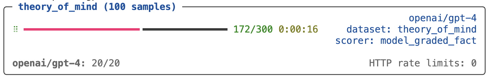

## Welcome

Inspect is a framework for frontier AI evaluations developed by the [UK AI Security Institute](https://aisi.gov.uk) and [Meridian Labs](https://meridianlabs.ai). Inspect can be used for a broad range of evaluations that measure coding, agentic tasks, reasoning, knowledge, behavior, and multi-modal understanding. Core features of Inspect include:

::: welcome-bullets
-   A set of straightforward interfaces for implementing evaluations and re-using components across evaluations.
-   A collection of over 200 pre-built evaluations ready to run on any model.
-   Extensive tooling, including a web-based Inspect View tool for monitoring and visualizing evaluations and a VS Code Extension that assists with authoring and debugging.
-   Flexible support for tool calling---custom and MCP tools, as well as built-in bash, python, text editing, web search, web browsing, and computer tools.
-   Support for agent evaluations, including flexible built-in agents, multi-agent primitives, the ability to run arbitrary external agents like Claude Code, Codex CLI, and Gemini CLI.
-   A sandboxing system that supports running untrusted model code in Docker, Kubernetes, Modal, Proxmox, and other systems via an extension API.
:::

We'll walk through a fairly trivial "Hello, Inspect" example below. Read on to learn the basics, then read the documentation on [Datasets](datasets.qmd), [Solvers](solvers.qmd), [Scorers](scorers.qmd), [Tools](tools.qmd), and [Agents](agents.qmd) to learn how to create more advanced evaluations.

If you are primarily interested in running evaluations rather than developing new ones, see the [Evals](evals/index.qmd) listing where you'll find implementations for over 200 popular benchmarks.

## Getting Started

To get started using Inspect:

1.  Install Inspect from PyPI with:

    ``` bash
    pip install inspect-ai
    ```

2.  If you are using VS Code, install the [Inspect VS Code Extension](vscode.qmd) (not required but highly recommended).

To develop and run evaluations, you'll also need access to a model, which typically requires installation of a Python package as well as ensuring that the appropriate API key is available in the environment.

Assuming you had written an evaluation in a script named `arc.py`, here's how you would setup and run the eval for a few different model providers:

::: {.panel-tabset .code-tabset}
#### OpenAI

``` bash
pip install openai
export OPENAI_API_KEY=your-openai-api-key
inspect eval arc.py --model openai/gpt-4o
```

#### Anthropic

``` bash
pip install anthropic
export ANTHROPIC_API_KEY=your-anthropic-api-key
inspect eval arc.py --model anthropic/claude-sonnet-4-0
```

#### Google

``` bash
pip install google-genai
export GOOGLE_API_KEY=your-google-api-key
inspect eval arc.py --model google/gemini-2.5-pro
```

#### Grok

``` bash
pip install openai
export GROK_API_KEY=your-grok-api-key
inspect eval arc.py --model grok/grok-3-mini
```

#### Mistral

``` bash
pip install mistralai
export MISTRAL_API_KEY=your-mistral-api-key
inspect eval arc.py --model mistral/mistral-large-latest
```

#### HF

``` bash
pip install torch transformers
export HF_TOKEN=your-hf-token
inspect eval arc.py --model hf/meta-llama/Llama-2-7b-chat-hf
```
:::

In addition to the model providers shown above, Inspect also supports models hosted on AWS Bedrock, Azure AI, TogetherAI, Groq, Cloudflare, and Goodfire as well as local models with vLLM, Ollama, llama-cpp-python, TransformerLens, and nnterp. See the documentation on [Model Providers](providers.qmd) for additional details.

## Hello, Inspect {#sec-hello-inspect}

Inspect evaluations have three main components:

1.  **Datasets** contain a set of labelled samples. Datasets are typically just a table with `input` and `target` columns, where `input` is a prompt and `target` is either literal value(s) or grading guidance.

2.  **Solvers** are chained together to evaluate the `input` in the dataset and produce a final result. The most elemental solver, `generate()`, just calls the model with a prompt and collects the output. Other solvers might do prompt engineering, multi-turn dialog, critique, or provide an agent scaffold.

3.  **Scorers** evaluate the final output of solvers. They may use text comparisons, model grading, or other custom schemes

Let's take a look at a simple evaluation that aims to see how models perform on the [Sally-Anne](https://en.wikipedia.org/wiki/Sally%E2%80%93Anne_test) test, which assesses the ability of a person to infer false beliefs in others. Here are some samples from the dataset:

| input | target |
|---------------------------------------------|---------------------------|
| Jackson entered the hall. Chloe entered the hall. The boots is in the bathtub. Jackson exited the hall. Jackson entered the dining_room. Chloe moved the boots to the pantry. Where was the boots at the beginning? | bathtub |
| Hannah entered the patio. Noah entered the patio. The sweater is in the bucket. Noah exited the patio. Ethan entered the study. Ethan exited the study. Hannah moved the sweater to the pantry. Where will Hannah look for the sweater? | pantry |

Here's the code for the evaluation[ (click on the numbers at right for further explanation)]{.content-visible when-format="html"}:

``` {.python filename="theory.py"}
from inspect_ai import Task, task
from inspect_ai.dataset import example_dataset
from inspect_ai.scorer import model_graded_fact
from inspect_ai.solver import (               
  chain_of_thought, generate, self_critique   
)                                             

@task
def theory_of_mind():
    return Task(  # <1>
        dataset=example_dataset("theory_of_mind"),
        solver=[                           # <2>
          chain_of_thought(),              # <2>
          generate(),                      # <2>
          self_critique()                  # <2>
        ],
        scorer=model_graded_fact() # <3>
    )
```

1.  The `Task` object brings together the dataset, solvers, and scorer, and is then evaluated using a model.

2.  In this example we are chaining together three standard solver components. It's also possible to create a more complex custom solver that manages state and interactions internally.

3.  Since the output is likely to have natural, nuanced language, we use a model for scoring.

Note that you can provide a *single* solver or multiple solvers chained together as we did here.

The `@task` decorator applied to the `theory_of_mind()` function is what enables `inspect eval` to find and run the eval in the source file passed to it. For example, here we run the eval against GPT-4:

``` bash
inspect eval theory.py --model openai/gpt-4
```

{fig-alt="The Inspect task results displayed in the terminal. A progress bar indicates that the evaluation is about 60% complete."}

## Evaluation Logs

By default, eval logs are written to the `./logs` sub-directory of the current working directory. When the eval is complete you will find a link to the log at the bottom of the task results summary.

If you are using VS Code, we recommend installing the [Inspect VS Code Extension](vscode.qmd) and using its integrated log browsing and viewing.

For other editors, you can use the `inspect view` command to open a log viewer in the browser (you only need to do this once as the viewer will automatically update when new evals are run):

``` bash
inspect view
```

{.border .lightbox fig-alt="The Inspect log viewer, displaying a summary of results for the task as well as 7 individual samples."}

See the [Log Viewer](log-viewer.qmd) section for additional details on using Inspect View.

## Eval from Python

Above we demonstrated using `inspect eval` from CLI to run evaluations—you can perform all of the same operations from directly within Python using the `eval()` function. For example:

``` python
from inspect_ai import eval
from .tasks import theory_of_mind

eval(theory_of_mind(), model="openai/gpt-4o")
```

## Learning More

The best way to get familiar with Inspect's core features is the [Tutorial](tutorial.qmd), which includes several annotated examples. From there, the documentation is organised into the sections below—each link goes to the section's overview, with more specialised articles available alongside it in the sidebar.

-   [Components](tasks.qmd) are the building blocks of an evaluation: tasks, datasets, solvers, scorers, and scanners.

-   [Models](models.qmd) covers specifying models and providers, along with caching, multimodal input, reasoning, batch mode, and concurrency.

-   [Agents](agents.qmd) combine planning, memory, and tool use for longer-horizon tasks, including the built-in ReAct agent, multi-agent architectures, and bridges to external frameworks.

-   [Tools](tools.qmd) extend models with custom and built-in tools, MCP integrations, sandboxing, and tool-call approval.

-   [Running](eval-sets.qmd) covers running larger eval sets, with error handling, limits, parallelism, and early stopping.

-   [Analysis](eval-logs.qmd) explains how to read eval logs and extract data frames for analysis.

-   [Extensions](extensions.qmd) shows how to extend Inspect with new model APIs, components, sandboxes, approvers, hooks, and filesystems.

You may also want to explore the [Evals](evals/index.qmd) listing of ready-to-run benchmark implementations, the [Extensions](extensions/index.qmd) gallery of community packages, and the [Reference](reference/index.qmd) for the complete Python and CLI API.

