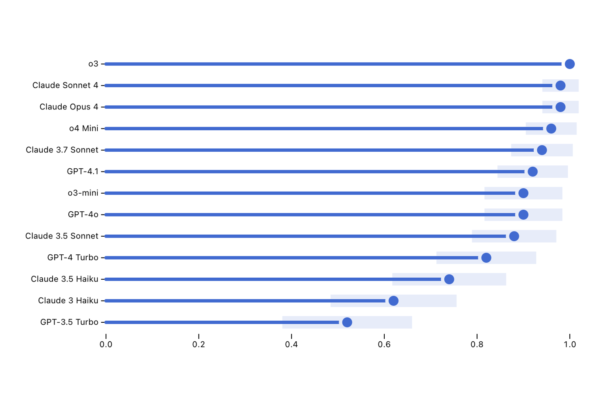

[Inspect Viz](https://meridianlabs-ai.github.io/inspect_viz/) is a companion package for turning Inspect logs into high quality, interactive visualisations. It reads Inspect [log dataframes](dataframe.qmd) and provides both pre-built views for common analysis patterns and composable marks for building custom plots—published to notebooks, websites, dashboards, or static images.

::: {layout-ncol=3}
{.border .lightbox group="inspect-viz"}

{.border .lightbox group="inspect-viz"}

{.border .lightbox group="inspect-viz"}
:::

Inspect Viz includes:

-   Interactive plots with built-in filtering and tooltips, linked back to the underlying Inspect transcripts.
-   Pre-built views for common evaluation analysis patterns, plus composable marks (dots, bars, cells, text, images, arrows) for custom plots.
-   Data tables with sorting and filtering, along with a range of inputs for dynamic filtering.
-   Support for multiple data sources (parquet, Pandas, Polars, PyArrow) and publishing to notebooks, websites, dashboards, or PNGs.

See the [Inspect Viz documentation](https://meridianlabs-ai.github.io/inspect_viz/) for installation along with a gallery of the available plots and views.
