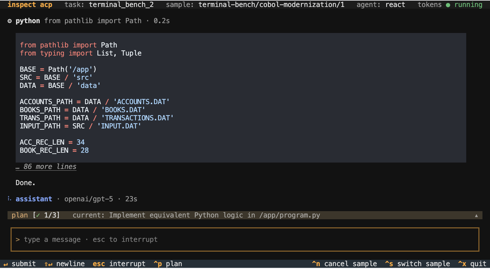
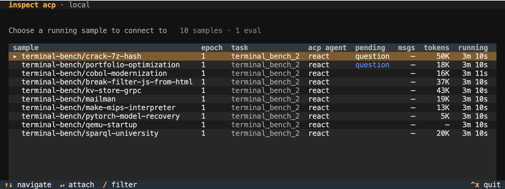

## Overview

Agent intervention features support creating evaluations with a human in the loop, better modeling how agents accomplish tasks in real world settings. Intervention can be initialized from either the human or agent side:

1. Human operators can connect to running sessions, interrupt agents, and redirect them with follow-up messages.

2. Agents can solicit help from humans by asking questions and sending notifications.

Every intervention is recorded in the transcript, so the log faithfully captures both the agent's work and any actions taken by the human operator. `react()` and `deepagent()` support intervention out of the box. [Custom agents](#adding-acp-to-an-agent) can opt in with a small change to their turn loop.

## Interactive Agent Client

Agent intervention uses the [Agent Client Protocol](https://agentclientprotocol.com), a standard for interactively controlling running agents. To enable ACP for an eval, pass the `--acp-server` option to `inspect eval`:

```bash
inspect eval terminal_bench_2 --acp-server
```

Then, in a separate terminal, run `inspect acp`:

```bash
inspect acp
```

You'll see a list of running ACP sessions:

{.border}

Select a session to attach to the running agent:

{.border}

Messages you type are delivered to the agent at the start of its next turn. Press **Esc** to interrupt the current generation or tool call, then send a message to continue.

Other keybindings:

- **Ctrl+P** shows the active plan and its status.

- **Ctrl+L** cancels the running tool call.

- **Ctrl+N** cancels the sample; choose to score it or treat it as an error.

- **Ctrl+S** switches to another running sample.

::: {.callout-note}
## Non-Interactive Sessions

You can attach to any running sample, including one whose agent hasn't added ACP support (a custom agent or solver without `agent_channel()` --- see [Adding ACP to an Agent](#adding-acp-to-an-agent)). These sessions are *observe-only*: the transcript streams live and you can still cancel the sample (**Ctrl+N**) or a running tool call (**Ctrl+L**), but sending messages and **Esc** interrupt are unavailable---those require changes to the agent's turn loop. The message composer is hidden to indicate this.
:::


### Intervention Logging

Interrupts and operator messages are recorded in the Inspect log:

1. Messages you send become `ChatMessageUser` with `source="operator"`.

2. **Esc** records an `InterruptEvent`.

3. **Ctrl+N** records a `SampleLimitEvent` with `type="operator"`.


### Remote Connections

`inspect acp` defaults to local evals. For remote evals, bind a TCP loopback port on the eval host and forward it over SSH---the ACP server has no built-in authentication, so the port should not be exposed directly:

```bash
# eval listening for ACP connections on a loopback port
inspect eval terminal_bench_2 --acp-server 4545

# from your local machine, forward the port over SSH
ssh -L 4545:localhost:4545 user@eval-host

# in another local terminal, connect through the tunnel
inspect acp --server 127.0.0.1:4545
```

You can also bind to a non-loopback interface with `--acp-server 0.0.0.0:4545`, but only on a trusted network, as anyone who can reach the port can drive the agent.

### Intervention Clients

While the ACP client described above is the preferred way to manage agent intervention, all of the intervention features also work with the standard Inspect full task display. Each call to `eval()` establishes which client it will use for intervention using the `--acp-server` option:

```bash
# manage intervention using ACP client
inspect eval terminal_bench_2 --acp-server

# manage intervention using standard task display
inspect eval terminal_bench_2 
```

The ACP client is recommended because it is more feature rich, works with `--display plain` and other non-interactive display modes, and can be remoted over HTTP.

## Questions and Notifications

In some cases you may want agents to initiate intervention. You can do this by providing agents with the `ask_user()` and/or `notify_user()` tools.

### Ask User Tool

The `ask_user()` tool enables models to request structured information from users. It uses the the [ACP Elicitation](https://agentclientprotocol.com/rfds/elicitation) standard, which provides for a variety of field types (text, boolean, enum, etc.)

For example, here we add `ask_user()` to a `react()` agent:

``` python
from inspect_ai.agent import agent, react
from inspect_ai.tool import ask_user, bash, text_editor

@agent
def ctf_agent():
    return react(
        description="Expert at completing cybersecurity challenges.",
        prompt="You are an expert at CTF challenges.",
        tools=[bash(), text_editor(), ask_user()]
    )
```

If you are monitoring several sessions where agents may ask questions, use the main session display to monitor for pending questions:

{.border}

In addition, the next section describes how to configure notifications so that you can be aware of questions as they are asked. 

### Notifications

Notifications fire whenever a human-in-the-loop interaction is posted (the `ask_user()` tool and tool-approval prompts). Inspect uses [Apprise](https://appriseit.com) to route notifications, which you can install with:

``` bash
pip install apprise
```

Apprise supports dozens of notifification types including Slack, desktop, SMS, email, and many other services. Learn more at <https://appriseit.com/services/>.

Notifications are opt-in per eval. Notification URLs usually contain secrets, so neither the Python API nor the CLI accepts URL strings directly. Set them in the `INSPECT_EVAL_NOTIFICATION` environment variable, or pass a path to an Apprise config file. This keeps URLs out of source code, shell history, and eval logs.

Set the environment variable in your `.env` file:

``` bash
# single URL
INSPECT_EVAL_NOTIFICATION="slack://TokenA/TokenB/TokenC/#agent-help"

# multiple URLs (comma-separated)
INSPECT_EVAL_NOTIFICATION="macosx://,slack://TokenA/TokenB/TokenC/#agent-help"

# or point at an Apprise config file
INSPECT_EVAL_NOTIFICATION="/path/to/apprise.yml"
```

Then enable notifications for the eval. Using the CLI:

``` bash
inspect eval ctf_challenge --notification
```

Or using Python:

``` python
eval(task, model="openai/gpt-5", notification=True)
```

You can also point at an Apprise config file directly, with no environment variable required:

``` python
eval(task, model="openai/gpt-5", notification="/path/to/apprise.yml")
```

``` bash
inspect eval ctf_challenge --notification /path/to/apprise.yml
```

::: {.callout-important}
Apprise config files often carry secrets so should never be checked in to version control.
:::


#### Notify User Tool

If you want the agent to be able to raise notifications to the user, you can also provide it with a `notify_user()` tool. For example:

``` python
from inspect_ai.agent import agent, react
from inspect_ai.tool import ask_user, notify_user, bash, text_editor

@agent
def ctf_agent():
    return react(
        ...,
        tools=[bash(), text_editor(), ask_user(), notify_user()]
    )
```

#### Notify from Code

You can also build scaffold driven notification into your custom agents by calling the `notify()` function. For example:

```python
from inspect_ai.util import notify

async def my_step(state):
    if state.output.stop_reason == "model_length":
        await notify("Model context length exceeded.")
```

## Adding ACP to an Agent

Add intervention support to a custom agent via the `agent_channel()` context manager.

A minimal agent loop, with `tools` captured from the surrounding `@agent` factory the way `react()` does (click the circled numbers for details):

```python
from inspect_ai.agent import (
    AgentState, agent_channel, AgentInterrupted
)
from inspect_ai.model import execute_tools, get_model

async def execute(state: AgentState) -> AgentState:
    async with agent_channel() as ch: # <1>
        while True:
            # handle operator messages # <2>
            state.messages.extend(
                await ch.before_turn(state.messages)
            ) # <2>

            try:
                with ch.turn_scope(): # <3>
                    state.output = await get_model().generate(
                        state.messages, tools=tools
                    )
                    state.messages.append(state.output.message)

                    if state.output.message.tool_calls:
                        messages, _ = await execute_tools(
                            state.messages,
                            tools
                        )
                        state.messages.extend(messages)
                    else:
                        break  # agent is done # <3>
            except AgentInterrupted: # <4>
                # operator interrupted agent
                state.messages.extend(
                    await ch.after_cancel(state.messages)
                )
                continue # <4>

    return state
```

1. Open the agent channel. ACP clients see a clean shutdown when the agent loop exits.

2. Drain any messages the operator queued between turns. Blocks for an initial user message on the first turn if `state.messages` has none.

3. The cancel target for the operator's **Esc**, entered and exited per turn.

4. `after_cancel` synthesizes a `ChatMessageTool` with `error.type="cancelled"` for any in-flight tool calls (so the next turn sees a clean tool_call / tool_result pair) and appends the operator's follow-up message.


## Writing an ACP Client

Any client that speaks the [Agent Client Protocol](https://agentclientprotocol.com) can attach to a running eval. Custom clients speak ACP directly over the eval's socket. Inspect implements the full standard ACP surface plus a handful of extensions; a client that uses only standard methods works without modification.

The standard surface is documented at [agentclientprotocol.com](https://agentclientprotocol.com). The methods Inspect expects:

| Method | Purpose |
|---|---|
| `initialize` | Handshake; optionally declare capabilities (see below). |
| `session/new` | Open a session. With multiple attachable samples the server responds with a `session/update` listing targets and binds on the client's first `session/prompt`; with exactly one sample it auto-binds. |
| `session/load` | Skip the picker by binding directly to a known sessionId. |
| `session/prompt` | Once bound, send a user message to the agent. |
| `session/cancel` | Interrupt the current turn. |
| `session/update` | Agent activity notification (messages, tool calls, plans). |
| `session/request_permission` | Ask the operator to approve a tool call. |
| `elicitation/create` | Ask the operator a structured question via the `ask_user` tool (form mode; opt-in via `clientCapabilities.elicitation.form`). |
: {tbl-colwidths=[35,65]}

Inspect-aware clients can opt into richer behavior by declaring capabilities at `initialize` and calling extension methods. Extensions are namespaced `inspect/*` (methods) or `inspect.*` (metadata keys); a standard ACP client ignores them.

| Extension | Purpose |
|---|---|
| `inspect/list_sessions` | Enumerate attachable sessions before connecting. |
| `inspect/list_samples` | Enumerate all running samples, including observe-only ones without ACP support. |
| `inspect/attach` | Direct-bind by `(task, sample_id, epoch)` instead of going through the picker. |
| `inspect/cancel_sample` | Terminal sample cancel (with `score` or `error` disposition). |
| `inspect/cancel_tool_call` | Cancel one in-flight tool call without unwinding the turn. |
| `inspect/event` | Raw transcript event stream (opt-in via `clientCapabilities._meta["inspect.raw_events"]`). |
| `inspect/session_ended` | Notification when a sample has completed, so the client can flip its UI to a terminal state without waiting for socket EOF. |
: {tbl-colwidths=[35,65]}

Samples enumerated by `inspect/list_samples` carry an `inspect.interactive` flag. When it is `false` the sample is *observe-only* — its agent hasn't bound a turn loop (no `agent_channel()`), so the client can attach to stream the transcript and call `inspect/cancel_sample` / `inspect/cancel_tool_call`, but `session/prompt` is rejected with `invalid_request` and `session/cancel` is ignored. Custom clients should disable their message composer for these sessions. The bind confirmation echoes the same flag in its `_meta` under `inspect.interactive`. (The standard `session/new` picker lists only interactive sessions; observe-only ones are reachable solely via `inspect/list_samples`.)

Clients with a dedicated plan UI indicate this at `initialize` by setting `inspect.plan_rendering` to `true` in their capability `_meta`. Clients that can render structured forms — required to receive `ask_user` prompts — declare ACP's standard `elicitation.form` capability:

```json
{
  "clientCapabilities": {
    "elicitation": { "form": {} },
    "_meta": {
      "inspect.plan_rendering": true
    }
  }
}
```

Inspect then translates `update_plan` and `todo_write` tool calls into `AgentPlanUpdate` notifications, which the client renders in its plan widget. With `elicitation.form` advertised, the agent's `ask_user` tool dispatches `elicitation/create` to the attached client and renders the operator's response back to the model as a structured tool result. Without it, the `ask_user` prompt parks the sample until a client that declares `elicitation.form` attaches — under `--acp-server`, ACP is the exclusive human channel, with no silent fallback to the in-proc panel or console.

The full set of extensions and metadata keys is defined in [inspect_ext.py](https://github.com/UKGovernmentBEIS/inspect_ai/blob/main/src/inspect_ai/agent/_acp/inspect_ext.py).


