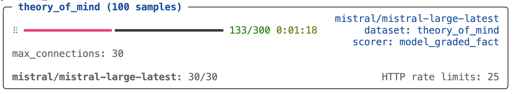

## Overview

Model API rate limits typically constrain evaluation throughput more than anything else. Inspect manages this with per-model concurrency limits (a cap on in-flight requests to a given provider) plus automatic retry on rate-limit and transient errors.

Two modes are available:

- Static. Set a fixed `--max-connections` value. You need to know the right number for your tier.

- Adaptive. Use `--adaptive-connections` to let Inspect tune the number, scaling up while the provider keeps up and backing off on rate-limit retries.

This page covers both modes, plus retry tuning and debugging. For other forms of parallelism (multiple tasks, sandbox containers, custom code), see [Parallelism](parallelism.qmd). For provider-side batch APIs, which run on a separate quota and use a different concurrency model, see [Batch Mode](models-batch.qmd).

## Max Connections

Connections to model APIs are the most fundamental unit of concurrency to manage. The main thing that limits model API concurrency is not local compute or network availability, but rather *rate limits* imposed by model API providers. Here we run an evaluation and set the maximum connections to 20:

``` bash
$ inspect eval --model openai/gpt-4 --max-connections 20
```

The default value for max connections is 10. By increasing it we might get better performance due to higher parallelism, however we might get *worse* performance if this causes us to frequently hit rate limits (which are retried with exponential backoff). The "correct" max connections for your evaluations will vary based on your actual rate limit and the size and complexity of your evaluations.

::: {.callout-note appearance="simple"}
Note that max connections is applied per-model. This means that if you use a grader model from a provider distinct from the one you are evaluating you will get extra concurrency (as each model will enforce its own max connections).
:::

## Rate Limits

When you run an eval you'll see information reported on the current active connection usage as well as the number of HTTP retries that have occurred (Inspect will automatically retry on rate limits and other errors likely to be transient):

{fig-alt="The Inspect task results displayed in the terminal. The number of HTTP rate limit errors that have occurred (25) is printed in the bottom right of the task results."}

Here we've set a higher max connections than the default (30). While you might be tempted to set this very high to see how much concurrent traffic you can sustain, more often than not setting too high a max connections will result in slower evaluations, because retries are done using [exponential backoff](https://en.wikipedia.org/wiki/Exponential_backoff), and bouncing off of rate limits too frequently will have you waiting minutes for retries to fire.

You should experiment with various values for max connections at different times of day (evening is often very different than daytime!). Generally speaking, you want to see some number of HTTP rate limits enforced so you know that you are somewhere close to ideal utilisation, but if you see hundreds of these you are likely over-saturating and experiencing a net slowdown.

## Adaptive Connections

Use the `--adaptive-connections` option to automatically scale model concurrency to your available capacity. Adaptive connections starts at a moderate concurrency, grows while the provider keeps up, and backs off on rate-limit retries.

``` bash
$ inspect eval --model openai/gpt-4o --adaptive-connections true
```

Adaptive connection works per-model, starting at 20 concurrent connections and attempting to scale up to 200. When adaptive connections is in effect, `max_samples` automatically tracks the controller's current limit (set an explicit `max_samples` to override this behavior).

### Bounds Tuning

Bounds (`min`, `start`, `max`) can be used to tune the behavior of adaptive connections: `start` is where the controller begins (it doubles aggressively during slow-start until the first rate-limit episode), and `max` is the ceiling.

Pass a string shorthand. `min-max` constrains the range (`start` defaults to 20, clamped into the range):

``` bash
$ inspect eval --model openai/gpt-4o --adaptive-connections 4-80
```

`min-start-max` also sets the starting value:

``` bash
$ inspect eval --model openai/gpt-4o --adaptive-connections 4-40-80
```

In Python, pass `True` for defaults or an `AdaptiveConcurrency` to customize:

``` python
from inspect_ai.util import AdaptiveConcurrency

eval(
    "task.py",
    model="openai/gpt-4o",
    adaptive_connections=AdaptiveConcurrency(min=4, max=80),
)
```

### Retry Types

The controller distinguishes two kinds of retries.

- Rate-limit retries (HTTP 429). These shrink the limit by `decrease_factor` (default 0.8) per episode, with a debounce so a single rate-limit burst produces only one cut.

- Transient retries (5xx, timeouts, and network errors). These pause scale-up (the eventual success won't count toward growth) but do not shrink the limit. Provider 5xx and network blips are usually infra noise unrelated to your concurrency, and lowering concurrency doesn't help an upstream outage.

After a rate-limit cut, the controller waits at least `cooldown_seconds` (default 15s) before allowing another cut. If the response carries a `Retry-After` header, the cooldown extends to honor it. Cache hits and successful-after-retry calls are neutral: they neither grow nor shrink the limit.

### Advanced Tuning

The response curve is also tunable. These fields are Python-only (CLI shorthand stays at `min-max` / `min-start-max`):

- `cooldown_seconds` (default 15): minimum debounce between scale-down cuts. Larger for long-running agent loops where each rate-limit episode takes longer to clear; smaller for short request workloads.

- `decrease_factor` (default 0.8): multiplicative cut on each rate-limit episode. More aggressive (e.g. 0.5) for volatile tiers where overshoots are common; gentler when tiers are stable.

- `scale_up_percent` (default 0.05): additive growth per clean round in steady state. Increase for short evals where slow ramp-up doesn't have time to converge.

``` python
from inspect_ai.util import AdaptiveConcurrency

eval(
    "task.py",
    model="openai/gpt-4o",
    adaptive_connections=AdaptiveConcurrency(
        min=4,
        max=80,
        cooldown_seconds=30,
        decrease_factor=0.5,
        scale_up_percent=0.1,
    ),
)
```

### Limit History

The full history of scale changes is captured in the eval log under `stats.connection_limit_history`. Each entry records the timestamp, model, old and new limits, and a `reason` of `slow_start`, `steady_state_up`, or `rate_limit`. Only `rate_limit` reflects an actual scale-down (transient infra noise no longer appears here). You can stream the same events live in the trace log:

``` bash
inspect trace dump --filter "[connections]"
```

## Limiting Retries

By default, Inspect will retry model API calls indefinitely (with exponential backoff) when a recoverable HTTP error occurs. The initial backoff is 3 seconds and exponentiation will result in a 25 minute wait for the 10th request (then 30 minutes for the 11th and subsequent requests). You can limit Inspect's retries using the `--max-retries` option:

``` bash
inspect eval --model openai/gpt-4 --max-retries 10
```

Note that model interfaces themselves may have internal retry behavior (for example, the `openai` and `anthropic` packages both retry twice by default).

You can put a limit on the total time for retries using the `--timeout` option:

``` bash
inspect eval --model openai/gpt-4 --timeout 600
```

## Debugging Retries

If you want more insight into Model API connections and retries, specify `log_level=http`. For example:

``` bash
inspect eval --model openai/gpt-4 --log-level=http
```

You can also view all of the HTTP requests for the current (or most recent) evaluation run using the `inspect trace http` command. For example:

``` bash
inspect trace http           # show all http requests
inspect trace http --failed  # show only failed requests
```

## Learning More

- [Parallelism](parallelism.qmd): running multiple tasks or models in parallel, sandbox container concurrency, and writing parallel custom code.

- [Batch Mode](models-batch.qmd): provider-side batch APIs (separate quota, longer turnaround, lower per-token cost).