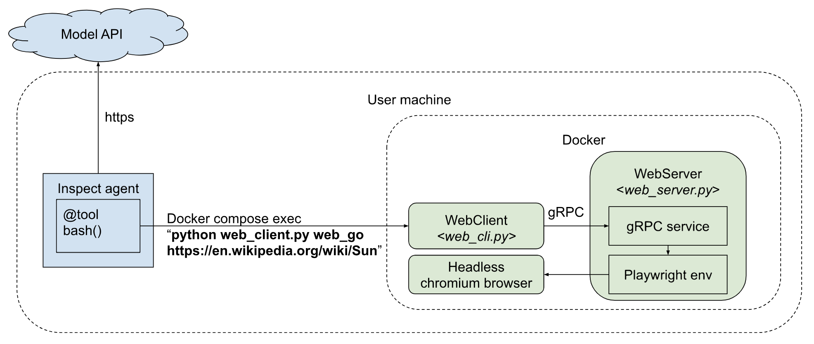

## Headless Browser Tool

This directory contains an implementation for the Headless Browser Tool which can be used to test web browsing agents. 


### Usage

#### 1. Start the Docker container

A web server with the headless browser will be launched automatically on starting of the docker container and will be ready to receive client requests.

#### 2. Send the command

Use the following format:

```
# Inside the Docker container
$ python web_client.py [COMMAND] [args]
```

###### Commands

The following commands are available at the moment:

* **web_go \<URL\>** - goes to the specified url.
* **web_click \<ELEMENT_ID\>** - clicks on a given element. 
* **web_scroll \<up/down\>** - scrolls up or down one page.
* **web_forward** - navigates forward a page.
* **web_back** - navigates back a page.
* **web_refresh** - reloads current page (F5).
* **web_type \<ELEMENT_ID\> \<TEXT\>** - types the specified text into the input with the specified id.
* **web_type_submit \<ELEMENT_ID\> \<TEXT\>** - types the specified text into the input with the specified id and presses ENTER to submit the form.

#### 3. Read the resulting observations

The result will be printed out in _stdout_ in the following format:

```
# Inside the Docker container
error: <an ERROR message if one occured>
info: <general info about the container>
web_url: <the URL of the page the browser is currently at>
wen_at: <accessibility tree of the visible elements of the page>
```   


### Design

The following diagram describes the design and the intended usage of the tool:



The tool consists of the following components:

* [WebServer](web_server.py) - a server which launches a stateful session with the headless chromium browser and interracts with it through the [Playwright API](https://playwright.dev/python/docs/intro) upon receiving client commands. The server components are: 
  * _dm_env_servicer.py_ - an implementation for the gRPC Service based on [dm_env_rpc protocol](https://github.com/google-deepmind/dm_env_rpc).
  * _web_environment.py_ - an environment which gets instantiated by the servicer and which launches the browser, stores its state and maps client commands to Playwright API. 
  * _playwright_crawler.py_ - a wrapper over the sync Playwright API. 

* [WebClient](web_client.py) - a simple stateless client to interract with the server. When launched, the client:
  1. creates a connection with the server;
  2. sends user command to the server;
  3. receives the response in the form of observations and prints them to stdout;
  4. Destroys the connection.