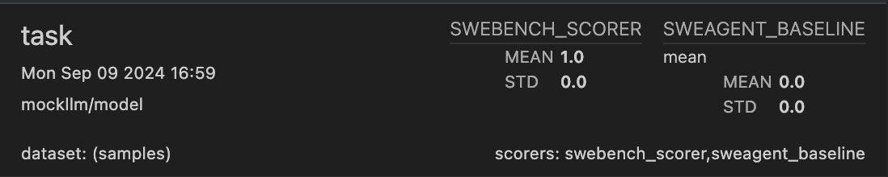

# SWE-agent
This is an inspect-native implementation of [the SWE-bench dataset](https://www.swebench.com/).

## Installation

- **Install requirements.** As well as the requirements provided by inspect, this benchmark has its own dependencies. You can install them in your virtual environment by running ```pip install -r requirements.txt```
- **Build environment images.** SWE-bench requires a set of images with all the dependencies of each repository. To build them for the SWE-bench-verified split, run ```./build_images.py --dataset_path princeton-nlp/SWE-bench_Verified --split train```. See ```./build_images.py --help``` for all arguments. NOTE: Depending on the repositories contained in your subset of SWE-bench, this can take a while to run (several hours). If you wish to download a subset of the images, you can create a local copy of the SWE-bench dataset, and pass the path to that dataset. 

## Usage


### Running the benchmark
The ```swe_bench.py``` file contains the ```swe_bench``` function, which creates an instance of a SWE-bench Task:

```python
from inspect_ai import eval
from inspect_ai.solver import system_message, basic_agent
from inspect_ai.tool import bash, python
from swe_bench import swe_bench

# Create an agent that only uses bash, and an agent that only uses python.
agents = [
    basic_agent(
        init=system_message("Please solve the coding task below. Once you are done, use your submit tool."),
        tools=[tool],
    )
    for tool in [bash(), python()]
]

# Create a swe-bench instance for each of those agents.
swebench_task = [swe_bench(dataset="princeton-nlp/SWE-bench_Verified", split="test", plan=agent) for agent in agents]

# For the demonstration, we will select only the first 5 tasks.
swebench_task.dataset = swebench_task.dataset[:5]

# Compare how these two agents perform. 
eval(swebench_task, model="openai/gpt-4o", max_tasks=2, max_subprocesses=8, max_connections=4)
```

NOTE: SWE-bench will take a while to run, and uses a lot of tokens. If things are too slow, you should increase the level of parallelism - see https://inspect.ai-safety-institute.org.uk/parallelism.html. Note that running too many docker containers on your machine can also cause issues, most notably with a 'ALL PREDEFINED ADDRESS POOLS HAVE BEEN FULLY SUBNETTED' error - we don't recommend running more than 32 containers at any one time.

### Comparing to baselines
Submissions to [the official SWE-bench leaderboard](https://www.swebench.com/) often come with a set of trajectories and per-swebench-instance results. This means that you can compare the performance of your agent not just on the full dataset, but also on subsets of that dataset. This is often useful when trying to run smaller, cheaper experiments. To make this comparison easy, we provide a scorer that will calculate the average performance of an existing baseline on that set of trajectories:

```python
from inspect_ai import eval
from swe_bench import swe_bench, swe_bench_scorer, swebench_baseline_scorer

# Select only the subset where the patch is more than 20 lines long. Select the default plan.
swebench_verified_short_descriptions = swe_bench(dataset="princeton-nlp/SWE-bench_Verified", split="train",plan=simple_bash_plan, filter=lambda x: len(x["patch"].split("\n")) > 20)


# Report the Claude 3.5 Sonnet + SweAgent baseline, as well as the performance of the agent. To download the baseline run ./resources/baselines/download_swebench_baseline.sh
swebench_verified_task_subset.scorer = [swebench_baseline_scorer("./resources/baselines/swebench_verified_20240620_sweagent_claude3.5sonnet",name="sweagent_baseline"), swebench_scorer()]

eval(swebench_verified_task_subset,limit=5)
```

This will lead to both numbers being reported in the final output, allowing you to compare baselines:


```


