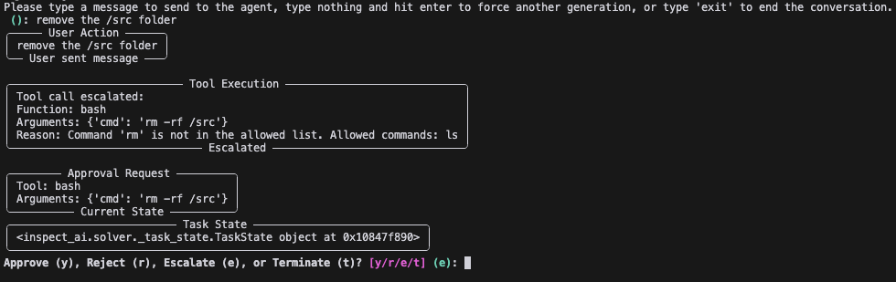
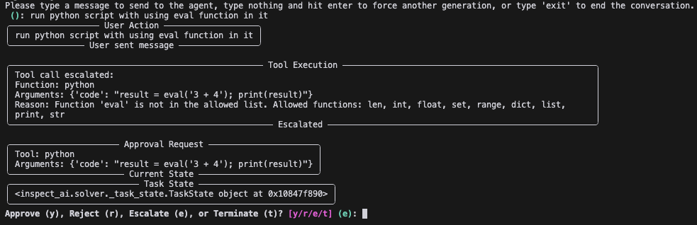

# Intervention Approvals

This example implements an approval system for tool calls, specifically focusing on bash and Python commands. The example uses a combination of allowlist approvers and human approvers to ensure the safety and appropriateness of executed commands.

This example builds upon the `examples/intervention_mode` example, adding more sophisticated approval mechanisms.

### Approvers

Approvers are in the `approvals.py` file. We've implemented three types of approvers:

1. `bash_allowlist_approver`: Automatically approves bash commands that are in a predefined list (+ more configuation options)
2. `python_allowlist_approver`: Automatically approves python code that uses allowed modules and functions (+ more configuation options)
3. `human_approver`: Prompts the user to approve, reject, escalate, or terminate the execution of a tool call.


### Example of a tool call intervention for bash tool:
User wants to remove a file. This is rejected by the approver and escalated to the human approver.


### Example of a tool call intervention for python tool:
User wants to run code with eval function. This is rejected by the approver and escalated to the human approver.

## Key Components

Approvers can be used at the tool call level or at the agent level. Both examples are included in the `intervention.py` file.
1. `tool_call_intervention`: Uses a `bash_allowlist_approver`, `python_allowlist_approver`, and `human_approver` on tool level.
2. `agent_loop_intervention`: Uses a `human_approver` on agent level.


You can run these tasks using the following code:

```python:examples/intervention_approvals/intervention.py
if __name__ == "__main__":
    from inspect_ai import eval
    tasks = [tool_call_intervention(), agent_loop_intervention()]
    eval(tasks=tasks, model='openai/gpt-4o-mini')
```

### approvals.py
This file contains the core functionality for the approval system:

1. **Approver Classes and Protocols:**
   - `Approval`: A Pydantic model representing an approval decision.
   - `Approver`: A Protocol defining the interface for approver functions.
2. **Approval Process:**
   - `get_approval`: Processes a tool call through a list of approvers to determine if it should be executed.
3. **Creating Approvers:**
   In the `intervention.py` file, we create instances of our approvers:
   ```python
   bash_allow_list_approver_func = bash_allowlist_approver(["ls"])
   human_approver_func = human_approver()
   ```
4. **Combining Approvers:**
   We create lists of approvers for each tool type:
   ```python
   bash_approvers = [bash_allow_list_approver_func, human_approver_func]
   python_approvers = [python_approver_func, human_approver_func]
   ```
5. **Tool Wrapping:**
   - `wrap_approvers`: Wraps existing tools (like bash and python) with the approval system. This means there is no need to change your current tool functions.
   ```python
   tools = [
       wrap_approvers(bash(), approvers=bash_approvers),
       wrap_approvers(python(), approvers=python_approvers)
   ]
   ```

### Customization

You can customize this setup in several ways:

1. Modify the `bash_allowlist_approver` or `python_allowlist_approver` to include more allowed commands, modules, or functions.
2. Adjust the configuration options for existing approvers (e.g., `disallowed_builtins`, `sensitive_modules`, `allow_system_state_modification`).
3. Create new types of approvers by implementing the `Approver` interface.
4. Change the order or composition of approvers in the `tool_call_intervention` or `agent_loop_intervention` functions.
5. Apply approval mechanisms to other tools by wrapping them with `wrap_approvers`.

