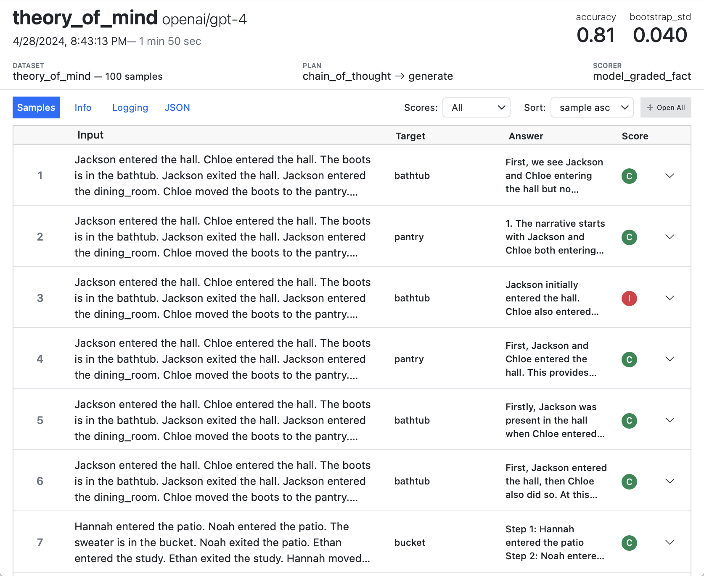

# Inspect

## Welcome

Welcome to Inspect, a framework for large language model evaluations created by the [UK AI Security Institute](https://aisi.gov.uk).

Inspect can be used for a broad range of evaluations that measure coding, agentic tasks, reasoning, knowledge, behavior, and multi-modal understanding. Core features of Inspect include:

- A set of straightforward interfaces for implementing evaluations and re-using components across evaluations.
- A collection of over 200 pre-built evaluations ready to run on any model.
- Extensive tooling, including a web-based Inspect View tool for monitoring and visualizing evaluations and a VS Code Extension that assists with authoring and debugging.
- Flexible support for tool calling—custom and MCP tools, as well as built-in bash, python, text editing, web search, web browsing, and computer tools.
- Support for agent evaluations, including flexible built-in agents, multi-agent primitives, the ability to run arbitrary external agents like Claude Code, Codex CLI, and Gemini CLI.
- A sandboxing system that supports running untrusted model code in Docker, Kubernetes, Modal, Proxmox, and other systems via an extension API.

We’ll walk through a fairly trivial “Hello, Inspect” example below. Read on to learn the basics, then read the documentation on [Datasets](./datasets.html.md), [Solvers](./solvers.html.md), [Scorers](./scorers.html.md), [Tools](./tools.html.md), and [Agents](./agents.html.md) to learn how to create more advanced evaluations.

If you are primarily interested in running evaluations rather than developing new ones, see the [Evals](./evals/index.html.md) listing where you’ll find implementations for over 200 popular benchmarks.

## Getting Started

To get started using Inspect:

1.  Install Inspect from PyPI with:

    ``` bash
    pip install inspect-ai
    ```

2.  If you are using VS Code, install the [Inspect VS Code Extension](./vscode.html.md) (not required but highly recommended).

To develop and run evaluations, you’ll also need access to a model, which typically requires installation of a Python package as well as ensuring that the appropriate API key is available in the environment.

Assuming you had written an evaluation in a script named `arc.py`, here’s how you would setup and run the eval for a few different model providers:

``` bash
pip install openai
export OPENAI_API_KEY=your-openai-api-key
inspect eval arc.py --model openai/gpt-4o
```

``` bash
pip install anthropic
export ANTHROPIC_API_KEY=your-anthropic-api-key
inspect eval arc.py --model anthropic/claude-sonnet-4-0
```

``` bash
pip install google-genai
export GOOGLE_API_KEY=your-google-api-key
inspect eval arc.py --model google/gemini-2.5-pro
```

``` bash
pip install openai
export GROK_API_KEY=your-grok-api-key
inspect eval arc.py --model grok/grok-3-mini
```

``` bash
pip install mistralai
export MISTRAL_API_KEY=your-mistral-api-key
inspect eval arc.py --model mistral/mistral-large-latest
```

``` bash
pip install torch transformers
export HF_TOKEN=your-hf-token
inspect eval arc.py --model hf/meta-llama/Llama-2-7b-chat-hf
```

In addition to the model providers shown above, Inspect also supports models hosted on AWS Bedrock, Azure AI, TogetherAI, Groq, Cloudflare, and Goodfire as well as local models with vLLM, Ollama, llama-cpp-python, TransformerLens, and nnterp. See the documentation on [Model Providers](./providers.html.md) for additional details.

## Hello, Inspect

Inspect evaluations have three main components:

1.  **Datasets** contain a set of labelled samples. Datasets are typically just a table with `input` and `target` columns, where `input` is a prompt and `target` is either literal value(s) or grading guidance.

2.  **Solvers** are chained together to evaluate the `input` in the dataset and produce a final result. The most elemental solver, [generate()](./reference/inspect_ai.solver.html.md#generate), just calls the model with a prompt and collects the output. Other solvers might do prompt engineering, multi-turn dialog, critique, or provide an agent scaffold.

3.  **Scorers** evaluate the final output of solvers. They may use text comparisons, model grading, or other custom schemes

Let’s take a look at a simple evaluation that aims to see how models perform on the [Sally-Anne](https://en.wikipedia.org/wiki/Sally%E2%80%93Anne_test) test, which assesses the ability of a person to infer false beliefs in others. Here are some samples from the dataset:

| input | target |
|----|----|
| Jackson entered the hall. Chloe entered the hall. The boots is in the bathtub. Jackson exited the hall. Jackson entered the dining_room. Chloe moved the boots to the pantry. Where was the boots at the beginning? | bathtub |
| Hannah entered the patio. Noah entered the patio. The sweater is in the bucket. Noah exited the patio. Ethan entered the study. Ethan exited the study. Hannah moved the sweater to the pantry. Where will Hannah look for the sweater? | pantry |

Here’s the code for the evaluation (click on the numbers at right for further explanation):

    theory.py

``` python
from inspect_ai import Task, task
from inspect_ai.dataset import example_dataset
from inspect_ai.scorer import model_graded_fact
from inspect_ai.solver import (               
  chain_of_thought, generate, self_critique   
)                                             

@task
def theory_of_mind():
1    return Task(
        dataset=example_dataset("theory_of_mind"),
2        solver=[
          chain_of_thought(),
          generate(),
          self_critique()
        ],
3        scorer=model_graded_fact()
    )
```

1  
The [Task](./reference/inspect_ai.html.md#task) object brings together the dataset, solvers, and scorer, and is then evaluated using a model.

2  
In this example we are chaining together three standard solver components. It’s also possible to create a more complex custom solver that manages state and interactions internally.

3  
Since the output is likely to have natural, nuanced language, we use a model for scoring.

Note that you can provide a *single* solver or multiple solvers chained together as we did here.

The `@task` decorator applied to the `theory_of_mind()` function is what enables `inspect eval` to find and run the eval in the source file passed to it. For example, here we run the eval against GPT-4:

``` bash
inspect eval theory.py --model openai/gpt-4
```

[](images/running-theory.png)

## Evaluation Logs

By default, eval logs are written to the `./logs` sub-directory of the current working directory. When the eval is complete you will find a link to the log at the bottom of the task results summary.

If you are using VS Code, we recommend installing the [Inspect VS Code Extension](./vscode.html.md) and using its integrated log browsing and viewing.

For other editors, you can use the `inspect view` command to open a log viewer in the browser (you only need to do this once as the viewer will automatically update when new evals are run):

``` bash
inspect view
```

[](images/inspect-view-home.png)

See the [Log Viewer](./log-viewer.html.md) section for additional details on using Inspect View.

## Eval from Python

Above we demonstrated using `inspect eval` from CLI to run evaluations—you can perform all of the same operations from directly within Python using the [eval()](./reference/inspect_ai.html.md#eval) function. For example:

``` python
from inspect_ai import eval
from .tasks import theory_of_mind

eval(theory_of_mind(), model="openai/gpt-4o")
```

## Learning More

The best way to get familiar with Inspect’s core features is the [Tutorial](./tutorial.html.md), which includes several annotated examples.

Next, review these articles which cover basic workflow, more sophisticated examples, and additional useful tooling:

- [Options](./options.html.md) covers the various options available for evaluations as well as how to manage model credentials.

- [Evals](./evals/index.html.md) are a set of ready to run evaluations that implement popular LLM benchmarks and papers.

- [Log Viewer](./log-viewer.html.md) goes into more depth on how to use Inspect View to develop and debug evaluations, including how to provide additional log metadata and how to integrate it with Python’s standard logging module.

- [VS Code](./vscode.html.md) provides documentation on using the Inspect VS Code Extension to run, tune, debug, and visualise evaluations.

These sections provide a more in depth treatment of the various components used in evals. Read them as required as you learn to build evaluations.

- [Tasks](./tasks.html.md) bring together datasets, solvers, and scorers to define an evaluation. This section explores strategies for creating flexible and re-usable tasks.

- [Task Config](./task-configuration.html.md) is a reference for overriding task components at runtime using [task_with()](./reference/inspect_ai.html.md#task_with), [eval()](./reference/inspect_ai.html.md#eval), and the CLI.

- [Datasets](./datasets.html.md) provide samples to evaluation tasks. This section illustrates how to adapt various data sources for use with Inspect, as well as how to include multi-modal data (images, etc.) in your datasets.

- [Solvers](./solvers.html.md) are the heart of Inspect, and encompass prompt engineering and various other elicitation strategies (the `plan` in the example above). Here we cover using the built-in solvers and creating your own more sophisticated ones.

- [Scorers](./scorers.html.md) evaluate the work of solvers and aggregate scores into metrics. Sophisticated evals often require custom scorers that use models to evaluate output. This section covers how to create them.

These sections cover defining custom tools as well as Inspect’s standard built-in tools:

- [Tool Basics](./tools.html.md): Tools provide a means of extending the capabilities of models by registering Python functions for them to call. This section describes how to create custom tools and use them in evaluations.

- [Standard Tools](./tools-standard.html.md) describes Inspect’s built-in tools for code execution, text editing, computer use, web search, and web browsing.

- [MCP Tools](./tools-mcp.html.md) covers how to intgrate tools from the growing list of [Model Context Protocol](https://modelcontextprotocol.io/introduction) providers.

- [Custom Tools](./tools-custom.html.md) provides details on more advanced custom tool features including sandboxing, error handling, and dynamic tool definitions.

- [Sandboxing](./sandboxing.html.md) enables you to isolate code generated by models as well as set up more complex computing environments for tasks.

- [Tool Approval](./approval.html.md) enables you to create fine-grained policies for approving tool calls made by models.

These sections cover how to use various language models with Inspect:

- [Models](./models.html.md) describe various ways to specify and provide options to models in Inspect evaluations.

- [Providers](./providers.html.md) covers usage details and available options for the various supported providers.

- [Caching](./caching.html.md) explains how to cache model output to reduce the number of API calls made.

- [Compaction](./compaction.html.md) covers compacting message histories for long-running agents that exceed the context window.

- [Multimodal](./multimodal.html.md) describes the APIs available for creating multimodal evaluations (including images, audio, and video).

- [Reasoning](./reasoning.html.md) documents the additional options and data available for reasoning models.

- [Batch Mode](./models-batch.html.md) covers using batch processing APIs for model inference.

- [Structured Output](./structured.html.md) explains how to constrain model output to a particular JSON schema.

These sections describe how to create agent evaluations with Inspect:

- [Agents](./agents.html.md) combine planning, memory, and tool usage to pursue more complex, longer horizon tasks. This articles covers the basics of using agents in evaluations.

- [ReAct Agent](./react-agent.html.md) provides details on using and customizing the built-in ReAct agent.

- [Multi Agent](./multi-agent.html.md) covers various ways to compose agents together in multi-agent architectures.

- [Custom Agents](./agent-custom.html.md) describes advanced Inspect APIs available for creating custom agents.

- [Agent Bridge](./agent-bridge.html.md) enables the use of agents from 3rd party frameworks like OpenAI Agents SDK, LangChain, and Pydantic AI with Inspect.

- [Human Agent](./human-agent.html.md) is a solver that enables human baselining on computing tasks.

These sections outline how to analyze data generated from evaluations:

- [Eval Logs](./eval-logs.html.md) explores log viewing, log file formats, and the Python API for reading log files.

- [Data Frames](./dataframe.html.md) documents the APIs available for extracting dataframes of evals, samples, messages, and events from log files.

These sections discuss more advanced features and workflows. You don’t need to review them at the outset, but be sure to revisit them as you get more comfortable with the basics.

- [Eval Sets](./eval-sets.html.md) covers Inspect’s features for describing, running, and analysing larger sets of evaluation tasks.

- [Handling Errors](./handling-errors.html.md) covers techniques for dealing with runtime errors and recovering from crashes during evaluation.

- [Setting Limits](./setting-limits.html.md) covers setting time, message, token, and cost limits on evaluation tasks and samples.

- [Typing](./typing.html.md): provides guidance on using static type checking with Inspect, including creating typed interfaces to untyped storage (i.e. sample metadata and store).

- [Tracing](./tracing.html.md) Describes advanced execution tracing tools used to diagnose runtime issues.

- [Caching](./caching.html.md) enables you to cache model output to reduce the number of API calls made, saving both time and expense.

- [Parallelism](./parallelism.html.md) delves into how to obtain maximum performance for evaluations. Inspect uses a highly parallel async architecture—here we cover how to tune this parallelism (e.g to stay under API rate limits or to not overburden local compute) for optimal throughput.

- [Interactivity](./interactivity.html.md) covers various ways to introduce user interaction into the implementation of tasks (for example, prompting the model dynamically based on the trajectory of the evaluation).

- [Early Stopping](./early-stopping.html.md) describes the early stopping API for ending tasks early based on previously scored samples.

- [Extensions](./extensions.html.md) describes the various ways you can extend Inspect, including adding support for new Model APIs, tool execution environments, and storage platforms (for datasets, prompts, and logs).

## Citation

BibTeX citation:

``` quarto-appendix-bibtex
@software{UK_AI_Security_Institute_Inspect_AI_Framework_2024,
  author = {AI Security Institute, UK},
  title = {Inspect {AI:} {Framework} for {Large} {Language} {Model}
    {Evaluations}},
  date = {2024-05},
  url = {https://github.com/UKGovernmentBEIS/inspect_ai},
  langid = {en}
}
```

For attribution, please cite this work as:

AI Security Institute, UK. 2024. *Inspect AI: Framework for Large Language Model Evaluations*. Released May. <https://github.com/UKGovernmentBEIS/inspect_ai>.
