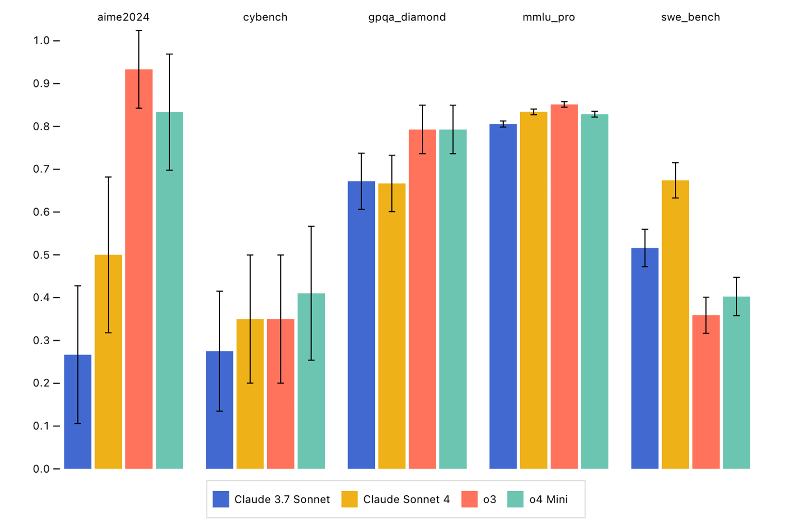
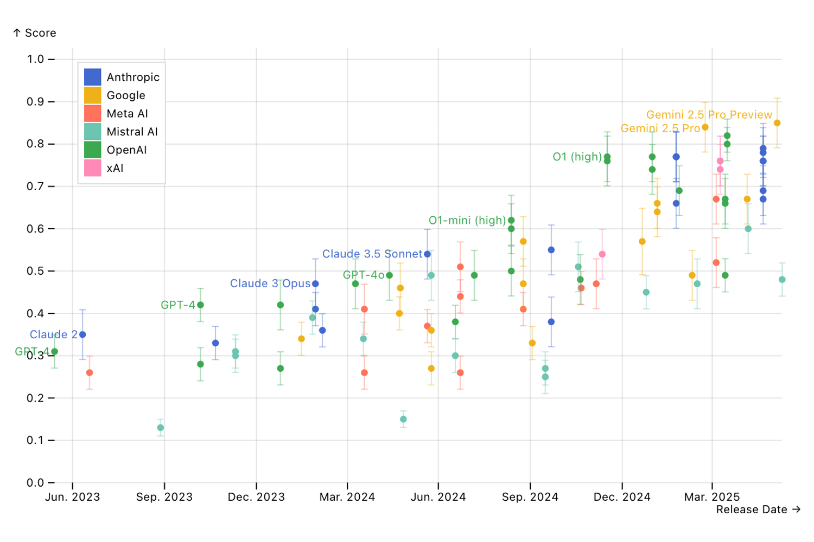

# Inspect Viz – Inspect

[Inspect Viz](https://meridianlabs-ai.github.io/inspect_viz/) is a companion package for turning Inspect logs into high quality, interactive visualisations. It reads Inspect [log dataframes](./dataframe.html.md) and provides both pre-built views for common analysis patterns and composable marks for building custom plots—published to notebooks, websites, dashboards, or static images.

Scores across models and tasks.

Scores across a set of models.

Scores against model release date.

Inspect Viz includes:

- Interactive plots with built-in filtering and tooltips, linked back to the underlying Inspect transcripts.
- Pre-built views for common evaluation analysis patterns, plus composable marks (dots, bars, cells, text, images, arrows) for custom plots.
- Data tables with sorting and filtering, along with a range of inputs for dynamic filtering.
- Support for multiple data sources (Parquet, Pandas, Polars, PyArrow) and publishing to notebooks, websites, and dashboards.

See the [Inspect Viz documentation](https://meridianlabs-ai.github.io/inspect_viz/) for installation along with a gallery of the available plots and views.
