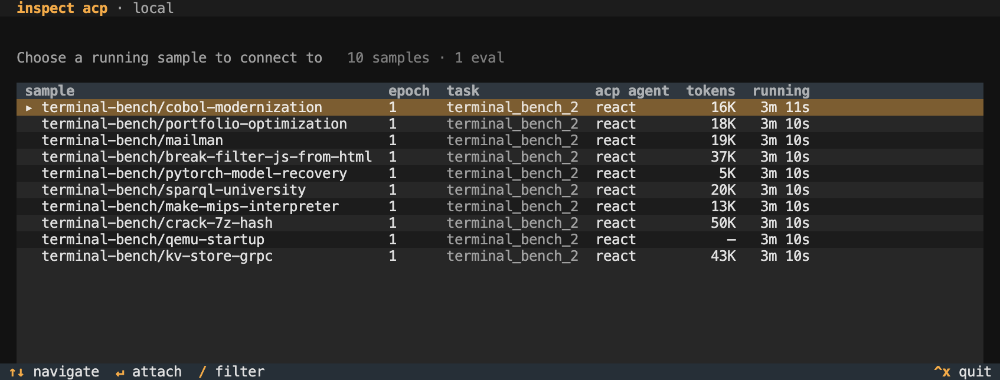

# Agent Intervention – Inspect

## Overview

Agent intervention lets you observe a running agent, interrupt it, and redirect it with follow-up messages. Every intervention is recorded in the transcript, so the log faithfully captures both the agent’s work and any operator actions.

[react()](./reference/inspect_ai.agent.html.md#react) and [deepagent()](./reference/inspect_ai.agent.html.md#deepagent) support intervention out of the box. [Custom agents](#adding-acp-to-an-agent) can opt in with a small change to their turn loop.

## Interactive Agent Client

Agent intervention uses the [Agent Client Protocol](https://agentclientprotocol.com), a standard for interactively controlling running agents. To enable ACP for an eval, pass the `--acp-server` option to `inspect eval`:

``` bash
inspect eval terminal_bench_2 --acp-server
```

Then, in a separate terminal, run `inspect acp`:

``` bash
inspect acp
```

You’ll see a list of running ACP sessions:

[](images/acp-listing.png)

Select a session to attach to the running agent:

[](images/acp-session.png)

Messages you type are delivered to the agent at the start of its next turn. Press **Esc** to interrupt the current generation or tool call, then send a message to continue.

Other keybindings:

- **Ctrl+P** shows the active plan and its status.

- **Ctrl+L** cancels the running tool call.

- **Ctrl+N** cancels the sample; choose to score it or treat it as an error.

- **Ctrl+S** switches to another running sample.

### Intervention Logging

Interrupts and operator messages are recorded in the Inspect log:

1.  Messages you send become [ChatMessageUser](./reference/inspect_ai.model.html.md#chatmessageuser) with `source="operator"`.

2.  **Esc** records an [InterruptEvent](./reference/inspect_ai.event.html.md#interruptevent).

3.  **Ctrl+N** records a [SampleLimitEvent](./reference/inspect_ai.event.html.md#samplelimitevent) with `type="operator"`.

### Remote Connections

`inspect acp` defaults to local evals. For remote evals, bind a TCP loopback port on the eval host and forward it over SSH—the ACP server has no built-in authentication, so the port should not be exposed directly:

``` bash
# eval listening for ACP connections on a loopback port
inspect eval terminal_bench_2 --acp-server 4545

# from your local machine, forward the port over SSH
ssh -L 4545:localhost:4545 user@eval-host

# in another local terminal, connect through the tunnel
inspect acp --server 127.0.0.1:4545
```

You can also bind to a non-loopback interface with `--acp-server 0.0.0.0:4545`, but only on a trusted network, as anyone who can reach the port can drive the agent.

## Adding ACP to an Agent

Add intervention support to a custom agent via the [agent_channel()](./reference/inspect_ai.agent.html.md#agent_channel) context manager.

A minimal agent loop, with `tools` captured from the surrounding `@agent` factory the way [react()](./reference/inspect_ai.agent.html.md#react) does (click the circled numbers for details):

``` python
from inspect_ai.agent import (
    AgentState, agent_channel, AgentInterrupted
)
from inspect_ai.model import execute_tools, get_model

async def execute(state: AgentState) -> AgentState:
1    async with agent_channel() as ch:
        while True:
2            # handle operator messages
            state.messages.extend(
                await ch.before_turn(state.messages)
            )

            try:
3                with ch.turn_scope():
                    state.output = await get_model().generate(
                        state.messages, tools=tools
                    )
                    state.messages.append(state.output.message)

                    if state.output.message.tool_calls:
                        messages, _ = await execute_tools(
                            state.messages,
                            tools
                        )
                        state.messages.extend(messages)
                    else:
                        break  # agent is done
4            except AgentInterrupted:
                # operator interrupted agent
                state.messages.extend(
                    await ch.after_cancel(state.messages)
                )
                continue

    return state
```

1  
Open the agent channel. ACP clients see a clean shutdown when the agent loop exits.

2  
Drain any messages the operator queued between turns. Blocks for an initial user message on the first turn if `state.messages` has none.

3  
The cancel target for the operator’s **Esc**, entered and exited per turn.

4  
`after_cancel` synthesizes a [ChatMessageTool](./reference/inspect_ai.model.html.md#chatmessagetool) with `error.type="cancelled"` for any in-flight tool calls (so the next turn sees a clean tool_call / tool_result pair) and appends the operator’s follow-up message.

Notes:

- Custom solvers and agents without this code still run normally. They just don’t appear in the `inspect acp` picker.

- Sub-agents invoked via [handoff()](./reference/inspect_ai.agent.html.md#handoff), [as_tool()](./reference/inspect_ai.agent.html.md#as_tool), or [deepagent()](./reference/inspect_ai.agent.html.md#deepagent) open their own channel but are not bound to the ACP transport. Only the outermost agent in a sample is ACP-controllable; sub-agent activity collapses to a single tool call in the operator’s view.

- Hard sample cancels (limits, eval shutdown) propagate as `CancelledError` and unwind the agent normally. `ch.turn_scope()` distinguishes the two: only producer-driven interrupts raise [AgentInterrupted](./reference/inspect_ai.agent.html.md#agentinterrupted).

## Using Other ACP Clients

Any client that speaks the [Agent Client Protocol](https://agentclientprotocol.com) can attach to a running eval, including editors with built-in ACP support (such as [Zed](https://zed.dev)) or a custom built client.

### Standard Clients

ACP clients launch the agent as a subprocess and exchange JSON-RPC frames over its stdio. Inspect provides `inspect acp --stdio` as the bridge: the editor spawns it, and it forwards messages between the editor’s stdio and a running eval’s ACP socket.

To use Inspect from Zed, add an entry like this to your `settings.json`:

``` json
{
  "agent_servers": {
    "Inspect": {
      "command": "inspect",
      "args": ["acp", "--stdio"]
    }
  }
}
```

The bridge auto-discovers the most recently started local eval running with `--acp-server`. If multiple evals are running it picks the newest and lists the others on stderr (visible in the editor’s debug pane). To target a specific eval, pass `--eval-id <id>`; for an explicit transport, pass `--socket <path-or-host:port>`.

Editors get the same intervention surface as `inspect acp`: pick among running samples, interrupt turns, send follow-up messages, and respond to approval prompts. Editors with native plan rendering display `update_plan` and `todo_write` calls as their own plan widgets.

### Writing a Client

Custom clients speak ACP directly over the eval’s socket. Inspect implements the full standard ACP surface plus a handful of extensions; a client that uses only standard methods works without modification.

The standard surface is documented at [agentclientprotocol.com](https://agentclientprotocol.com). The methods Inspect expects:

| Method | Purpose |
|----|----|
| `initialize` | Handshake; optionally declare capabilities (see below). |
| `session/new` | Open a session. With multiple attachable samples the server responds with a `session/update` listing targets and binds on the client’s first `session/prompt`; with exactly one sample it auto-binds. |
| `session/load` | Skip the picker by binding directly to a known sessionId. |
| `session/prompt` | Once bound, send a user message to the agent. |
| `session/cancel` | Interrupt the current turn. |
| `session/update` | Agent activity notification (messages, tool calls, plans). |
| `session/request_permission` | Ask the operator to approve a tool call. |

Inspect-aware clients can opt into richer behavior by declaring capabilities at `initialize` and calling extension methods. Extensions are namespaced `inspect/*` (methods) or `inspect.*` (metadata keys); a standard ACP client ignores them.

| Extension | Purpose |
|----|----|
| `inspect/list_sessions` | Enumerate attachable sessions before connecting. |
| `inspect/list_samples` | Enumerate all running samples, including those without ACP support. |
| `inspect/attach` | Direct-bind by `(task, sample_id, epoch)` instead of going through the picker. |
| `inspect/cancel_sample` | Terminal sample cancel (with `score` or `error` disposition). |
| `inspect/cancel_tool_call` | Cancel one in-flight tool call without unwinding the turn. |
| `inspect/event` | Raw transcript event stream (opt-in via `clientCapabilities._meta["inspect.raw_events"]`). |
| `inspect/session_ended` | Notification when a sample has completed, so the client can flip its UI to a terminal state without waiting for socket EOF. |

Clients with a dedicated plan UI indicate this at `initialize` by setting `inspect.plan_rendering` to `true` in their capability `_meta`:

``` json
{
  "clientCapabilities": {
    "_meta": {
      "inspect.plan_rendering": true
    }
  }
}
```

Inspect then translates `update_plan` and `todo_write` tool calls into `AgentPlanUpdate` notifications, which the client renders in its plan widget.

The full set of extensions and metadata keys is defined in [inspect_ext.py](https://github.com/UKGovernmentBEIS/inspect_ai/blob/main/src/inspect_ai/agent/_acp/inspect_ext.py).
