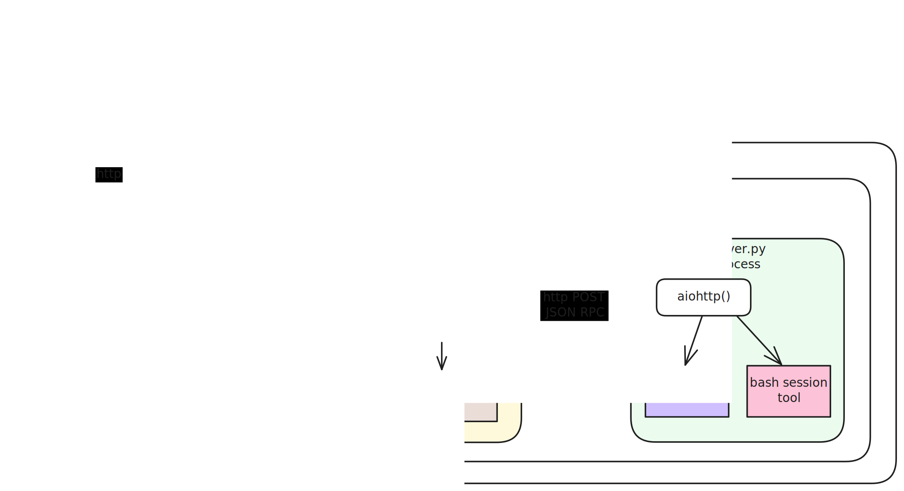

# Multi-tool Shared Image

## Stateless / Stateful Design

Inspect calls into the sandboxed image are done statelessly via `docker exec python multi-tool.py`.

Some tools can be implemented without the need for any in-process state. For those tools, the tool code will be executed within the `multi-tool.py` process.

For tools that require the maintenance of state over the lifetime of and sandbox, this image marshals tool calls into a long running process via JSON RPC to an http server process. That server then dispatches tool calls to tool specific `@method` handlers.

### Stateful Tool Design Pattern

Each stateful tool should have its own subdirectory that contains the following files:

- `json_rpc_methods.py`

  This module contains all of the JSON RPC `@method` functions — one for each tool (e.g. the web browser tool is actually a set of distinct tools). It is responsible for unpacking the JSON RPC request and forwarding the call to a transport-agnostic, strongly typed, stateful controller.

- `tool_types.py`

  This module includes the `pydantic` models representing the types for tool call parameters and results.

- `controller.py`

  This is transport-agnostic, strongly typed code that manages the tool specific in-process state and performs requested commands.

## Compatibility

The Inspect framework will insure that the most recently published image of a particular tag will be downloaded when an eval is executed. This means that, from a cross-version perspective, we only have to worry about old tool code interacting with newer container code. The inverse is not possible.

Because of this, when publishing new _major version_ images, care must be taken to retain the old version entrypoint called by tools.

For example, older versions of the `web_browser_tool()` performed `docker exec`'s against `/app/web_browser/web_client.py` and `/app/web_browser/web_client_new_session.py`. A newer version of the image changed the entry point to `/opt/inspect/multi-tool-v1.py`.

This means that newer versions of the image **must** retain the old entry points in a backwardly compatible way. Typically, the implementation of those old entry points will be updated to adapt and call the new version of the code.

> [!TIP]
> For this reason, it is a best practice to include a version number in the filename of the `docker exec` entry points.
