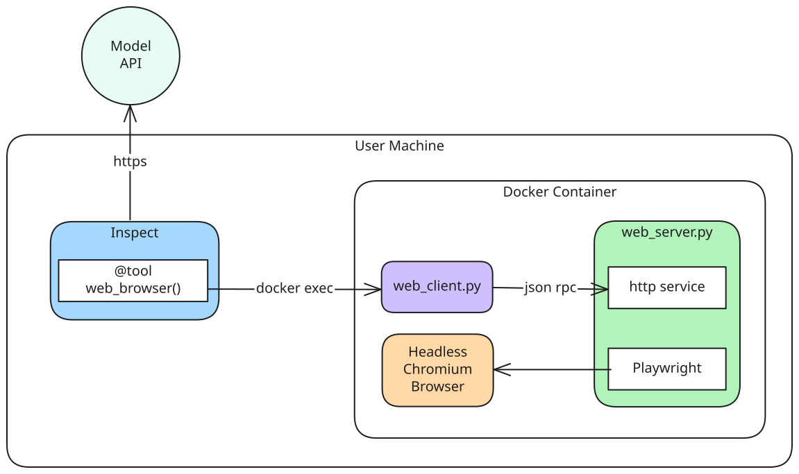

## Headless Browser Tool

This directory contains an implementation for the Headless Browser Tool which can be used to test web browsing agents.

### Usage

#### 1. Start the Docker container

The browser server is not started by the container entrypoint: the first command that needs it starts `inspect-tool-support server`, and later commands reuse that process.

#### 2. Send the command

Each command is a JSON-RPC request passed to the tool support CLI. Create a session first, then use the name it returns:

```
# Inside the Docker container
$ inspect-tool-support exec '{"jsonrpc": "2.0", "method": "web_new_session", "params": {"headful": false}, "id": 1}'
{"jsonrpc": "2.0", "result": {"session_name": "WebBrowser"}, "id": 1}
$ inspect-tool-support exec '{"jsonrpc": "2.0", "method": "web_go", "params": {"session_name": "WebBrowser", "url": "https://example.com"}, "id": 2}'
{"jsonrpc": "2.0", "result": {"web_url": "https://example.com/", "web_at": "[14] heading \"Example Domain\" ...", "error": null}, "id": 2}
```

###### Commands

Every method below also takes `session_name` (the name returned by `web_new_session`); the parameters shown are the rest of the request's `params` object:

* **web_go \<URL\>** - goes to the specified url.
* **web_click \<ELEMENT_ID\>** - clicks on a given element. 
* **web_scroll \<up/down\>** - scrolls up or down one page.
* **web_forward** - navigates forward a page.
* **web_back** - navigates back a page.
* **web_refresh** - reloads current page (F5).
* **web_type \<ELEMENT_ID\> \<TEXT\>** - types the specified text into the input with the specified id.
* **web_type_submit \<ELEMENT_ID\> \<TEXT\>** - types the specified text into the input with the specified id and presses ENTER to submit the form.

#### 3. Read the resulting observations

The result will be printed out in _stdout_ in the following format:

```
# Inside the Docker container
error: <an ERROR message if one occurred>
info: <general info about the container>
web_url: <the URL of the page the browser is currently at>
web_at: <accessibility tree of the visible elements of the page>
```

### Design

The following diagram describes the design and the intended usage of the tool:



The tool consists of the following components:

- `inspect-tool-support server` ([_cli/server.py](../../_cli/server.py)) - a server which keeps stateful browser sessions alive, driving the headless chromium browser through the [Playwright API](https://playwright.dev/python/docs/intro) in response to JSON-RPC requests posted over a Unix domain socket. The server components are:

  - _json_rpc_methods.py_ - one handler per command, which validates the request params and forwards the call to the controller.
  - _controller.py_ - `WebBrowserSessionController`, which owns browser session state and maps commands to the Playwright API.
  - _playwright_crawler.py_ - a wrapper over the async Playwright API.

- `inspect-tool-support exec` ([_cli/main.py](../../_cli/main.py)) - a simple stateless client to interact with the server. When launched, the client:
  1. creates a connection with the server;
  2. sends user command to the server;
  3. receives the response in the form of observations and prints them to stdout;
  4. Destroys the connection.